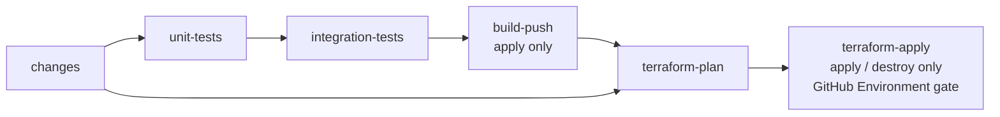

# CI/CD pipeline: test, build and deploy changed services to EKS

Workflow: [`.github/workflows/ci-cd.yml`](../../.github/workflows/ci-cd.yml)
Change detection: [`.github/scripts/detect-changed-services.sh`](../../.github/scripts/detect-changed-services.sh)
Terraform stack: [`infra/terraform/service/`](../../infra/terraform/service)
Helm chart: [`infra/helm/aura-service/`](../../infra/helm/aura-service)

## 1. What runs when

| Trigger | Environment | Unit + integration tests | Docker build & push | Terraform |
|---|---|---|---|---|
| Pull request to `main` | `dev` | yes | no | `plan` (job summary). Skipped for fork PRs. |
| Push to `main` | `dev` | yes | no | `plan` (job summary) |
| Manual run, `action=plan` | chosen | yes | no | `plan` |
| Manual run, `action=apply` (from `main` only) | chosen | yes | yes | `plan`, then `apply` (gated by the GitHub Environment) |
| Manual run, `action=destroy` (from `main` only) | chosen | no | no | `plan -destroy`, then `apply` (gated). Needs `confirm_destroy` set to the environment name and an explicit `services` list. |

Every stage runs only for the **changed services**, one matrix job per service. One service failing doesn't stop the others (`fail-fast: false`).



## 2. Change detection

A service is any `services/<name>/` folder with a `Dockerfile`. Each one must have `infra/terraform/service/services/<name>.tfvars.json`, or the pipeline fails.

| Changed path | Services selected |
|---|---|
| `services/<name>/**` | `<name>` |
| `infra/terraform/service/services/<name>.tfvars.json` | `<name>` |
| `infra/terraform/service/*.tf`, `infra/terraform/service/environments/**`, `infra/helm/**` | all |
| `.github/workflows/ci-cd.yml`, `.github/scripts/**` | all |
| Anything else (`docs/`, `services/shared/`, …) | none |

The diff base is:

- **Pull request:** the merge base of the PR and `main`.
- **Push:** the previous tip of the branch (`github.event.before`). A new branch, or a base that no longer exists after a force push, selects all services.
- **Manual run:** the `services` input (`all` or a comma-separated list). If it's empty, the services changed in the latest commit.

`services/shared` isn't imported by any service yet (see [services/DEPLOYMENT.md](../../services/DEPLOYMENT.md)), so changing it doesn't select anything. Add it to `GLOBAL_PATTERNS` in the script once services depend on it.

Run it locally:

```sh
BASE_SHA=origin/main .github/scripts/detect-changed-services.sh
REQUESTED="auth-service,api-gateway" .github/scripts/detect-changed-services.sh
```

## 3. Stages

### Unit tests

| Runtime | Steps |
|---|---|
| Node (NestJS) | `npm install`, `prisma generate` (if there's a schema), `npm run test --if-present -- --ci`, `npm run build` (type check) |
| Python (`ai-service`) | `python -m compileall`, plus `pytest tests` when `tests/` exists |
| Static (`api-gateway`) | `nginx -t` against `nginx.conf`, using the Dockerfile's base image |

### Integration tests

Each service image is built once with the GitHub Actions layer cache and started on the runner. It runs against real Postgres 16 and Redis 7 service containers, plus ChromaDB for `ai-service`. The job:

1. Starts the container. Sibling hostnames such as `identity-service` resolve to `127.0.0.1`, so a service, or the gateway, boots on its own.
2. Waits up to 180 s for the service's health endpoint (`health_check_path`) to return 2xx. This exercises `prisma migrate deploy`, DB and Redis connectivity, and app startup.
3. Runs `npm run test:integration` if the service defines it. Add that script to a service to plug in API → service → DB tests. `DATABASE_URL` and `REDIS_URL` are set for it.

Container logs are printed when the job fails.

### Docker build and push

The image is pushed to `<account>.dkr.ecr.<region>.amazonaws.com/the-aura-lab/<service>:<git-sha>`. The ECR repository is created on first use with immutable tags, scan on push and encryption. Re-running a job whose tag already exists skips the push.

### Terraform plan and apply

Each environment/service pair has its own state file in S3: `s3://$TF_STATE_BUCKET/the-aura-lab/<env>/<service>.tfstate`. Locking uses native S3 lockfiles (`use_lockfile`), so no DynamoDB table is needed.

The plan job writes the plan to the job summary and uploads it as an artifact. The apply job runs inside the GitHub Environment for the target environment and applies **that saved plan**. If the state changed after the plan was made, Terraform rejects the stale plan. Deploys of the same environment and service are serialized with a `concurrency` group.

## 4. Terraform stack (`infra/terraform/service`)

One root module is shared by all services. It is configured by layering two variable files:

```sh
terraform plan \
  -var-file=environments/<env>.tfvars.json \   # region, cluster, namespace, replicas, common env
  -var-file=services/<service>.tfvars.json \   # port, health path, env, resources (wins on conflict)
  -var=service_name=<service> -var=image_tag=<sha>
```

**Kubernetes objects are always deployed with Helm.** The stack contains one `helm_release` per service. It installs the shared chart [`infra/helm/aura-service`](../../infra/helm/aura-service) with values that Terraform renders from the two variable files. Terraform still owns plan, apply, destroy and state; Helm owns the Kubernetes objects. The release uses `atomic` and `wait`, so a rollout that doesn't become healthy within 10 minutes is rolled back to the previous Helm revision and the apply fails. Don't add raw manifests or `kubernetes_*` workload resources: extend the chart instead.

The chart creates these objects, all named after the service so in-cluster DNS matches docker-compose (for example `http://identity-service:3001`):

| Object | Notes |
|---|---|
| `Deployment` | Rolling update (`maxUnavailable 0`); startup, readiness and liveness probes on `health_check_path`; resource requests and limits; `allowPrivilegeEscalation=false`; waits for the rollout. Replicas are owned by the HPA. |
| `Service` | `ClusterIP`. `api-gateway` uses `LoadBalancer` with AWS Load Balancer Controller NLB annotations. |
| `HorizontalPodAutoscaler` (v2) | CPU based, between `min_replicas` and `max_replicas` |
| `PodDisruptionBudget` | Only when `min_replicas > 1` |

**Secrets are not managed by Terraform**, so they never reach state or plan output. Each pod loads the existing Kubernetes Secret `<service>-secrets` through `envFrom`. Create it with External Secrets Operator or Secrets Manager CSI, or by hand. It holds keys such as `DATABASE_URL`, `REDIS_URL`, `JWT_SECRET`, `JWT_REFRESH_SECRET`, `INTERNAL_SERVICE_TOKEN` and `OPENAI_API_KEY`. If the secret is missing, pods fail with `CreateContainerConfigError` and the apply times out.

### Adding a service

1. Create `services/<name>/Dockerfile`.
2. Add `infra/terraform/service/services/<name>.tfvars.json` with at least `container_port` and `health_check_path`.
3. Create the `<name>-secrets` Secret in each environment's namespace.

### Changing the chart

Edit `infra/helm/aura-service`, bump `version` in `Chart.yaml`, and check it renders:

```sh
helm lint infra/helm/aura-service --strict --set image.repository=x/y,image.tag=t
helm template auth-service infra/helm/aura-service --set image.repository=x/y,image.tag=t
```

`values.schema.json` validates the values Terraform passes. A chart change selects every service, so the next plan shows the diff for all of them.

## 5. One-time setup

| Item | Where | Purpose |
|---|---|---|
| EKS cluster per environment | AWS | Names in `environments/<env>.tfvars.json` (`the-aura-lab-<env>` placeholders) |
| Namespace `the-aura-lab` | each cluster | Not created by the service stack, because services share it |
| AWS Load Balancer Controller and metrics-server | each cluster | Gateway NLB and HPA metrics |
| RDS Postgres, ElastiCache Redis, ChromaDB | AWS / cluster | Referenced from the `<service>-secrets` values and `CHROMA_HOST` |
| S3 state bucket (versioned, encrypted) | AWS | Repository variable `TF_STATE_BUCKET` |
| IAM role trusted by GitHub OIDC | AWS | Secret `AWS_ROLE_ARN`. Needs ECR push/create, S3 state read/write and `eks:DescribeCluster`, and must be mapped to a Kubernetes RBAC identity (EKS access entry) that can manage Deployments, Services, HPAs, PDBs and Secrets (Helm stores release history as Secrets) in the namespace |
| Read-only plan role (optional) | AWS | Secret `AWS_PLAN_ROLE_ARN`, used for PR plans. Falls back to `AWS_ROLE_ARN` |
| GitHub Environments `dev`, `staging`, `prod` | repo settings | Add required reviewers to `staging` and `prod` to gate apply and destroy |

Region comes from `aws_region` in the environment tfvars file. It is used for ECR, the EKS API and the S3 backend.

## 6. Operations

- **Redeploy a service without a code change:** run the workflow manually with `action=apply`, the environment, and `services=<name>`.
- **Deploy:** pushes to `main` only plan. To deploy, run the workflow manually with `action=apply`, the environment, and `services=<list|all>` (empty = services changed in the latest commit).
- **Roll back:** revert the commit on `main`, then run a manual `apply` for the affected service.
- **Tear down:** run manually with `action=destroy`, `services=<list|all>` and `confirm_destroy=<env>`. The Helm release (and so its Kubernetes objects) is uninstalled. ECR images and state files are kept.

## 7. Known limitations

- `.terraform.lock.hcl` isn't committed yet, so provider versions float within `~> 5.0` (aws) and `~> 2.17` (helm). Commit one generated with `terraform providers lock -platform=linux_amd64 -platform=darwin_arm64`.
- Only `auth-, identity-, customer-` and `authorization-service` have Jest unit tests. No service defines `test:integration` yet, so integration coverage is the container smoke test.
- A manual `apply` gates on the whole run. If any selected service fails its tests, nothing is built or deployed, including services that passed.
- Every deploy, including `dev`, is manual (workflow dispatch). It builds the image for the current `main` SHA, or reuses it if that tag is already in ECR.
