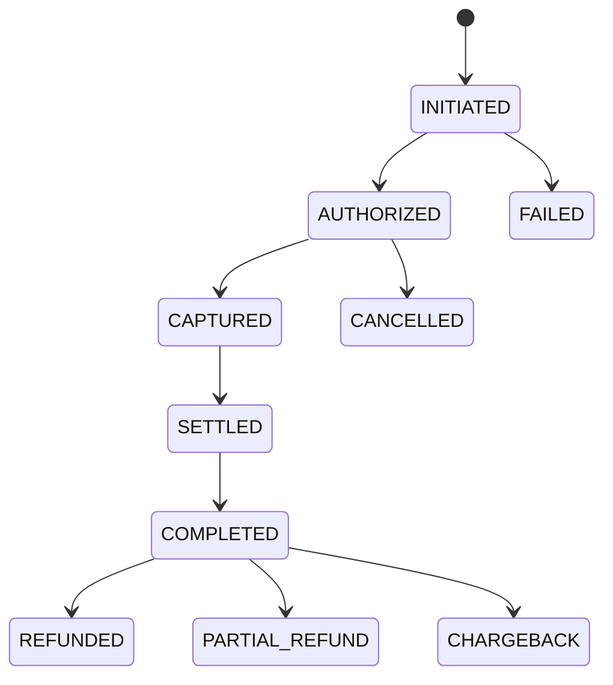

# Payments Business Rules

**Module:** Payment Service

**Version:** 1.0

**Owner:** Payments & Finance Team

---

# Overview

The Payment Service is responsible for securely processing customer payments, managing payment lifecycles, integrating with external Payment Service Providers (PSPs), handling payment failures, and ensuring financial consistency across the platform.

The service is responsible for:

- Payment Authorization
- Payment Capture
- Payment Status Management
- Payment Retry
- Payment Gateway Routing
- Wallet Payments
- Gift Cards
- EMI
- COD
- Split Payments
- Partial Payments
- Chargebacks
- Settlement Integration

The Payment Service integrates with:

- Checkout Service
- Order Service
- Pricing Service
- Promotion Service
- Notification Service
- Reconciliation Service
- Analytics Service
- Fraud Detection Service

---

# Business Objectives

- Secure payment processing
- Support multiple payment methods
- Prevent duplicate payments
- Reduce payment failures
- Enable high payment success rates
- Support global payment providers
- Maintain PCI DSS compliance

---

# Supported Payment Methods

| Method | Supported |
|----------|-----------|
| Credit Card | Yes |
| Debit Card | Yes |
| UPI | Yes |
| Net Banking | Yes |
| Wallet | Yes |
| Gift Card | Yes |
| EMI | Yes |
| Cash on Delivery | Yes |
| Buy Now Pay Later | Yes |
| Bank Transfer | Optional |

---

# Payment Lifecycle

```text
Payment Initiated

↓

Validation

↓

Authorization

↓

Authorized

↓

Capture

↓

Captured

↓

Settlement

↓

Completed
```

Alternative States

```text
Failed

Cancelled

Expired

Refunded

Partially Refunded

Chargeback
```

---

# Payment State Machine



---

# Payment Flow

1. Customer places order.
2. Checkout requests payment.
3. Payment Service validates request.
4. Payment Gateway authorizes payment.
5. Payment Service captures payment.
6. Order Service confirms order.
7. Settlement occurs.
8. Reconciliation validates settlement.

---

# Business Rules

## Rule 1

Every payment must have a unique Payment ID.

---

## Rule 2

Each order can have one or more payment attempts.

---

## Rule 3

Only one successful payment is allowed per order.

---

## Rule 4

Authorization must occur before capture.

---

## Rule 5

Capture must not exceed authorized amount.

---

## Rule 6

Duplicate payment requests must be prevented using an idempotency key.

---

## Rule 7

Payment amount must exactly match the payable amount calculated by the Pricing Service unless explicitly supporting partial payments.

---

## Rule 8

Payment status must only transition through valid states.

---

## Rule 9

Gateway webhooks must be verified before updating payment status.

---

## Rule 10

Every successful payment must generate a settlement record.

---

# Payment Validation

Validate

- Order Exists
- Order Active
- Amount Matches
- Currency Supported
- Customer Active
- Payment Method Enabled
- Fraud Score Below Threshold

Reject when

- Order Cancelled
- Amount Modified
- Currency Invalid
- Payment Expired
- Gateway Disabled

---

# Authorization Rules

Authorization reserves customer funds.

Authorization timeout

```
15 Minutes
```

If capture does not happen within timeout

```
Authorization Expires
```

---

# Capture Rules

Capture occurs

- Immediately (default)
- On shipment (configurable)
- Partial capture (supported if gateway allows)

---

# Partial Payments

Supported for

- Gift Card + Card
- Wallet + Card
- Wallet + UPI
- Store Credit + Card

Rules

- Total paid must equal payable amount.
- Order remains pending until full payment is received.

---

# Split Payments

Marketplace platforms may split payments between

- Seller
- Platform
- Commission
- Tax Account

Example

| Recipient | Amount |
|------------|--------|
| Seller | ₹900 |
| Platform | ₹80 |
| Tax | ₹20 |

---

# Cash on Delivery (COD)

Eligibility may depend on

- Order Value
- Pincode
- Product Category
- Customer Risk Score

Example

| Order Value | COD |
|--------------|-----|
| ≤ ₹5,000 | Allowed |
| > ₹5,000 | Not Allowed |

---

# EMI Rules

Supported for eligible banks and payment providers.

Rules

- Minimum order value configurable
- Tenure options configurable
- Interest calculation delegated to payment provider

---

# Wallet Rules

- Wallet balance cannot exceed payable amount.
- Wallet deduction happens before external payment.
- Wallet transactions are immutable.

---

# Gift Card Rules

- Multiple gift cards may be supported (configurable).
- Gift card balance is consumed before external payment.
- Expired gift cards cannot be used.

---

# Fraud Prevention

Evaluate

- Velocity checks
- Device fingerprint
- IP reputation
- High-value orders
- BIN validation
- Country mismatch
- Blacklisted customer
- Suspicious payment patterns

Actions

- Reject payment
- Require OTP
- Manual review
- Block customer

---

# Retry Policy

Retry allowed for

- Network failure
- Gateway timeout
- Bank timeout

Do not retry

- Invalid card
- Insufficient balance
- Expired card
- Fraud rejection

Maximum retries

```
3
```

---

# Idempotency Rules

Every payment request must include

```
Idempotency-Key
```

Duplicate requests with the same key must return the original response.

---

# Payment Timeout

Checkout payment timeout

```
15 Minutes
```

After timeout

- Release inventory reservation
- Expire payment
- Cancel checkout session

---

# Chargeback Rules

Chargeback lifecycle

```text
Chargeback Received

↓

Evidence Submitted

↓

Bank Review

↓

Won / Lost

↓

Ledger Updated
```

---

# Settlement Rules

Settlement must include

- Payment ID
- Gateway Transaction ID
- Settlement Date
- Settlement Amount
- Gateway Fees
- Taxes

Settlement discrepancies are handled by the Reconciliation Service.

---

# APIs

## Initiate Payment

```
POST /payments
```

---

## Get Payment

```
GET /payments/{paymentId}
```

---

## Capture Payment

```
POST /payments/{paymentId}/capture
```

---

## Cancel Payment

```
POST /payments/{paymentId}/cancel
```

---

## Payment Webhook

```
POST /payments/webhook
```

---

## Payment Status

```
GET /payments/{paymentId}/status
```

---

# Database

## Payment

| Column | Description |
|----------|------------|
| payment_id | UUID |
| order_id | Order Reference |
| customer_id | Customer |
| amount | Payment Amount |
| currency | Currency |
| payment_method | UPI/Card/etc |
| status | Payment Status |
| gateway_transaction_id | PSP Transaction |
| created_at | Timestamp |

---

## Payment Attempt

| Column | Description |
|----------|------------|
| attempt_id | UUID |
| payment_id | Parent Payment |
| gateway | PSP |
| status | Success/Failure |
| error_code | Failure Reason |
| created_at | Timestamp |

---

# Kafka Events

| Topic | Producer | Consumer |
|---------|----------|----------|
| payment.initiated | Payment | Analytics |
| payment.authorized | Payment | Order |
| payment.captured | Payment | Order |
| payment.completed | Payment | Reconciliation |
| payment.failed | Payment | Notification |
| payment.refunded | Refund | Analytics |
| payment.chargeback | Payment | Finance |

---

# Exception Handling

## Gateway Timeout

Retry according to retry policy.

---

## Duplicate Payment

Return existing payment response.

---

## Webhook Received Twice

Ignore duplicate using transaction ID and idempotency.

---

## Settlement Delay

Notify Reconciliation Service.

---

## Payment Success but Order Creation Failed

Compensating transaction should reconcile payment with order or trigger manual investigation.

---

# Monitoring Metrics

- Payment Success Rate
- Authorization Rate
- Capture Rate
- Gateway Success Rate
- Average Payment Time
- Retry Rate
- Chargeback Ratio
- Payment Failures by Reason
- Gateway Latency
- Settlement Delay

---

# Security

- PCI DSS Compliance
- Tokenized card data
- TLS encryption
- HMAC webhook verification
- API authentication
- RBAC
- Audit logging
- Secrets management
- Encryption at rest

---

# Audit Log

Track

- Payment Initiated
- Authorization
- Capture
- Cancellation
- Refund
- Chargeback
- Webhook Received
- Manual Override

Each record includes

- User/System
- Timestamp
- Payment ID
- Order ID
- Previous Status
- New Status
- Gateway
- Remarks

---

# Edge Cases

- Customer refreshes payment page
- Duplicate webhook delivery
- Payment succeeds after checkout timeout
- Partial gateway outage
- Gateway returns unknown status
- Currency mismatch
- Order cancelled after authorization
- Inventory released before payment completion
- Multi-device checkout
- Payment completed during failover

---

# SLA

| Operation | SLA |
|------------|-----|
| Payment Initiation | <300 ms |
| Authorization | <5 sec |
| Capture | <5 sec |
| Status Lookup | <100 ms |
| Webhook Processing | <2 sec |
| API Availability | 99.99% |

---

# Acceptance Criteria

- Payment is processed securely.
- Duplicate payments are prevented.
- Authorization and capture follow valid state transitions.
- Gateway webhooks are authenticated.
- Settlement records are generated.
- Payment events are published.
- Audit logs are maintained.
- Fraud checks are executed.
- Retry policy is enforced.
- Payment lifecycle is traceable end-to-end.

---

# Future Enhancements

- Intelligent gateway routing
- AI-based payment retry optimization
- Network tokenization
- One-click payments
- Multi-currency settlement
- Cross-border payments
- Cryptocurrency support (where legally permitted)
- Real-time bank account verification
- Adaptive fraud detection
- Smart payment orchestration

---