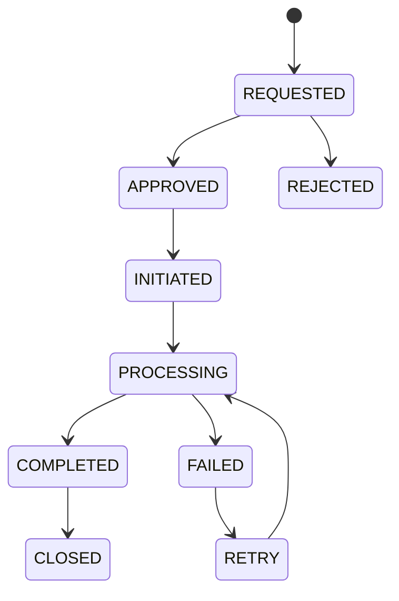

# Refunds Business Rules

**Module:** Refund Management

**Version:** 1.0

**Owner:** Finance & Payments Team

---

# Overview

The Refund Service is responsible for validating, initiating, tracking, and completing customer refunds after a return, cancellation, or payment reversal.

The Refund Service **does not determine return eligibility**. That responsibility belongs to the Return Management Service.

The Refund Service integrates with:

- Payment Service
- Return Service
- Order Service
- Reconciliation Service
- Accounting Service
- Notification Service
- Analytics Service

---

# Business Objectives

- Process refunds accurately
- Minimize refund turnaround time
- Prevent duplicate refunds
- Support full and partial refunds
- Maintain financial consistency
- Ensure auditability
- Comply with payment provider policies

---

# Refund Types

| Refund Type | Description |
|-------------|-------------|
| Full Refund | Entire order amount refunded |
| Partial Refund | Refund for selected items or amount |
| Cancellation Refund | Order cancelled before fulfillment |
| Return Refund | Approved return |
| Shipping Refund | Delivery fee refunded |
| Tax Refund | Tax component refunded |
| Wallet Refund | Refunded to platform wallet |
| Store Credit | Refunded as store credit |

---

# Refund Lifecycle

```text
Refund Requested

↓

Validation

↓

Approved

↓

Refund Initiated

↓

Gateway Processing

↓

Refund Completed
```

Alternative States

```text
Rejected

Cancelled

Failed

Retry

Manual Review
```

---

# Refund State Machine



---

# Refund Eligibility

Refunds are allowed only when:

- Payment was successful
- Order is eligible
- Return approved (if applicable)
- Refund amount is valid
- Refund has not already been processed
- Fraud checks pass

---

# Business Rules

## Rule 1

Refund amount must never exceed the amount paid.

---

## Rule 2

A completed payment can only be refunded once for the same amount.

---

## Rule 3

Partial refunds cannot exceed the remaining refundable balance.

---

## Rule 4

Refunds must reference an Order ID and Payment ID.

---

## Rule 5

Refunds should be processed using the original payment method whenever supported.

---

## Rule 6

Refund approval is required for manual or exceptional refunds above configurable thresholds.

---

## Rule 7

Coupon discounts are not refunded unless explicitly configured.

---

## Rule 8

Shipping charges are refunded only if policy conditions are met.

---

## Rule 9

Refund events must be published only after successful initiation.

---

## Rule 10

All refund operations must be idempotent.

---

# Refund Priority

Preferred refund destination

```text
Original Payment Method

↓

Platform Wallet

↓

Store Credit

↓

Manual Bank Transfer
```

---

# Refund Calculation

```
Refund Amount

=

Item Value

-

Non-refundable Charges

+

Eligible Tax

+

Eligible Shipping Refund
```

---

# Shipping Refund Rules

| Scenario | Shipping Refund |
|----------|-----------------|
| Entire Order Returned | Yes |
| Partial Return | Configurable |
| Customer Changed Mind | Configurable |
| Wrong Product Delivered | Yes |
| Damaged Product | Yes |

---

# Tax Refund Rules

Tax should follow the refunded item value in accordance with applicable tax regulations.

Example

| Scenario | Tax Refund |
|----------|------------|
| Full Refund | 100% |
| Partial Refund | Proportional |
| Shipping Only | Configurable |

---

# Coupon Refund Rules

| Coupon Type | Refund Behaviour |
|-------------|------------------|
| Percentage Coupon | Proportional |
| Flat Coupon | Proportional Allocation |
| Free Shipping | Shipping not refunded unless policy allows |
| Cashback | Configurable |
| Gift Voucher | Depends on campaign configuration |

---

# Wallet Refund Rules

- Wallet refunds are instant.
- Wallet balance updates atomically.
- Wallet refunds generate ledger entries.
- Wallet refunds cannot exceed refundable balance.

---

# Store Credit Rules

Store credit

- Never expires (configurable)
- Can be partially used
- Cannot be converted to cash unless policy allows

---

# Partial Refund Rules

Supported scenarios

- One item cancelled
- One item returned
- Damaged accessory
- Price adjustment
- Service compensation

Refund amount must be calculated proportionally.

---

# Automatic Refund Rules

Automatically process refunds when

- Payment captured but order creation failed
- Order cancelled before shipment
- Payment duplicated
- Payment authorization expired after capture reversal (gateway dependent)

---

# Manual Refund Rules

Require approval when

- High-value refund
- Offline payment
- Bank transfer
- Exceptional customer compensation
- Fraud investigation

---

# Fraud Prevention

Validate

- Duplicate refund attempts
- Excessive refunds
- Mismatched payment
- Invalid order reference
- Suspicious customer activity
- Multiple refund requests
- Manual override frequency

Possible actions

- Reject
- Escalate
- Manual review
- Freeze refund
- Notify Risk Team

---

# Refund Retry Policy

Retry only for transient failures

Examples

- Gateway timeout
- Network interruption
- PSP unavailable

Do not retry

- Invalid payment reference
- Closed payment
- Fraud rejection
- Unsupported payment method

Maximum retries

```
3
```

---

# APIs

## Create Refund

```
POST /refunds
```

---

## Get Refund

```
GET /refunds/{refundId}
```

---

## Retry Refund

```
POST /refunds/{refundId}/retry
```

---

## Cancel Refund

```
POST /refunds/{refundId}/cancel
```

---

## Refund Status

```
GET /refunds/{refundId}/status
```

---

# Database

## Refund

| Column | Description |
|----------|------------|
| refund_id | UUID |
| order_id | Order Reference |
| payment_id | Payment Reference |
| customer_id | Customer |
| amount | Refund Amount |
| currency | Currency |
| refund_method | Original/Wallet/Store Credit |
| status | Refund Status |
| initiated_at | Timestamp |

---

## Refund Item

| Column | Description |
|----------|------------|
| refund_item_id | UUID |
| refund_id | Parent Refund |
| order_item_id | Order Item |
| refunded_amount | Amount |
| tax_amount | Tax Refunded |
| shipping_amount | Shipping Refunded |

---

# Kafka Events

| Topic | Producer | Consumer |
|---------|----------|----------|
| refund.requested | Refund | Analytics |
| refund.approved | Refund | Payment |
| refund.initiated | Refund | Notification |
| refund.completed | Payment | Reconciliation |
| refund.failed | Payment | Support |
| refund.cancelled | Refund | Analytics |

---

# Exception Handling

## Gateway Timeout

Retry according to retry policy.

---

## Duplicate Refund

Return existing refund information.

---

## Refund Amount Exceeds Payment

Reject request.

---

## Original Payment Method Unavailable

Fallback to configured alternative (wallet or store credit).

---

## Reconciliation Failure

Mark refund for manual finance review.

---

# Monitoring Metrics

- Refund Success Rate
- Average Refund Time
- Refund Failure Rate
- Partial Refund Count
- Manual Refund Count
- Refund Retry Count
- Wallet Refund Ratio
- Chargeback-related Refunds
- Refund Processing Cost

---

# Security

- RBAC for manual refunds
- API authentication
- Idempotency enforcement
- Encryption in transit
- Immutable refund ledger
- Audit logging
- Approval workflow for exceptional refunds

---

# Audit Log

Track

- Refund Requested
- Refund Approved
- Refund Initiated
- Refund Completed
- Refund Failed
- Refund Retried
- Refund Cancelled
- Manual Override

Each record contains

- User/System
- Timestamp
- Refund ID
- Order ID
- Payment ID
- Previous Status
- New Status
- Remarks

---

# Edge Cases

- Partial refund after partial shipment
- Refund requested after chargeback
- Payment gateway reports success but webhook delayed
- Duplicate refund API requests
- Refund for split payment
- Currency conversion differences
- Wallet partially used with card payment
- Coupon applied across multiple items
- Refund initiated during reconciliation window
- Store credit already partially consumed

---

# SLA

| Operation | SLA |
|------------|-----|
| Refund Validation | <200 ms |
| Refund Initiation | <1 min |
| Gateway Processing | PSP Dependent |
| Wallet Refund | Instant |
| Refund Status Update | Real-time |
| API Availability | 99.99% |

---

# Acceptance Criteria

- Refund eligibility validated.
- Refund amount calculated correctly.
- Duplicate refunds prevented.
- Partial refunds supported.
- Refund routed to the correct destination.
- Retry policy enforced.
- Kafka events published.
- Reconciliation updated.
- Audit logs maintained.
- Refund lifecycle fully traceable.

---

# Future Enhancements

- Instant refunds for trusted customers
- AI-powered refund fraud detection
- Dynamic refund routing across payment providers
- Self-service refund tracking portal
- Real-time bank account verification
- Automated goodwill compensation engine
- Predictive refund analytics
- ERP integration for finance automation
- Multi-currency refund optimization
- Smart refund approval using machine learning

---