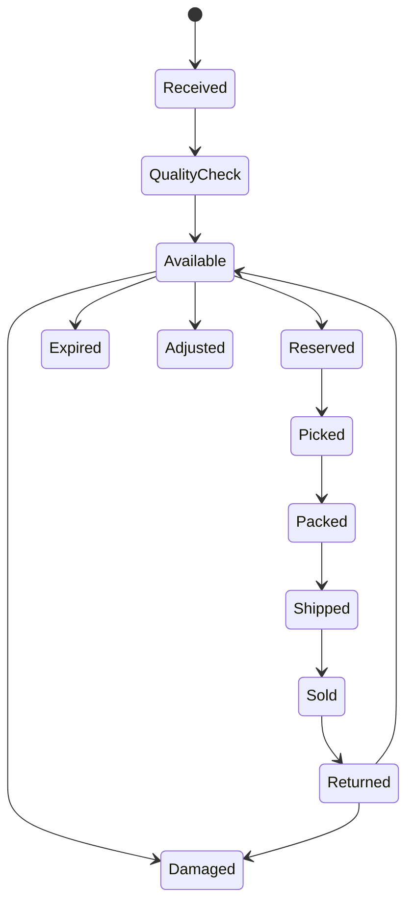
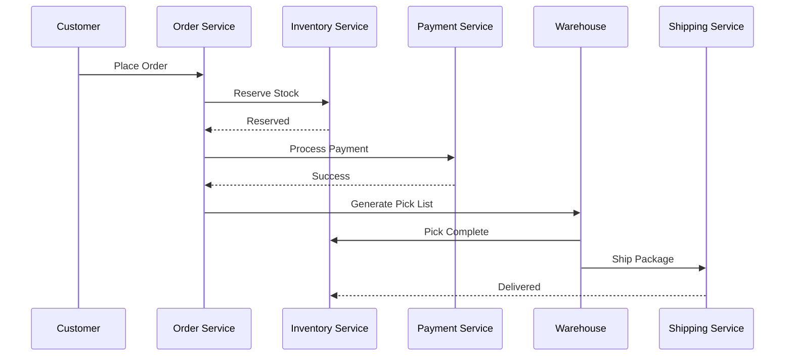

# Inventory Flow

**Module:** Inventory Management

**Version:** 1.0

**Owner:** Inventory & Warehouse Team

---

# Overview

The Inventory Flow manages the complete lifecycle of product inventory from the moment stock enters the warehouse until it is sold, reserved, shipped, returned, adjusted, or disposed.

The Inventory Service is responsible for maintaining accurate stock levels across multiple warehouses while preventing overselling and ensuring high availability.

Inventory should always be event-driven and eventually consistent across all dependent services.

---

# Business Objectives

- Maintain accurate stock levels
- Prevent overselling
- Support multiple warehouses
- Enable real-time inventory visibility
- Automatically reserve inventory during checkout
- Handle stock adjustments
- Support returns and damaged goods
- Generate inventory analytics

---

# Inventory Concepts

## Physical Stock

Actual quantity available in warehouse.

Example

```
iPhone 16 Pro

Warehouse A

100 Units
```

---

## Reserved Stock

Stock reserved for orders awaiting payment.

```
Physical Stock = 100

Reserved = 15

Available = 85
```

---

## Available Stock

Stock available for purchase.

```
Available = Physical - Reserved
```

---

## Damaged Stock

Items that cannot be sold.

---

## Returned Stock

Returned items awaiting inspection.

---

## Quarantined Stock

Products blocked due to quality issues.

---

# Inventory Lifecycle

```text
Stock Received

↓

Quality Check

↓

Available

↓

Reserved

↓

Picked

↓

Packed

↓

Shipped

↓

Delivered

↓

Sold
```

Alternative flows

```text
Returned

Damaged

Lost

Expired

Disposed

Adjusted
```

---

# Inventory State Machine



---

# Inventory Workflow

## Step 1

Supplier delivers products.

Inventory Status

```
RECEIVED
```

---

## Step 2

Warehouse performs quality inspection.

Possible outcomes

- Approved
- Rejected
- Damaged

---

## Step 3

Approved stock becomes

```
AVAILABLE
```

Products become searchable.

---

## Step 4

Customer places order.

Inventory Service receives

```
Reserve Inventory Request
```

---

## Step 5

Inventory validates

- SKU Exists
- Warehouse Exists
- Stock Available

---

## Step 6

Inventory reserved.

```
Available --

Reserved ++
```

---

## Step 7

Payment successful.

Inventory reservation confirmed.

---

## Step 8

Warehouse receives Pick List.

Inventory becomes

```
PICKING
```

---

## Step 9

Warehouse picks products.

Inventory

```
Reserved --

Picked ++
```

---

## Step 10

Package packed.

Status

```
PACKED
```

---

## Step 11

Courier picks shipment.

Inventory deducted permanently.

```
Physical --

```

---

## Step 12

Order delivered.

Inventory transaction completed.

---

# Sequence Diagram



---

# Business Rules

## Rule 1

Inventory must be reserved before payment.

---

## Rule 2

Reservation expires after

```
15 Minutes
```

if payment fails.

---

## Rule 3

Reserved inventory cannot be purchased by another customer.

---

## Rule 4

Inventory updates must be atomic.

---

## Rule 5

Negative inventory is never allowed.

---

## Rule 6

Every inventory movement must generate an audit record.

---

# Inventory Transactions

| Transaction | Effect |
|--------------|--------|
| Purchase | Increase |
| Sale | Decrease |
| Reservation | Reserve Stock |
| Reservation Expired | Release Stock |
| Return | Increase |
| Damage | Decrease |
| Transfer | Move Between Warehouses |
| Adjustment | Increase/Decrease |

---

# Stock Formula

```text
Available Stock

=

Physical Stock

-

Reserved Stock

-

Damaged Stock

```

---

# APIs

## Get Inventory

```
GET /inventory/{sku}
```

---

## Reserve Inventory

```
POST /inventory/reserve
```

---

## Release Reservation

```
POST /inventory/release
```

---

## Update Inventory

```
PATCH /inventory
```

---

## Transfer Inventory

```
POST /inventory/transfer
```

---

## Stock Adjustment

```
POST /inventory/adjustment
```

---

# Database

## Inventory

| Column | Description |
|----------|------------|
| inventory_id | UUID |
| sku | Product SKU |
| warehouse_id | Warehouse |
| physical_stock | Quantity |
| reserved_stock | Quantity |
| available_stock | Quantity |
| damaged_stock | Quantity |
| updated_at | Timestamp |

---

## Inventory Transaction

| Column | Description |
|----------|------------|
| transaction_id | UUID |
| inventory_id | Inventory Reference |
| type | SALE / PURCHASE / RETURN |
| quantity | Quantity |
| order_id | Order Reference |
| warehouse_id | Warehouse |
| created_at | Timestamp |

---

# Kafka Events

| Topic | Producer | Consumer |
|----------|----------|----------|
| inventory.received | Inventory | Analytics |
| inventory.updated | Inventory | Search |
| inventory.reserved | Inventory | Order |
| inventory.released | Inventory | Order |
| inventory.adjusted | Inventory | Analytics |
| inventory.low_stock | Inventory | Notification |
| inventory.out_of_stock | Inventory | Catalog |

---

# Multi-Warehouse Strategy

Priority

1. Nearest warehouse

2. Highest stock

3. Lowest shipping cost

4. Fastest delivery SLA

5. Warehouse priority score

---

# Reservation Flow

```text
Order Created

↓

Reserve Inventory

↓

Payment Success?

Yes

↓

Confirm Reservation

↓

Warehouse Pick

↓

Deduct Stock

No

↓

Release Reservation
```

---

# Return Flow

```text
Customer Return

↓

Warehouse Inspection

↓

Approved?

↓

Yes

↓

Inventory++

↓

Available

No

↓

Damaged Inventory
```

---

# Inventory Adjustment

Reasons

- Physical Count Difference
- Damaged Goods
- Theft
- Supplier Correction
- Manual Admin Adjustment
- Warehouse Error

Approval Required

- Supervisor
- Inventory Manager

---

# Failure Handling

## Reservation Failed

Return

```
OUT_OF_STOCK
```

---

## Warehouse Offline

Allocate inventory from another warehouse.

---

## Inventory Mismatch

Trigger recount.

---

## Duplicate Reservation

Ignore duplicate request.

---

## Inventory Service Down

Retry using Kafka.

---

# Monitoring Metrics

- Available Stock
- Reserved Stock
- Damaged Stock
- Inventory Accuracy
- Stock Turnover Ratio
- Reservation Time
- Inventory Update Latency
- Warehouse Utilization
- Low Stock Count
- Out of Stock Count

---

# Alerts

Generate alerts when

- Stock below threshold
- Inventory mismatch
- Reservation failures
- Warehouse offline
- Negative inventory detected
- High adjustment frequency
- SKU unavailable

---

# Security

- RBAC
- Inventory Audit Logs
- Supervisor Approval
- Warehouse Authorization
- Immutable Inventory Transactions
- Encrypted APIs

---

# Audit Log

Capture

- Reservation Created
- Reservation Released
- Stock Updated
- Stock Adjusted
- Warehouse Transfer
- Inventory Count
- Manual Override

Each log includes

- User
- Timestamp
- Warehouse
- SKU
- Previous Quantity
- Updated Quantity
- Reason

---

# Edge Cases

- Customer orders last available item
- Payment succeeds after reservation expires
- Multiple customers reserve same SKU
- Warehouse goes offline
- Split inventory across warehouses
- Product recalled
- Damaged item discovered during picking
- Inventory mismatch after shipment
- Duplicate reservation requests
- Concurrent inventory updates

---

# SLA

| Operation | SLA |
|------------|-----|
| Inventory Lookup | <100 ms |
| Reservation | <500 ms |
| Release Reservation | <500 ms |
| Stock Update | <1 sec |
| Warehouse Sync | <5 sec |

---

# Acceptance Criteria

- Inventory reserved successfully
- No overselling occurs
- Reservation expires automatically
- Warehouse receives pick request
- Inventory deducted after shipment
- Returns increase inventory
- Adjustments audited
- Kafka events published
- Inventory visible in real time
- Reports updated automatically

---

# Future Enhancements

- AI-based demand forecasting
- Dynamic stock allocation
- RFID integration
- IoT warehouse sensors
- Automated replenishment
- Smart warehouse routing
- Inventory heat maps
- Multi-region inventory balancing
- Predictive stock optimization
- Autonomous warehouse robots

---