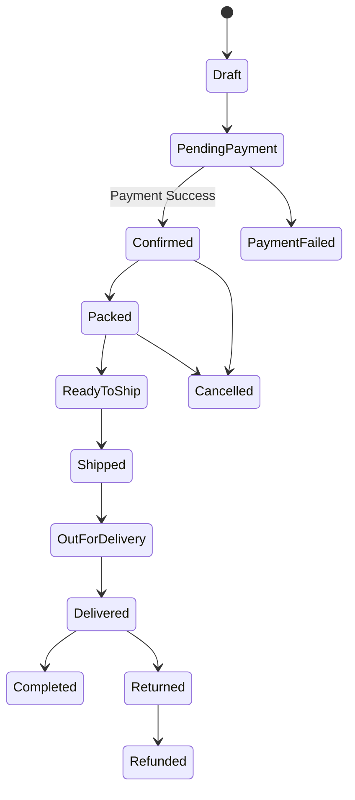
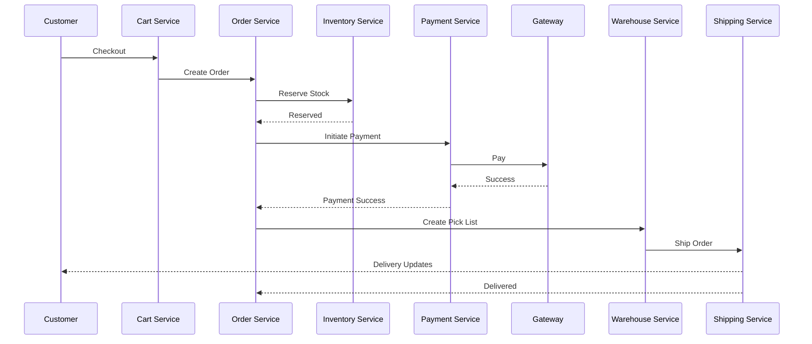

# Order Lifecycle

**Module:** Order Management

**Version:** 1.0

**Owner:** Product Team

---

# Overview

The Order Lifecycle defines the end-to-end journey of an order from the moment a customer clicks **Place Order** until the order is delivered, returned, refunded, or cancelled.

The objective is to ensure a scalable, event-driven, fault-tolerant order processing workflow that supports millions of orders per day.

---

# Business Objective

The order lifecycle should:

- Allow customers to place orders seamlessly.
- Reserve inventory before payment completion.
- Process payments securely.
- Generate invoices.
- Notify warehouses.
- Ship products.
- Deliver orders.
- Handle cancellations, returns, and refunds.
- Maintain complete audit history.

---

# Actors

| Actor | Responsibility |
|---------|---------------|
| Customer | Places order |
| Order Service | Creates and manages orders |
| Inventory Service | Reserves inventory |
| Payment Service | Handles payment |
| Warehouse Service | Packs items |
| Shipping Service | Ships order |
| Notification Service | Sends notifications |
| Analytics Service | Tracks events |
| Admin | Manage orders |

---

# Order States

```text
Draft

↓

Pending Payment

↓

Payment Successful

↓

Inventory Reserved

↓

Confirmed

↓

Packed

↓

Ready To Ship

↓

Shipped

↓

Out For Delivery

↓

Delivered

↓

Completed
```

Alternative states

```text
Cancelled

Refunded

Returned

Failed

Payment Failed

Inventory Failed
```

---

# State Machine



---

# Workflow

## Step 1

Customer adds products into cart.

Output

- Cart Created

---

## Step 2

Customer clicks Checkout.

System performs

- Coupon validation
- Price calculation
- Tax calculation
- Shipping calculation

---

## Step 3

Customer chooses

- Address
- Shipping method
- Payment method

---

## Step 4

Order Service creates

Status

```
PENDING_PAYMENT
```

---

## Step 5

Inventory Service reserves stock.

If unavailable

```
OUT_OF_STOCK
```

Order fails.

---

## Step 6

Payment Gateway processes payment.

Possible outcomes

- Success
- Failure
- Timeout
- Cancelled

---

## Step 7

On successful payment

Order becomes

```
CONFIRMED
```

---

## Step 8

Invoice generated.

---

## Step 9

Warehouse receives order.

---

## Step 10

Warehouse packs products.

Status

```
PACKED
```

---

## Step 11

Shipping partner assigned.

Status

```
READY_TO_SHIP
```

---

## Step 12

Courier picks package.

Status

```
SHIPPED
```

---

## Step 13

Tracking updates.

Status

```
OUT_FOR_DELIVERY
```

---

## Step 14

Package delivered.

Status

```
DELIVERED
```

---

## Step 15

After return period expires

Status

```
COMPLETED
```

---

# Sequence Diagram



---

# Business Rules

## Order ID

Every order must have globally unique Order ID.

Example

```
ORD-2026-000001245
```

---

## Inventory

Inventory must be reserved before payment confirmation.

---

## Payment

Payment timeout

```
15 minutes
```

---

## Cancellation

Customer may cancel until

```
Packed
```

After packing

Approval required.

---

## Invoice

Invoice generated only after payment success.

---

## Notifications

Customer notified

- Order Placed
- Payment Success
- Packed
- Shipped
- Out For Delivery
- Delivered

---

# Kafka Events

| Topic | Producer | Consumer |
|----------|--------------|----------------|
| order.created | Order | Inventory |
| inventory.reserved | Inventory | Payment |
| payment.completed | Payment | Order |
| order.confirmed | Order | Warehouse |
| order.packed | Warehouse | Shipping |
| shipment.created | Shipping | Notification |
| order.delivered | Shipping | Analytics |

---

# APIs

## Create Order

```
POST /orders
```

---

## Get Order

```
GET /orders/{id}
```

---

## Cancel Order

```
POST /orders/{id}/cancel
```

---

## Update Status

```
PATCH /orders/{id}/status
```

---

## Order History

```
GET /customers/{id}/orders
```

---

# Database

## Order

```
order_id

customer_id

status

payment_status

shipping_status

total_amount

discount

tax

created_at

updated_at
```

---

## Order Item

```
order_item_id

order_id

product_id

quantity

price
```

---

# Exception Scenarios

## Payment Failed

Action

Cancel reservation.

---

## Inventory Failed

Return

```
OUT_OF_STOCK
```

---

## Shipping Failed

Retry shipment assignment.

---

## Warehouse Failure

Move order to another warehouse.

---

## Duplicate Payment Callback

Ignore duplicate callback.

---

## Customer Closed Browser

Order remains

```
Pending Payment
```

for

15 minutes.

---

# Edge Cases

- Payment succeeds but callback delayed
- Customer retries payment
- Inventory released accidentally
- Product discontinued after order
- Warehouse unavailable
- Shipping partner unavailable
- Partial shipment
- Split shipment
- Multiple warehouses
- Address changed after payment
- Fraud detection triggered

---

# SLA

| Stage | SLA |
|----------|---------|
| Payment | <30 sec |
| Inventory Reservation | <2 sec |
| Order Creation | <1 sec |
| Packing | <24 hrs |
| Shipping Assignment | <30 mins |
| Delivery | Based on SLA |

---

# Audit Log

Store

- User
- Timestamp
- Previous Status
- New Status
- IP Address
- Device
- Admin Changes

---

# Security

- JWT Authentication
- RBAC
- Signed Payment Callbacks
- Idempotent APIs
- Audit Logging
- PCI DSS Compliance

---

# KPIs

- Orders per Minute
- Payment Success Rate
- Average Processing Time
- Cancellation Rate
- Return Rate
- Delivery Success Rate
- Average Delivery Time

---

# Acceptance Criteria

- Order created successfully.
- Inventory reserved.
- Payment captured.
- Invoice generated.
- Warehouse notified.
- Shipment created.
- Customer receives notifications.
- Analytics updated.
- Audit logs recorded.
- Order reaches Completed state.

---

# Future Enhancements

- Split Orders
- Partial Deliveries
- Marketplace Orders
- Subscription Orders
- AI Fraud Detection
- Smart Warehouse Selection
- Dynamic Shipping Cost
- Same-Day Delivery
- Drone Delivery
- Hyperlocal Fulfillment

