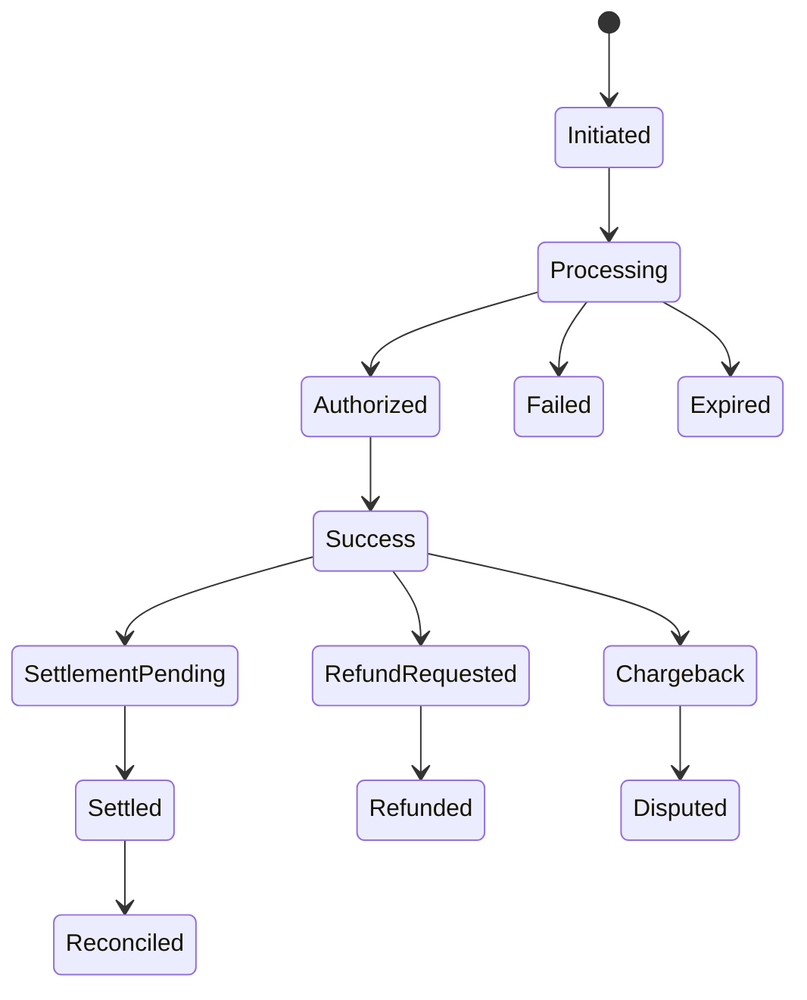
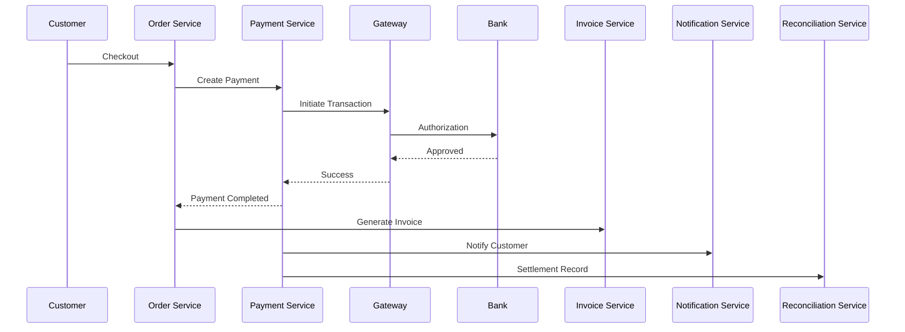

# Payment Flow

**Module:** Payment Service

**Version:** 1.0

**Owner:** Finance & Payments Team

---

# Overview

The Payment Flow defines the end-to-end lifecycle of a customer's payment from the moment they initiate payment until the amount is settled into the merchant's bank account.

The payment service acts as an orchestration layer between the Order Service, Payment Gateway, Bank, Wallets, UPI, Credit/Debit Cards, and the Reconciliation Service.

The service must support:
- Multiple payment methods
- Secure transactions
- High availability
- Idempotency
- Retry handling
- Fraud detection
- Refunds
- Partial payments
- Settlement tracking

---

# Business Objectives

- Enable secure online payments
- Support multiple payment methods
- Ensure payment reliability
- Prevent duplicate payments
- Handle payment failures gracefully
- Enable automated reconciliation
- Support refunds and partial refunds

---

# Supported Payment Methods

| Payment Type | Supported |
|--------------|-----------|
| UPI | ✅ |
| Credit Card | ✅ |
| Debit Card | ✅ |
| Net Banking | ✅ |
| Wallet | ✅ |
| Gift Card | ✅ |
| EMI | ✅ |
| Cash on Delivery | ✅ |
| Buy Now Pay Later | Future |
| Cryptocurrency | Future |

---

# Actors

| Actor | Responsibility |
|---------|---------------|
| Customer | Initiates payment |
| Order Service | Creates payment request |
| Payment Service | Orchestrates payment |
| Payment Gateway | Processes payment |
| Bank | Authorizes payment |
| Fraud Service | Detects suspicious activity |
| Notification Service | Sends payment updates |
| Reconciliation Service | Verifies settlement |
| Finance Team | Reviews payment issues |

---

# Payment Lifecycle

```text
Payment Initiated

↓

Gateway Selected

↓

Authorization

↓

Payment Processing

↓

Payment Success

↓

Order Confirmed

↓

Invoice Generated

↓

Settlement Pending

↓

Settlement Completed

↓

Reconciled
```

Alternative states

```text
Payment Failed

Cancelled

Expired

Refund Pending

Refunded

Chargeback

Disputed
```

---

# State Machine



---

# Payment Workflow

## Step 1

Customer clicks **Pay Now**.

---

## Step 2

Order Service sends payment request.

```
POST /payments
```

Payment Service creates

```
Payment Status = INITIATED
```

---

## Step 3

Payment Service validates

- Order Exists
- Customer Exists
- Amount
- Currency
- Order Status

---

## Step 4

Payment Gateway selected.

Example

```
Razorpay

Stripe

Adyen

PayU
```

Selection criteria

- Success rate
- Region
- Cost
- Failover rules

---

## Step 5

Customer completes payment.

Possible outcomes

- Success
- Failure
- Timeout
- User Cancelled

---

## Step 6

Gateway authorizes transaction.

```
AUTHORIZED
```

---

## Step 7

Gateway sends callback (Webhook)

Payment Service verifies

- Signature
- Amount
- Order ID
- Transaction ID

---

## Step 8

Payment becomes

```
SUCCESS
```

---

## Step 9

Publish event

```
payment.completed
```

---

## Step 10

Order Service confirms order.

---

## Step 11

Invoice generated.

---

## Step 12

Settlement starts.

---

## Step 13

Bank transfers funds.

```
SETTLED
```

---

## Sequence Diagram



---

# Business Rules

## Rule 1

Each order can have only one successful payment.

---

## Rule 2

Duplicate gateway callbacks must be ignored.

---

## Rule 3

Payment amount cannot exceed order amount.

---

## Rule 4

Payment expires after

```
15 Minutes
```

---

## Rule 5

Gateway callback is the source of truth.

---

## Rule 6

Payment status must never be updated manually.

Only Finance Admins can override.

---

# Payment Status

| Status | Description |
|----------|------------|
| INITIATED | Payment request created |
| PROCESSING | Payment in progress |
| AUTHORIZED | Bank approved |
| SUCCESS | Payment completed |
| FAILED | Payment failed |
| EXPIRED | Session expired |
| CANCELLED | Customer cancelled |
| REFUND_PENDING | Refund initiated |
| REFUNDED | Refund completed |
| CHARGEBACK | Chargeback received |
| SETTLED | Merchant received money |
| RECONCILED | Verified with bank |

---

# APIs

## Create Payment

```
POST /payments
```

---

## Get Payment

```
GET /payments/{paymentId}
```

---

## Payment Callback

```
POST /payments/webhook
```

---

## Refund

```
POST /payments/{paymentId}/refund
```

---

## Settlement Status

```
GET /payments/{paymentId}/settlement
```

---

# Database

## Payment

| Column | Description |
|----------|------------|
| payment_id | UUID |
| order_id | Order Reference |
| customer_id | Customer |
| amount | Total Amount |
| currency | INR |
| gateway | Razorpay |
| transaction_id | Gateway Transaction |
| status | Payment Status |
| created_at | Timestamp |
| updated_at | Timestamp |

---

## Refund

| Column | Description |
|----------|------------|
| refund_id | UUID |
| payment_id | Reference |
| amount | Refund Amount |
| reason | Refund Reason |
| status | Refund Status |

---

# Kafka Events

| Topic | Producer | Consumer |
|---------|----------|----------|
| payment.created | Payment | Analytics |
| payment.processing | Payment | Analytics |
| payment.completed | Payment | Order |
| payment.failed | Payment | Notification |
| payment.refunded | Payment | Order |
| settlement.completed | Payment | Reconciliation |

---

# Failure Handling

## Gateway Timeout

Retry

Maximum

```
3 Times
```

---

## Duplicate Callback

Ignore

Return

```
HTTP 200
```

---

## Callback Signature Invalid

Reject

Log security event.

---

## Bank Timeout

Keep

```
PROCESSING
```

Retry status check.

---

## Gateway Down

Switch to backup gateway.

---

# Refund Flow

```text
Customer Requests Refund

↓

Validate Eligibility

↓

Refund Approved

↓

Gateway Refund API

↓

Bank Processes Refund

↓

Refund Completed

↓

Customer Notified
```

---

# Chargeback Flow

```text
Customer Raises Dispute

↓

Gateway Notifies Merchant

↓

Finance Review

↓

Evidence Submission

↓

Bank Decision

↓

Won / Lost
```

---

# Fraud Checks

Before payment

Validate

- Device Fingerprint
- IP Address
- Velocity Checks
- Blacklisted Cards
- High Risk Countries
- Multiple Failed Attempts
- Suspicious Email
- BIN Validation

---

# Security

- PCI DSS
- TLS 1.3
- Tokenized Cards
- No CVV Storage
- Webhook Signature Validation
- JWT Authentication
- OAuth Support
- Encryption at Rest
- Encryption in Transit
- HMAC Verification

---

# SLAs

| Operation | SLA |
|------------|-----|
| Payment Creation | <1 sec |
| Gateway Response | <30 sec |
| Callback Processing | <5 sec |
| Refund Initiation | <30 sec |
| Settlement Update | Daily |

---

# Monitoring Metrics

- Payment Success Rate
- Payment Failure Rate
- Average Payment Time
- Gateway Response Time
- Refund Count
- Refund Time
- Chargeback Rate
- Settlement Delay
- Duplicate Callback Count
- Fraud Detection Count

---

# Audit Log

Capture

- Payment Created
- Payment Updated
- Gateway Callback
- Refund Initiated
- Refund Completed
- Manual Override
- Chargeback Received
- Settlement Completed

Each log should include

- User
- Timestamp
- Previous Status
- New Status
- IP Address
- Device
- Request ID

---

# Edge Cases

- Customer refreshes payment page
- Customer pays twice
- Gateway callback delayed
- Gateway callback received multiple times
- Settlement delayed
- Partial refund
- Multiple refunds
- Bank outage
- Network interruption
- Currency mismatch
- Duplicate transaction IDs
- Payment succeeds but order confirmation fails

---

# Acceptance Criteria

- Payment request created successfully
- Gateway selected automatically
- Payment processed securely
- Duplicate callbacks ignored
- Order confirmed after successful payment
- Invoice generated
- Settlement tracked
- Refunds processed correctly
- Audit logs generated
- Kafka events published successfully

---

# Future Enhancements

- Multi-currency support
- Smart gateway routing using AI
- One-click payments
- Tokenized recurring payments
- Buy Now Pay Later (BNPL)
- Split payments
- Subscription billing
- International payment gateways
- AI-powered fraud detection
- Real-time settlement monitoring

---