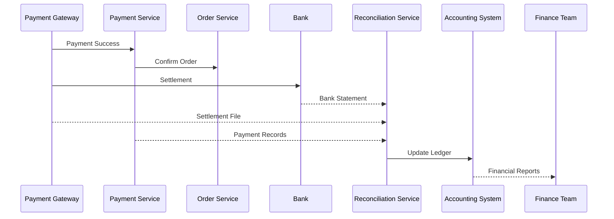

# Reconciliation Flow

**Module:** Financial Reconciliation

**Version:** 1.0

**Owner:** Finance & Accounting Team

---

# Overview

The Reconciliation Flow ensures that every financial transaction processed by the platform is accurately matched across all participating systems.

The primary objective is to verify that:

- Customer payments are received successfully.
- Payment Gateway records match platform records.
- Bank settlements are correct.
- Refunds are processed accurately.
- Chargebacks are tracked.
- Financial reports remain accurate.

Reconciliation acts as the final financial validation layer of the e-commerce platform.

---

# Business Objectives

- Ensure financial accuracy
- Detect payment mismatches
- Prevent revenue leakage
- Automate settlement verification
- Track refunds and chargebacks
- Simplify finance operations
- Generate reconciliation reports

---

# Systems Involved

| System | Responsibility |
|---------|---------------|
| Order Service | Order information |
| Payment Service | Payment transactions |
| Payment Gateway | Payment processing |
| Bank | Merchant settlements |
| Refund Service | Refund processing |
| Accounting System | Ledger posting |
| Reconciliation Service | Matching transactions |
| Analytics Service | Financial dashboards |

---

# Reconciliation Lifecycle

```text
Order Completed
        │
        ▼
Payment Captured
        │
        ▼
Settlement Received
        │
        ▼
Transaction Matching
        │
        ▼
Exception Detection
        │
        ▼
Manual Review (If Needed)
        │
        ▼
Ledger Update
        │
        ▼
Reconciliation Completed
```

Alternative paths

```text
Settlement Missing

Duplicate Settlement

Refund Pending

Chargeback

Manual Adjustment
```

---

# Types of Reconciliation

## Payment Reconciliation

Compare

Platform Payment

↓

Payment Gateway

↓

Bank Settlement

---

## Refund Reconciliation

Compare

Refund Requested

↓

Gateway Refund

↓

Bank Debit

↓

Customer Credit

---

## Settlement Reconciliation

Verify

Gateway Settlement

↓

Merchant Bank Account

↓

Accounting Ledger

---

## Order Reconciliation

Verify

Order Amount

↓

Discount

↓

Tax

↓

Shipping

↓

Final Payment

---

# Reconciliation Workflow

## Step 1

Order completed.

Payment Service publishes

```
payment.completed
```

---

## Step 2

Gateway sends settlement file.

Example

```
Settlement Date

Settlement Amount

Gateway Fee

Tax

Reference Number
```

---

## Step 3

Bank credits merchant account.

Status

```
SETTLED
```

---

## Step 4

Reconciliation Service imports

- Settlement File
- Bank Statement
- Payment Records

---

## Step 5

Transaction Matching

Matching Criteria

- Order ID
- Payment ID
- Gateway Transaction ID
- Settlement ID
- Amount
- Currency

---

## Step 6

Validation

Verify

- Amount
- Currency
- Gateway Fees
- Taxes
- Settlement Date

---

## Step 7

Exceptions

Detect

- Missing Settlement
- Duplicate Settlement
- Incorrect Amount
- Duplicate Payment
- Refund Mismatch
- Chargeback
- Currency Mismatch

---

## Step 8

Manual Review

Finance Team reviews exceptions.

Possible actions

- Approve
- Reject
- Correct
- Escalate

---

## Step 9

Ledger Posting

Accounting system updated.

```
Revenue

Gateway Fees

Taxes

Refunds

Net Settlement
```

---

## Step 10

Reconciliation Completed.

Status

```
RECONCILED
```

---

# Sequence Diagram



---

# Business Rules

## Rule 1

Every successful payment must have exactly one settlement.

---

## Rule 2

Settlement amount must equal

```
Payment Amount

-

Gateway Fee

-

Tax
```

---

## Rule 3

Refunds must be reconciled separately.

---

## Rule 4

Duplicate settlements are rejected.

---

## Rule 5

Chargebacks remain open until resolved.

---

## Rule 6

Manual adjustments require Finance Manager approval.

---

# Reconciliation Status

| Status | Description |
|----------|------------|
| PENDING | Waiting for settlement |
| MATCHED | Records matched |
| UNMATCHED | Missing transaction |
| EXCEPTION | Manual review required |
| RECONCILED | Successfully completed |
| FAILED | Reconciliation failed |

---

# APIs

## Upload Settlement File

```
POST /reconciliation/settlements
```

---

## Upload Bank Statement

```
POST /reconciliation/bank-statement
```

---

## Get Reconciliation Status

```
GET /reconciliation/{id}
```

---

## Resolve Exception

```
POST /reconciliation/{id}/resolve
```

---

## Generate Report

```
GET /reconciliation/report
```

---

# Database

## Reconciliation

| Column | Description |
|----------|------------|
| reconciliation_id | UUID |
| payment_id | Payment Reference |
| settlement_id | Settlement Reference |
| bank_reference | Bank Transaction |
| status | Current Status |
| matched_amount | Amount |
| created_at | Timestamp |

---

## Reconciliation Exception

| Column | Description |
|----------|------------|
| exception_id | UUID |
| reconciliation_id | Parent Record |
| type | Exception Type |
| description | Details |
| resolved | Boolean |

---

# Kafka Events

| Topic | Producer | Consumer |
|---------|----------|----------|
| settlement.received | Payment Service | Reconciliation |
| reconciliation.started | Reconciliation | Analytics |
| reconciliation.completed | Reconciliation | Accounting |
| reconciliation.failed | Reconciliation | Notification |
| refund.reconciled | Reconciliation | Finance |
| chargeback.received | Payment Service | Finance |

---

# Exception Types

| Exception | Resolution |
|------------|------------|
| Missing Settlement | Verify gateway |
| Duplicate Settlement | Ignore duplicate |
| Incorrect Amount | Manual review |
| Currency Mismatch | Finance approval |
| Refund Mismatch | Recalculate |
| Chargeback | Investigation |
| Settlement Delay | Wait or escalate |

---

# Settlement Formula

```text
Net Settlement

=

Payment Amount

-

Gateway Charges

-

GST

-

Refunds

+

Adjustments
```

---

# Chargeback Workflow

```text
Customer Raises Dispute

↓

Payment Gateway

↓

Merchant Notification

↓

Evidence Submission

↓

Bank Review

↓

Won / Lost

↓

Ledger Updated
```

---

# Refund Reconciliation

```text
Refund Requested

↓

Gateway Refund

↓

Bank Debit

↓

Customer Credit

↓

Reconciled
```

---

# Failure Handling

## Settlement File Missing

Retry import.

Notify Finance Team.

---

## Bank Statement Delayed

Retry every hour.

---

## Duplicate Upload

Reject duplicate file.

---

## Ledger Update Failure

Retry 3 times.

Raise alert.

---

## Gateway Downtime

Pause reconciliation until settlement available.

---

# Monitoring Metrics

- Total Payments
- Total Settlements
- Matched Transactions
- Unmatched Transactions
- Reconciliation Success Rate
- Refund Reconciliation Rate
- Settlement Delay
- Chargeback Count
- Exception Count
- Revenue Leakage

---

# Alerts

Trigger alerts when

- Settlement delayed > 24 hours
- Exception count exceeds threshold
- Chargeback received
- Large refund processed
- Duplicate settlement detected
- Missing settlement file
- Ledger synchronization failure

---

# Security

- RBAC for Finance Team
- Audit Logging
- Encrypted Settlement Files
- Secure File Transfer (SFTP/API)
- Immutable Financial Records
- Digital Signature Validation
- Least Privilege Access

---

# Audit Log

Track

- Settlement Imported
- Bank Statement Uploaded
- Reconciliation Started
- Exception Created
- Exception Resolved
- Ledger Updated
- Manual Adjustment
- Report Generated

Each record includes

- User
- Timestamp
- Payment ID
- Settlement ID
- Previous Status
- New Status
- Remarks

---

# Financial Reports

Generate

- Daily Settlement Report
- Gateway Fee Report
- Refund Report
- Chargeback Report
- Revenue Report
- Tax Report
- Ledger Summary
- Exception Report

Supported Formats

- PDF
- Excel
- CSV

---

# Edge Cases

- Partial settlement
- Multiple settlements for one payment
- Duplicate bank credit
- Settlement received after refund
- Gateway fee changes
- Currency conversion differences
- Settlement spanning multiple business days
- Chargeback after reconciliation
- Manual ledger correction
- Failed accounting synchronization

---

# SLA

| Operation | SLA |
|------------|-----|
| Settlement Import | <10 min |
| Bank Statement Processing | <15 min |
| Transaction Matching | <5 min |
| Exception Detection | Real-time |
| Ledger Update | <5 min |
| Report Generation | <2 min |

---

# KPIs

- Reconciliation Success Rate
- Settlement Accuracy
- Exception Resolution Time
- Refund Accuracy
- Chargeback Ratio
- Revenue Leakage
- Manual Intervention Rate
- Financial Reporting Accuracy

---

# Acceptance Criteria

- Settlement file imported successfully
- Bank statement processed
- Payments matched correctly
- Refunds reconciled
- Chargebacks tracked
- Exceptions identified
- Ledger updated
- Financial reports generated
- Kafka events published
- Audit logs maintained

---

# Future Enhancements

- AI-powered anomaly detection
- Automatic exception resolution
- Real-time bank APIs
- Multi-currency reconciliation
- Blockchain-based audit trail
- Predictive settlement forecasting
- Automated financial compliance checks
- ERP integration (SAP, Oracle, NetSuite)
- Machine Learning for fraud and chargeback prediction

---