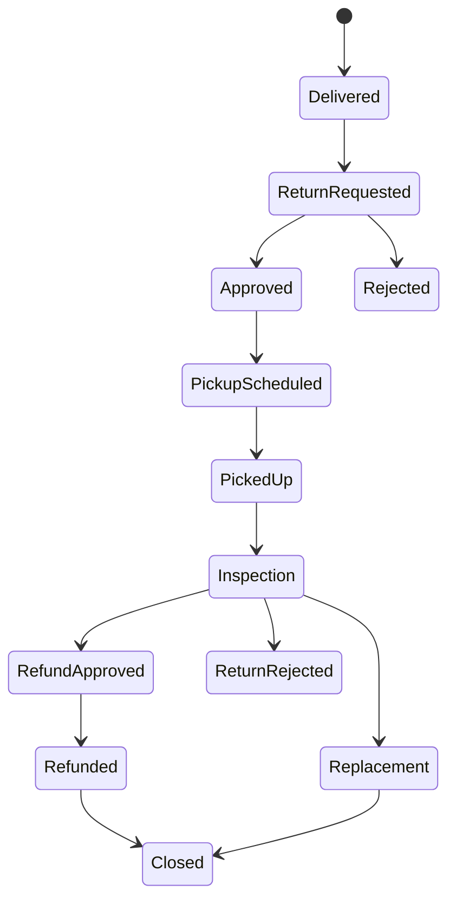
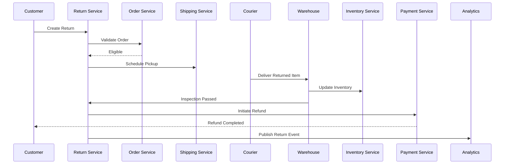

# Return Flow

**Module:** Return Management (RMA)

**Version:** 1.0

**Owner:** Customer Experience & Reverse Logistics Team

---

# Overview

The Return Flow defines the end-to-end lifecycle of a product return after it has been delivered to the customer. It includes return request creation, eligibility validation, pickup scheduling, warehouse inspection, inventory updates, refund processing, and reconciliation.

The Return Management Service integrates with:

- Order Service
- Inventory Service
- Warehouse Service
- Payment Service
- Shipping Service
- Notification Service
- Reconciliation Service
- Analytics Service

The objective is to provide a seamless return experience while preventing fraud and ensuring inventory accuracy.

---

# Business Objectives

- Simplify product returns
- Prevent fraudulent returns
- Automate return approvals
- Reduce return processing time
- Support partial returns
- Enable real-time refund tracking
- Maintain complete audit history

---

# Return Types

| Return Type | Description |
|-------------|-------------|
| Standard Return | Customer no longer wants the product |
| Damaged Product | Product damaged during delivery |
| Wrong Product | Incorrect SKU delivered |
| Missing Item | Order incomplete |
| Defective Product | Manufacturing defect |
| Exchange Request | Replace with another item |
| Replacement | Same product replacement |

---

# Actors

| Actor | Responsibility |
|--------|---------------|
| Customer | Creates return request |
| Customer Support | Manual approvals |
| Return Service | Orchestrates workflow |
| Warehouse | Inspects returned product |
| Inventory Service | Updates stock |
| Payment Service | Processes refund |
| Courier | Picks up return |
| Analytics | Tracks return metrics |

---

# Return Lifecycle

```text
Delivered

↓

Return Requested

↓

Eligibility Validation

↓

Approved

↓

Pickup Scheduled

↓

Product Picked Up

↓

Warehouse Inspection

↓

Approved

↓

Inventory Updated

↓

Refund Initiated

↓

Refund Completed

↓

Return Closed
```

Alternative states

```text
Rejected

Cancelled

Expired

Replacement Initiated

Exchange Completed
```

---

# State Machine



---

# Return Workflow

## Step 1 – Customer Creates Return Request

Customer selects

- Order
- Product
- Quantity
- Return Reason

Examples

- Damaged
- Wrong Product
- Doesn't Fit
- Quality Issue
- Missing Parts

Status

```
RETURN_REQUESTED
```

---

## Step 2 – Eligibility Validation

System validates

- Order Delivered
- Return Window
- Product Category
- Return Policy
- Previous Returns
- Fraud Score

Example

```text
Return Window

7 Days

Electronics

10 Days

Fashion

30 Days
```

If not eligible

```
RETURN_REJECTED
```

---

## Step 3 – Return Approval

Approval types

Automatic

- Low-value products
- Policy-compliant returns

Manual

- High-value products
- Fraud suspected
- Multiple previous returns

Status

```
RETURN_APPROVED
```

---

## Step 4 – Pickup Scheduling

Shipping Service schedules pickup.

Customer receives

- Pickup Date
- Pickup Time
- Courier Details

Status

```
PICKUP_SCHEDULED
```

---

## Step 5 – Pickup

Courier verifies

- Product
- Barcode
- IMEI (Electronics)
- Serial Number
- Accessories

Status

```
PICKED_UP
```

---

## Step 6 – Warehouse Inspection

Warehouse verifies

- Product Condition
- Accessories
- Packaging
- Serial Number
- Damage
- Usage

Possible outcomes

Approved

Rejected

Replacement

Partial Refund

---

## Step 7 – Inventory Update

If approved

Inventory becomes

```
Available ++
```

If damaged

```
Damaged Inventory ++
```

---

## Step 8 – Refund Processing

Payment Service starts refund.

Status

```
REFUND_PENDING
```

---

## Step 9 – Refund Completed

Customer notified.

Status

```
REFUNDED
```

---

## Step 10 – Return Closed

Status

```
CLOSED
```

---

# Sequence Diagram



---

# Business Rules

## Rule 1

Only delivered orders can be returned.

---

## Rule 2

Return request must be within policy window.

---

## Rule 3

Opened software licenses cannot be returned.

---

## Rule 4

Gift cards are non-returnable.

---

## Rule 5

Digital products cannot be returned.

---

## Rule 6

Products failing inspection are rejected.

---

## Rule 7

Refund begins only after warehouse approval.

---

# APIs

## Create Return

```
POST /returns
```

---

## Get Return

```
GET /returns/{returnId}
```

---

## Cancel Return

```
POST /returns/{returnId}/cancel
```

---

## Schedule Pickup

```
POST /returns/{returnId}/pickup
```

---

## Complete Inspection

```
POST /returns/{returnId}/inspection
```

---

## Initiate Refund

```
POST /returns/{returnId}/refund
```

---

# Database

## Return Request

| Column | Description |
|----------|------------|
| return_id | UUID |
| order_id | Order Reference |
| customer_id | Customer |
| reason | Return Reason |
| status | Current Status |
| pickup_date | Scheduled Pickup |
| created_at | Timestamp |

---

## Return Item

| Column | Description |
|----------|------------|
| return_item_id | UUID |
| return_id | Return Reference |
| sku | Product SKU |
| quantity | Quantity |
| inspection_status | PASS / FAIL |

---

# Kafka Events

| Topic | Producer | Consumer |
|---------|----------|----------|
| return.created | Return Service | Analytics |
| return.approved | Return Service | Shipping |
| return.picked | Shipping | Warehouse |
| return.inspected | Warehouse | Payment |
| inventory.restocked | Inventory | Catalog |
| refund.completed | Payment | Notification |

---

# Inspection Rules

## Pass

- Product matches order
- Accessories present
- No physical damage
- Serial number matches

---

## Fail

- Wrong product
- Broken seal (non-returnable)
- Missing accessories
- Heavy physical damage
- Fraud suspected

---

# Refund Decision Matrix

| Inspection Result | Refund |
|-------------------|--------|
| Perfect Condition | 100% |
| Minor Damage | Partial |
| Wrong Product | 100% |
| Missing Accessories | Partial |
| Fraud Detected | Rejected |

---

# Failure Handling

## Customer Misses Pickup

Reschedule once.

---

## Courier Unable to Reach

Retry within 24 hours.

---

## Warehouse Rejects Return

Notify customer.

Ship product back if applicable.

---

## Refund Failure

Retry 3 times.

Escalate to Finance Team.

---

# Notifications

Customer notified when

- Return Created
- Return Approved
- Pickup Scheduled
- Pickup Completed
- Inspection Completed
- Refund Initiated
- Refund Completed
- Return Rejected

---

# Monitoring Metrics

- Return Requests
- Return Approval Rate
- Return Rejection Rate
- Average Inspection Time
- Refund Processing Time
- Pickup Success Rate
- Fraudulent Return Rate
- Return Cost
- Exchange Rate

---

# Security

- Customer Authentication
- Return Policy Validation
- Fraud Detection
- Audit Logging
- Serial Number Verification
- Barcode Verification

---

# Audit Log

Track

- Return Created
- Approval
- Pickup
- Inspection
- Refund
- Manual Override
- Cancellation

Each record includes

- User
- Timestamp
- Order ID
- Return ID
- Previous Status
- New Status
- Device
- IP Address

---

# Edge Cases

- Partial return
- Multiple returns for same order
- Return after refund
- Wrong item returned
- Missing accessories
- Courier loses package
- Product damaged during return shipping
- Exchange requested after pickup
- Return window expires during transit
- Fraudulent repeated returns

---

# SLA

| Operation | SLA |
|------------|-----|
| Return Validation | <2 sec |
| Auto Approval | <1 min |
| Pickup Scheduling | <4 hrs |
| Warehouse Inspection | <24 hrs |
| Refund Initiation | <30 min |
| Refund Completion | 3–7 Business Days |

---

# KPIs

- Return Rate
- Return Approval %
- Refund Turnaround Time
- Inspection Accuracy
- Fraud Detection Rate
- Customer Satisfaction
- Reverse Logistics Cost
- Exchange Ratio

---

# Acceptance Criteria

- Customer can request return
- Eligibility validated automatically
- Pickup scheduled successfully
- Warehouse inspection completed
- Inventory updated correctly
- Refund processed successfully
- Notifications sent
- Kafka events published
- Audit logs maintained
- Return lifecycle completed successfully

---

# Future Enhancements

- AI-powered fraud detection
- Image-based return validation
- Self-service return kiosks
- Instant refunds for trusted customers
- Smart reverse logistics routing
- QR-code based paperless returns
- Automated warehouse inspection using Computer Vision
- Sustainability reporting for returned products

---