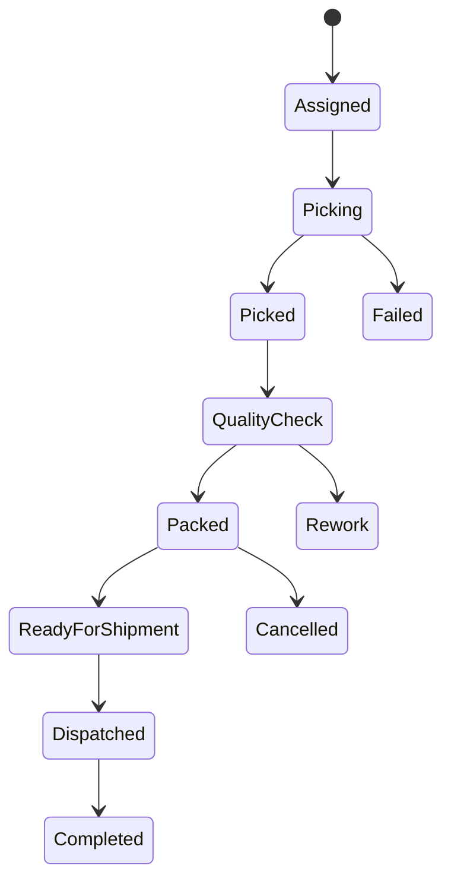
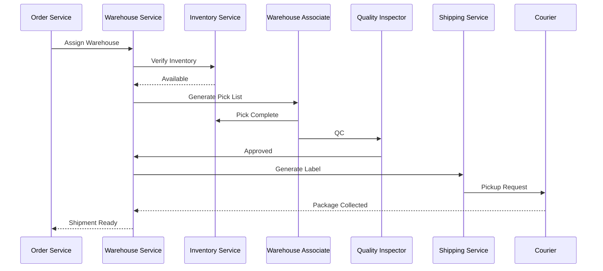

# Warehouse Flow

**Module:** Warehouse Management

**Version:** 1.0

**Owner:** Warehouse Operations Team

---

# Overview

The Warehouse Flow manages the complete lifecycle of order fulfillment inside the warehouse after an order is confirmed. It includes inventory allocation, picking, packing, quality inspection, shipping handoff, inventory adjustments, and exception handling.

The Warehouse Service integrates with:

- Inventory Service
- Order Service
- Shipping Service
- Notification Service
- Analytics Service
- Reconciliation Service

The primary objective is to fulfill customer orders accurately and efficiently while minimizing operational costs and ensuring inventory integrity.

---

# Business Objectives

- Fulfill orders accurately
- Minimize picking and packing time
- Prevent shipping incorrect items
- Support multiple warehouses
- Enable warehouse automation
- Maintain complete audit logs
- Improve warehouse productivity

---

# Warehouse Lifecycle

```text
Order Confirmed
        │
        ▼
Warehouse Assigned
        │
        ▼
Pick List Generated
        │
        ▼
Items Picked
        │
        ▼
Quality Check
        │
        ▼
Items Packed
        │
        ▼
Shipping Label Generated
        │
        ▼
Courier Pickup
        │
        ▼
Shipment Dispatched
```

Alternative flows

```text
Out of Stock

Picking Failed

Quality Check Failed

Package Damaged

Courier Rejected

Order Cancelled
```

---

# Actors

| Actor | Responsibility |
|---------|---------------|
| Warehouse Service | Fulfillment orchestration |
| Warehouse Associate | Picking items |
| Packing Associate | Packing |
| Quality Inspector | Quality validation |
| Shipping Service | Courier assignment |
| Inventory Service | Inventory updates |
| Order Service | Order status |
| Customer | Receives order |

---

# Warehouse State Machine



---

# Workflow

## Step 1 – Warehouse Assignment

Once payment is successful, the Order Service requests the Warehouse Service to allocate a fulfillment center.

Selection criteria:

- Product availability
- Nearest warehouse
- Delivery SLA
- Warehouse workload
- Shipping cost

Status

```
WAREHOUSE_ASSIGNED
```

---

## Step 2 – Pick List Generation

Warehouse Service generates a digital Pick List.

Example

```
Order

ORD-10001234

Items

SKU-1001 x2

SKU-1034 x1

SKU-8900 x4
```

Status

```
PICKING
```

---

## Step 3 – Picking

Warehouse associate scans every product barcode.

Validation

- Correct SKU
- Correct Quantity
- Correct Batch
- Correct Expiry Date

If validation fails

```
PICK_FAILED
```

---

## Step 4 – Inventory Update

Inventory Service updates

```
Reserved --

Picked ++
```

Inventory Transaction

```
PICK
```

---

## Step 5 – Quality Inspection

Every item undergoes quality verification.

Checks

- Correct Product
- Packaging Condition
- Manufacturing Date
- Expiry Date
- Physical Damage
- Accessories Included

If failed

```
QUALITY_FAILED
```

Items returned to inventory or marked damaged.

---

## Step 6 – Packing

Items are packed using predefined packaging rules.

Examples

Electronics

→ Bubble Wrap

Glass

→ Foam Protection

Books

→ Corrugated Box

Food

→ Insulated Packaging

Status

```
PACKED
```

---

## Step 7 – Shipping Label Generation

Shipping Service generates

- Shipping Label
- Tracking Number
- QR Code
- Barcode

Status

```
READY_FOR_SHIPMENT
```

---

## Step 8 – Courier Pickup

Courier scans package.

Warehouse validates

- Tracking ID
- Package Weight
- Destination
- Courier

Status

```
DISPATCHED
```

---

## Step 9 – Inventory Deduction

Inventory Service permanently deducts stock.

```
Physical Stock --

Picked Stock --
```

Inventory transaction

```
SALE
```

---

## Step 10 – Order Update

Order Service updates

```
SHIPPED
```

Customer receives notification.

---

# Sequence Diagram



---

# Business Rules

## Rule 1

Warehouse assignment must occur within

```
5 Minutes
```

after payment.

---

## Rule 2

Every picked item must be barcode scanned.

---

## Rule 3

Products failing quality inspection cannot be shipped.

---

## Rule 4

Inventory must only be deducted after courier pickup.

---

## Rule 5

Every package must have one unique tracking number.

---

## Rule 6

Packing slip must be generated before shipment.

---

# Warehouse Zones

Example

```
Receiving

↓

Storage

↓

Picking Zone

↓

Packing Zone

↓

Quality Check

↓

Dispatch Area
```

---

# APIs

## Assign Warehouse

```
POST /warehouse/assign
```

---

## Generate Pick List

```
POST /warehouse/pick-list
```

---

## Update Picking Status

```
PATCH /warehouse/picking
```

---

## Complete Packing

```
POST /warehouse/packing
```

---

## Dispatch Shipment

```
POST /warehouse/dispatch
```

---

# Database

## Warehouse

| Column | Description |
|----------|------------|
| warehouse_id | UUID |
| name | Warehouse Name |
| city | City |
| capacity | Maximum Capacity |
| active | Status |

---

## Pick List

| Column | Description |
|----------|------------|
| pick_id | UUID |
| order_id | Order |
| warehouse_id | Warehouse |
| picker_id | Employee |
| status | Picking Status |

---

## Shipment

| Column | Description |
|----------|------------|
| shipment_id | UUID |
| order_id | Order |
| tracking_number | Courier Tracking |
| courier | Courier Partner |
| shipped_at | Timestamp |

---

# Kafka Events

| Topic | Producer | Consumer |
|---------|----------|----------|
| warehouse.assigned | Warehouse | Analytics |
| picking.started | Warehouse | Analytics |
| picking.completed | Warehouse | Inventory |
| quality.completed | Warehouse | Order |
| package.packed | Warehouse | Shipping |
| shipment.dispatched | Warehouse | Notification |

---

# Exception Handling

## Warehouse Offline

Allocate another warehouse.

---

## Product Missing

Trigger inventory recount.

---

## Wrong Product Picked

Reject picking.

Generate new Pick List.

---

## Package Damaged

Repack order.

---

## Courier Doesn't Arrive

Reassign courier.

---

## Warehouse Capacity Full

Allocate overflow warehouse.

---

# Monitoring Metrics

- Orders Picked per Hour
- Packing Time
- Picking Accuracy
- Warehouse Utilization
- Average Dispatch Time
- QC Failure Rate
- Dispatch Delay
- Courier Pickup Delay
- Warehouse Throughput
- Employee Productivity

---

# Alerts

Raise alerts for

- Warehouse offline
- Picking delays
- QC failures
- Dispatch delays
- Inventory mismatch
- Courier SLA breach
- Capacity > 90%
- Package damaged

---

# Security

- Warehouse RBAC
- Employee Authentication
- Barcode Validation
- Audit Logging
- CCTV Integration (Future)
- Device Authentication

---

# Audit Log

Track

- Warehouse Assignment
- Pick Started
- Pick Completed
- QC Completed
- Package Packed
- Shipping Label Generated
- Courier Pickup
- Manual Overrides

Each record includes

- Employee
- Timestamp
- Warehouse
- Order ID
- Action
- Device
- IP Address

---

# Edge Cases

- Product located in multiple bins
- Order split across warehouses
- Picker scans incorrect SKU
- Package exceeds courier weight limit
- Courier rejects package
- Customer cancels after packing
- Warehouse loses connectivity
- Barcode unreadable
- Package damaged during packing
- Inventory mismatch during picking

---

# Warehouse KPIs

- Picking Accuracy > 99.8%
- Packing Accuracy > 99.9%
- Average Pick Time
- Average Pack Time
- Orders Fulfilled per Hour
- Dispatch SLA
- Warehouse Utilization
- Employee Productivity
- Inventory Accuracy
- QC Pass Rate

---

# SLA

| Operation | SLA |
|------------|-----|
| Warehouse Assignment | <5 min |
| Pick List Generation | <30 sec |
| Picking | <20 min |
| Quality Check | <5 min |
| Packing | <10 min |
| Dispatch | <30 min |

---

# Acceptance Criteria

- Warehouse assigned automatically
- Pick List generated correctly
- All items barcode validated
- Inventory synchronized
- QC completed successfully
- Packing completed
- Shipping label generated
- Courier pickup confirmed
- Shipment dispatched
- Customer notified
- Audit logs recorded
- Kafka events published

---

# Future Enhancements

- AI Warehouse Allocation
- Robotic Picking Systems
- RFID-based Inventory Tracking
- Automated Conveyor Systems
- Smart Packaging Recommendation
- IoT Warehouse Sensors
- Computer Vision for Quality Inspection
- Drone Inventory Counting
- Voice-guided Picking
- Digital Twin Warehouse Monitoring

---