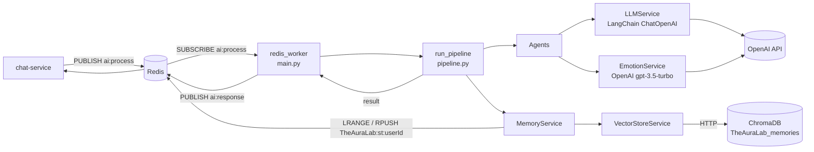
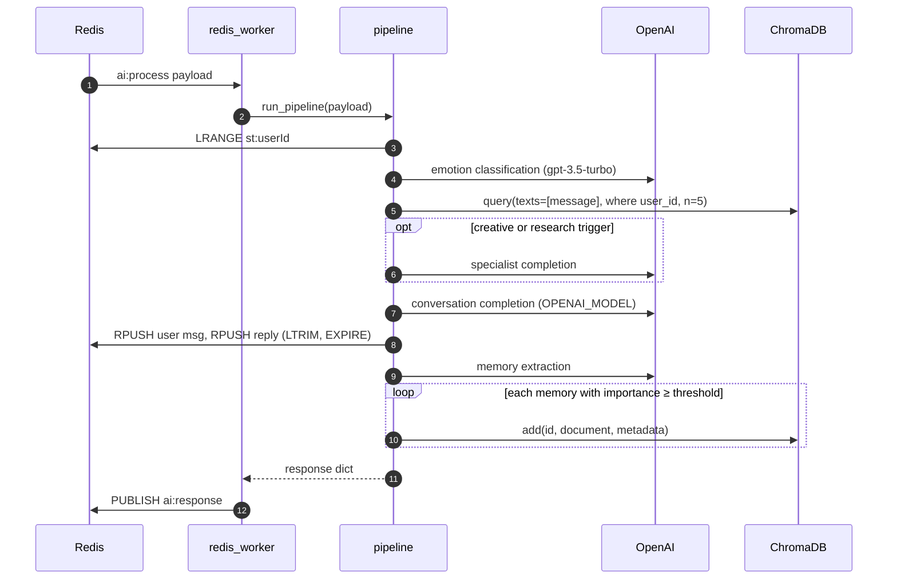

# ai-service

> The companion's "brain": a Python worker that consumes chat messages from Redis, runs a multi-agent pipeline (emotion detection, memory retrieval, wellness, research, creative and conversation agents) and publishes the reply.
> [← Service index](../README.md) · Product spec: [docs/modules/ai-chat-agent.md](../../docs/modules/ai-chat-agent.md)

| | |
|---|---|
| **Stack** | Python 3.11, FastAPI, uvicorn, redis-py (asyncio), LangChain + OpenAI, ChromaDB client |
| **Port** | `3000` (exposes only `GET /health`) |
| **Gateway route** | `/api/ai/health` → `/health` |
| **Inputs** | Redis channel `TheAuraLab:ai:process` |
| **Outputs** | Redis channel `TheAuraLab:ai:response` |
| **State** | Redis key `TheAuraLab:st:{userId}` (short-term memory, shared with memory-service); ChromaDB collection `TheAuraLab_memories` |
| **External** | OpenAI API (`OPENAI_MODEL` for chat and extraction; `gpt-3.5-turbo` for emotion detection) |
| **Database** | none. This service doesn't touch Postgres. |

---

## 1. Responsibilities

- Listen on `TheAuraLab:ai:process` for user messages that chat-service publishes.
- Build context from short-term history in Redis, semantically relevant memories in ChromaDB, the detected emotion and an empathy hint.
- Generate a personality-aware reply with the LLM, or hand off to the creative or research agents.
- Attach wellness suggestions when the user seems distressed.
- Extract important facts from the exchange and store them as vector memories in ChromaDB.
- Publish the reply to `TheAuraLab:ai:response` for chat-service to deliver.
- On any pipeline failure, publish a friendly fallback reply instead of nothing.

---

## 2. High-Level Design



- **Process model.** One uvicorn worker. The FastAPI `lifespan` starts `redis_worker()` as a background asyncio task, so the HTTP server exists only for health checks.
- **Concurrency.** Messages are processed **one at a time** in the `async for` loop, so a slow LLM call blocks every user. The ChromaDB client is synchronous and blocks the event loop.
- **Embeddings** are computed by ChromaDB's default embedding function, which runs on the Chroma server. OpenAI isn't used for embeddings.

---

## 3. Low-Level Design

```text
ai-service/
├── main.py            # FastAPI app, lifespan, redis_worker, GET /health
├── config.py          # pydantic-settings Settings (env and .env)
├── pipeline.py        # run_pipeline(payload): orchestrates agents
├── agents/
│   ├── conversation_agent.py  # main LLM reply (respond / stream_respond)
│   ├── emotion_agent.py       # emotion analysis + empathy hints
│   ├── memory_agent.py        # LLM fact extraction → candidate memories
│   ├── wellness_agent.py      # distress detection + suggestions
│   ├── research_agent.py      # factual Q&A via LLM (no web search)
│   ├── creative_agent.py      # stories, poems, brainstorming, lyrics
│   └── orchestrator.py        # intentionally empty (legacy)
└── services/
    ├── llm_service.py         # personality prompts, ChatOpenAI wrapper
    ├── emotion_service.py     # OpenAI emotion classifier + mappings
    ├── memory_service.py      # Redis short-term + Chroma retrieval
    ├── vector_store.py        # ChromaDB HttpClient wrapper
    └── voice_service.py       # Whisper STT / gTTS + OpenAI TTS (not wired in)
```

### 3.1 Pipeline steps (`pipeline.run_pipeline`)

| # | Step | Component | Details |
|---|---|---|---|
| 1 | Load history | `MemoryService.get_short_term` | `LRANGE TheAuraLab:st:{userId}` |
| 2 | Detect emotion | `EmotionAgent.analyze` → `EmotionService.detect` | `gpt-3.5-turbo`, temperature 0.1, JSON output. Falls back to `neutral` with confidence 0.5. |
| 3 | Retrieve memories | `MemoryService.retrieve_relevant` → `VectorStoreService.search_memories` | Top 5 by cosine distance, filtered by `user_id`, formatted as `- [emotion] text` |
| 4 | Empathy hint | `EmotionAgent.get_empathy_hint` | Appended to the memories as `Empathy note: …` |
| 5 | Wellness | `WellnessAgent.should_activate` / `get_suggestions` | Activates when the emotion is sadness, fear, anxiety or anger, or the message contains a trigger word. Adds up to 2 suggestions. |
| 6 | Specialist agent | `CreativeAgent` (checked first), then `ResearchAgent` | Keyword-triggered. Their output **replaces** the conversation reply. |
| 7 | Generate reply | `ConversationAgent.respond` → `LLMService.complete` | System prompt = personality prompt + base context (date, username, memories); keeps the last 20 history messages. **This runs even when step 6 produced content.** |
| 8 | Save short-term | `MemoryService.save_short_term` ×2 | Saves the user message and the reply. `LTRIM` keeps the last 50, and the TTL is `SHORT_TERM_MEMORY_TTL`. |
| 9 | Extract long-term | `MemoryAgent.extract_memories` → `VectorStoreService.add_memory` | The LLM returns a JSON array. Candidates need importance ≥ 0.5, then ≥ `MEMORY_IMPORTANCE_THRESHOLD` (0.6) to be stored in Chroma. |
| 10 | Return | – | Response dict (see [Interfaces](#4-interfaces)) |

### 3.2 Agents

| Agent | Triggers | Behavior |
|---|---|---|
| `ConversationAgent` | always | `llm_service.complete(...)`; a `stream_respond` method also exists but isn't used |
| `EmotionAgent` | always | Emotion plus an avatar expression; keeps a history of the last 10, though a new agent instance is created for every message |
| `MemoryAgent` | always | Extraction prompt; `should_store` (word overlap > 0.8 means duplicate) isn't used |
| `WellnessAgent` | negative emotion, or words like *stressed, anxious, overwhelmed, sad, lonely, burned out, panic, can't sleep…* | Static suggestions per emotion; the LLM-based `generate_support` isn't used |
| `CreativeAgent` | *write a story, poem, haiku, brainstorm, imagine, what if, song lyrics…* | Detects the type (poetry, story, brainstorm, lyrics or general) and generates with type-specific guidance |
| `ResearchAgent` | *what is, who is, how does, explain, latest, news about…* | Answers from LLM knowledge only; there's **no web search** |

### 3.3 Personalities (`LLMService.PERSONALITY_PROMPTS`)

The companion is called **Sora**. The archetypes are `friend` (the default and the fallback), `mentor`, `coach`, `creator` and `assistant`, matching `companion-service`. The chat model uses `temperature=0.85` and `max_tokens=1024`.

### 3.4 Emotion mappings (`EmotionService`)

| Emotion | Avatar | Color | Emoji |
|---|---|---|---|
| joy | happy | `#FFD700` | 😊 |
| love | happy | `#FF69B4` | 💕 |
| surprise | surprised | `#FF8C00` | 😮 |
| sadness | sad | `#4169E1` | 😢 |
| anger | upset | `#DC143C` | 😠 |
| fear | worried | `#9932CC` | 😨 |
| anxiety | worried | `#708090` | 😰 |
| neutral | idle | `#9E9E9E` | 😐 |

---

## 4. Interfaces

### HTTP

| Method | Path | Response |
|---|---|---|
| GET | `/health` | `{ "status": "ok", "service": "ai-service" }`. This is a liveness check only; it doesn't check Redis, Chroma or OpenAI. |

### Redis input: `TheAuraLab:ai:process`

```json
{ "userId": "uuid", "messageId": "client-msg-id", "content": "I'm so stressed about exams",
  "conversationId": "uuid", "username": "jane_d", "personality": "friend" }
```

### Redis output: `TheAuraLab:ai:response`

```json
{
  "userId": "uuid",
  "messageId": "new-uuid",
  "content": "That sounds like a lot to carry…",
  "emotion": "anxiety",
  "avatarExpression": "worried",
  "memoryUpdates": ["Jane has exams next week"],
  "suggestions": ["Try a breathing exercise", "Ground yourself with the 5-4-3-2-1 technique"],
  "conversationId": "uuid"
}
```

`messageId` is a **new** UUID, not the client's `messageId`. On failure the reply is `"I'm having a moment — could you say that again? 🌸"` with emotion `neutral` and avatar `idle`.

---

## 5. Data model

The service has no relational tables.

**ChromaDB collection `TheAuraLab_memories`** (`hnsw:space = cosine`)

| Field | Value |
|---|---|
| `id` | random UUID (`embedding_id`) |
| `document` | memory text, for example *"Jane has exams next week"* |
| `metadata.user_id` | user UUID (used as the query filter) |
| `metadata.emotion_tag` | emotion from extraction, or the detected emotion |
| `metadata.importance_score` | stored as a **string**, for example `"0.8"` |
| `metadata.conversation_id` | UUID or `""` |

**Redis**

| Key or channel | Type | Usage |
|---|---|---|
| `TheAuraLab:st:{userId}` | LIST of JSON `{role, content}` | Read and write; at most 50 entries; TTL `SHORT_TERM_MEMORY_TTL` |
| `TheAuraLab:ai:process` | pub/sub | Subscribe |
| `TheAuraLab:ai:response` | pub/sub | Publish |

---

## 6. Flows



Each message makes **three to four OpenAI calls**: emotion, the optional specialist, conversation and extraction.

---

## 7. Configuration

Settings are loaded by `pydantic-settings` from the environment or a `.env` file.

| Variable | Default | Purpose |
|---|---|---|
| `OPENAI_API_KEY` | `""` | OpenAI credentials. **Required** in practice; without it every reply is the fallback message. |
| `OPENAI_MODEL` | `gpt-4-turbo-preview` | Chat, specialist and extraction model |
| `REDIS_URL` | `redis://localhost:6379` | Pub/sub and short-term memory |
| `CHROMA_HOST` / `CHROMA_PORT` | `localhost` / `8000` | ChromaDB server |
| `MEMORY_SERVICE_URL` | `http://memory-service:3000` | Declared but **not used** |
| `SHORT_TERM_MEMORY_TTL` | `3600` | TTL in seconds for the short-term list |
| `MAX_SHORT_TERM_MESSAGES` | `50` | Declared, but the code hard-codes `MAX_SHORT = 50` |
| `MEMORY_IMPORTANCE_THRESHOLD` | `0.6` | Minimum importance to store a memory in Chroma |

---

## 8. Run, build and test

```bash
cd services/ai-service
python3.11 -m venv .venv && . .venv/bin/activate
pip install -r requirements.txt
export OPENAI_API_KEY=… REDIS_URL=redis://localhost:6379 CHROMA_HOST=localhost
uvicorn main:app --port 3000

# simulate chat-service
redis-cli SUBSCRIBE TheAuraLab:ai:response &
redis-cli PUBLISH TheAuraLab:ai:process '{"userId":"u1","messageId":"m1","content":"hi","username":"jane","personality":"friend"}'
```

The Docker image is multi-stage, runs as the non-root `app` user and has a built-in `HEALTHCHECK`.

**Quality:** `npm run quality` at the repository root runs `python3 -m compileall` over this service. **Tests:** none exist yet.

---

## 9. Known limitations and follow-ups

- **Delivery isn't durable.** Redis pub/sub drops messages while the worker is down, and there are no retries and no dead-letter queue.
- **No horizontal scaling.** Every replica receives every message, so running two replicas sends duplicate replies. Use Redis Streams with consumer groups or a work queue.
- Processing is sequential, and the synchronous Chroma calls block the event loop. Each OpenAI call has no explicit timeout.
- The specialist output replaces the conversation reply, but the conversation LLM call still runs. That's a wasted call.
- Research triggers are broad (`what is`, `explain`), so ordinary chat often skips the personality prompt.
- **AI-extracted memories never reach memory-service's Postgres table** (`memory_service_url` is unused), so analytics and the memory UI don't see them.
- The emotion model `gpt-3.5-turbo` is hard-coded.
- `voice_service.py`, `stream_respond`, `generate_support`, `should_store` and the heuristic emotion detector are unused.
- `memory_service.py` builds a second `MemoryService` and `VectorStoreService` singleton (a module-level `memory_service`, imported by `MemoryAgent`) alongside the one in `pipeline.py`.
- The health check doesn't verify dependencies.
- Prompt injection: user text is placed straight into the specialist and extraction prompts.
- There are no tests.
