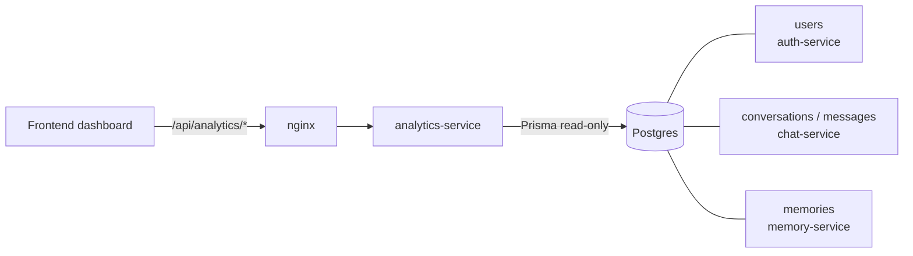
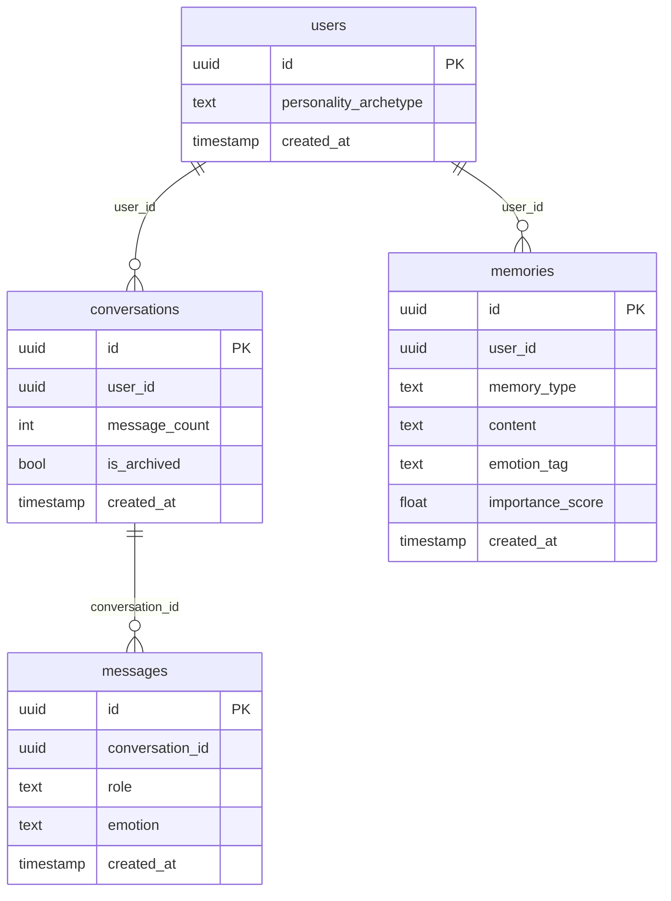
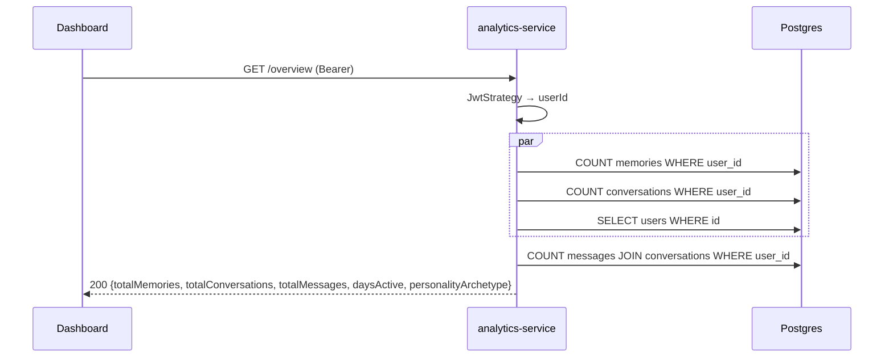

# analytics-service

> Read-only dashboard statistics: activity overview, emotion trends, conversation metrics and memory statistics for the current user.
> [← Service index](../README.md)

| | |
|---|---|
| **Stack** | NestJS 10, Prisma 6, PostgreSQL |
| **Port** | `3000` |
| **Route prefix** | `/api/analytics` |
| **Gateway route** | `/api/analytics/*` |
| **Swagger** | `/api/analytics/docs` (not served when `NODE_ENV=production`) |
| **Owns tables** | none (read-only) |
| **Reads tables** | `users`, `conversations`, `messages`, `memories` |
| **Depends on** | PostgreSQL; the migrations of auth-service, chat-service and memory-service |

---

## 1. Responsibilities

Compute per-user aggregates on demand. Nothing is precomputed, cached or stored.

| Endpoint | Answers |
|---|---|
| `/overview` | How much has the user used the app? |
| `/emotions/trend` | How has the user felt over the last N days? |
| `/conversations/stats` | How often, and on which days, does the user chat? |
| `/memories/stats` | What kinds of memories exist, and which are the most important? |

---

## 2. High-Level Design



The Prisma schema in `prisma/schema.prisma` is a **read model**: a subset of the columns of tables owned by other services, with relations declared only so Prisma can join them. The service has no migrations, and it must never run `prisma migrate` or `db push`, because that would try to change other services' tables.

---

## 3. Low-Level Design

```text
src/
├── main.ts                  # prefix api/analytics, ValidationPipe, CORS, Swagger
├── app.module.ts            # Config, Passport, JwtModule; PrismaService, AnalyticsService, JwtStrategy
├── prisma.service.ts
├── jwt.strategy.ts
├── health.controller.ts     # public; SELECT 1 with a 2 s timeout, 503 when down
├── analytics.controller.ts  # class-level AuthGuard('jwt')
└── analytics.service.ts
```

### 3.1 Calculations (`AnalyticsService`)

| Method | Queries | Output and formulas |
|---|---|---|
| `overview(userId)` | `count(memories)`, `count(conversations)`, `findUnique(users)`, then `count(messages WHERE conversation.userId)` | `{ totalMemories, totalConversations, totalMessages, daysActive, personalityArchetype }`. `daysActive = max(1, floor((now − user.createdAt) / 1 day))`. |
| `emotionTrend(userId, days=7)` | memories with `createdAt ≥ now − days` | `{ periodDays, emotionCounts{emotion: n}, trend[{date, <emotion>: n}], dominantEmotion }`. Days are grouped by UTC `YYYY-MM-DD`. `dominantEmotion` defaults to `neutral`. |
| `conversationStats(userId)` | all of the user's conversations | `{ totalConversations, averageMessagesPerConversation (1 decimal place), mostActiveDay, archived }`. `mostActiveDay` uses the server's local weekday and defaults to `N/A`. |
| `memoryStats(userId)` | all of the user's memories | `{ total, byType, byEmotion, averageImportance (2 decimal places), topMemories[5]: {content[0:100], importance} }` |

Emotion trends come from `memories.emotion_tag`, **not** from message emotions, because `messages.emotion` is never filled in.

---

## 4. API

All paths are relative to `/api/analytics`, and **every route requires** `Authorization: Bearer <access token>`.

| Method | Path | Query | Success | Errors |
|---|---|---|---|---|
| GET | `/overview` | – | 200 overview | 401 |
| GET | `/emotions/trend` | `days` (default 7; not validated) | 200 trend | 401 |
| GET | `/conversations/stats` | – | 200 stats | 401 |
| GET | `/memories/stats` | – | 200 stats | 401 |
| GET | `/health` (public) | – | 200 `{ status: 'ok', service, checks: { database: 'up' } }`; 503 with the failed check marked `down` | – |

Example response from `GET /api/analytics/emotions/trend?days=3`:

```json
{
  "periodDays": 3,
  "emotionCounts": { "joy": 4, "anxiety": 1 },
  "trend": [ { "date": "2026-09-29", "joy": 2 }, { "date": "2026-09-30", "joy": 2, "anxiety": 1 } ],
  "dominantEmotion": "joy"
}
```

---

## 5. Data model (read model)



The real column definitions are in [auth-service](../auth-service/README.md#5-data-model), [chat-service](../chat-service/README.md#5-data-model) and [memory-service](../memory-service/README.md#5-data-model).

---

## 6. Flows



---

## 7. Configuration

| Variable | Required | Default | Purpose |
|---|---|---|---|
| `PORT` | no | `3000` | HTTP port |
| `DATABASE_URL` | yes | – | Postgres connection string (ideally a read-only role) |
| `JWT_SECRET` | yes | `changeme` | Verifies access tokens |
| `CORS_ORIGINS` | no | `http://localhost:3000` | Allowed origins |
| `NODE_ENV` | no | – | `production` hides Swagger |
| `REDIS_URL` | – | – | Passed in by compose but **not used** |

---

## 8. Run, build and test

```bash
cd services/analytics-service
npm install
npx prisma generate      # do NOT run migrate or db push
npm run start:dev
```

**Tests:** none exist yet.

---

## 9. Known limitations and follow-ups

- The numbers are misleading because of upstream gaps:
  - `averageMessagesPerConversation` is always 0, because chat-service never updates `message_count`.
  - `totalMessages` counts only user messages.
  - Emotion and memory stats exclude memories the AI extracts, because those live only in ChromaDB.
- `memoryStats` and `conversationStats` load **every row** for the user into memory. Use `groupBy` or aggregate queries instead.
- `days` isn't validated: a negative number or `NaN` produces odd results.
- `mostActiveDay` depends on the server's time zone, while `trend` dates use UTC.
- Querying other services' tables directly couples this service to their schemas. Consider events or read replicas.
- There are no tests.
