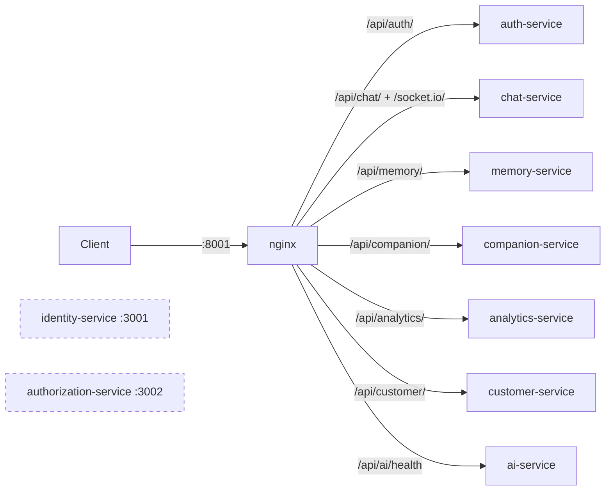
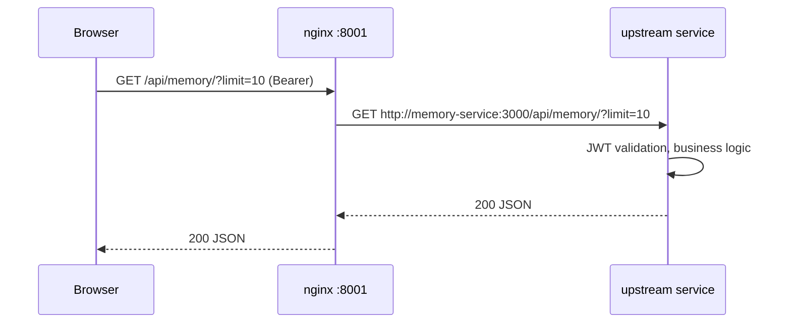

# api-gateway

> An nginx reverse proxy and the single public entry point (`:8001`) for REST and WebSocket traffic.
> [← Service index](../README.md)

| | |
|---|---|
| **Stack** | nginx 1.27-alpine |
| **Port** | `8001`, published to the host as `${API_GATEWAY_PORT:-8001}` |
| **Config** | [`nginx.conf`](nginx.conf), copied to `/etc/nginx/nginx.conf` at image build |
| **Networks** | `backend` (to the services), `edge` (public) |
| **Health** | `GET /health` → `{"status":"ok","service":"api-gateway"}` |

---

## 1. Responsibilities

- Route `/api/<service>/…` to the right upstream container.
- Proxy Socket.IO WebSocket upgrades to chat-service.
- Expose ai-service's health check.
- Report its own liveness.

It does **not** handle authentication, rate limiting, TLS termination, request IDs or CORS. Each service validates JWTs and handles CORS itself.

---

## 2. Routing table

| Public path | Upstream | Upstream path |
|---|---|---|
| `/api/auth/` | `auth-service:3000` | `/api/auth/` |
| `/api/chat/` | `chat-service:3000` | `/api/chat/` |
| `/socket.io/` | `chat-service:3000` | `/socket.io/` (HTTP/1.1, `Upgrade` and `Connection: upgrade`) |
| `/api/memory/` | `memory-service:3000` | `/api/memory/` |
| `/api/companion/` | `companion-service:3000` | `/api/companion/` |
| `/api/analytics/` | `analytics-service:3000` | `/api/analytics/` |
| `/api/customer/` | `customer-service:3000` | `/api/customer/` |
| `/api/ai/health` | `ai-service:3000` | `/health` |
| `/health` | – (answered by nginx itself) | – |

**Not routed:** `identity-service` (`:3001`) and `authorization-service` (`:3002`).

Each proxied location sets `Host` and `X-Real-IP`. The WebSocket location sets `Host` but not `X-Real-IP`.



---

## 3. Request flow



---

## 4. Run

```bash
docker compose up -d --build api-gateway   # starts the dependencies first
curl http://localhost:8001/health
```

To change the configuration, edit `nginx.conf` and rebuild the image, because the file is baked in rather than mounted. You can check the syntax with `docker run --rm -v "$PWD/nginx.conf:/etc/nginx/nginx.conf:ro" nginx:1.27-alpine nginx -t`. That check resolves upstream hostnames, so it reports "host not found" outside the compose network.

---

## 5. Known limitations and follow-ups

- **The `frontend` upstream is undefined.** `upstream frontend { server frontend:3000; }` is declared, but `docker-compose.yml` has no `frontend` service, and nginx refuses to start when it can't resolve an upstream host. Remove the block or add the frontend service.
- **Startup dependencies.** `depends_on` waits for chat, memory, companion and analytics to report healthy, but their health routes are behind JWT guards (see their READMEs), so the gateway may never start.
- identity-service and authorization-service aren't routed. Note too that `depends_on` lists them but not ai-service, which the gateway proxies to.
- There's no TLS, rate limiting, request-size limit, proxy timeouts, `X-Forwarded-For` or `X-Forwarded-Proto` header, request or correlation ID, gzip, or security headers.
- No authentication happens at the edge. Consider JWT validation in the gateway, and setting `x-identity-id` from the token for customer-service.
- The WebSocket location has no `proxy_read_timeout`, so the default of 60 seconds drops idle sockets. Socket.IO pings usually keep connections alive.
