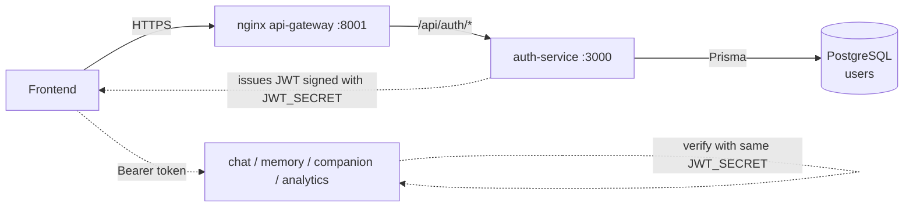
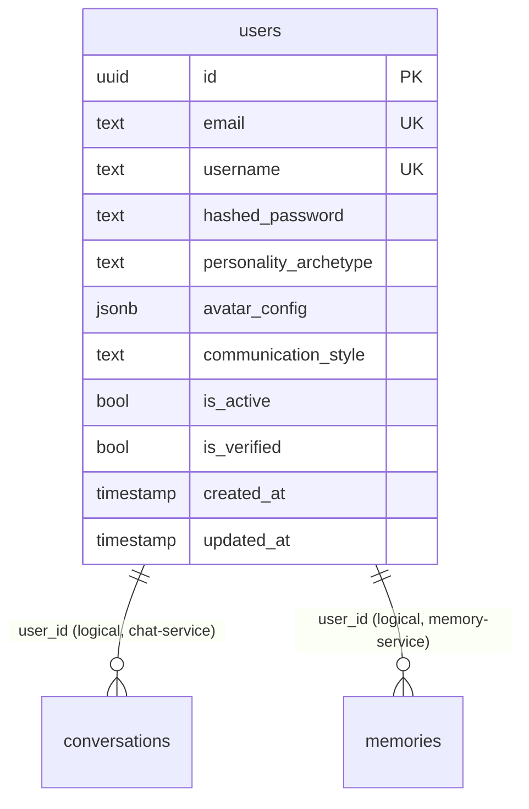
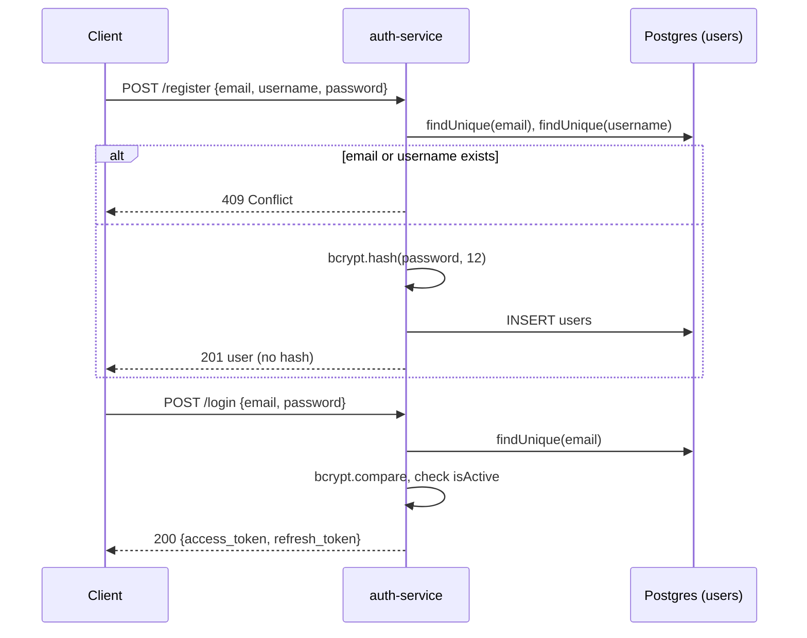
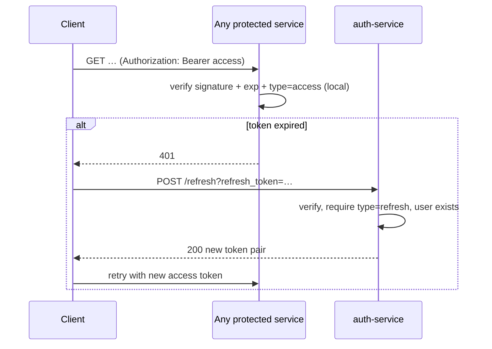

# auth-service

> User registration, login and JWT issuing for the TheAuraLab companion app.
> [← Service index](../README.md)

| | |
|---|---|
| **Stack** | NestJS 10, Prisma 6, PostgreSQL, Passport-JWT, bcryptjs |
| **Port** | `3000` |
| **Route prefix** | `/api/auth` |
| **Gateway route** | `http://<gateway>:8001/api/auth/*` |
| **Swagger** | `/api/auth/docs` (not served when `NODE_ENV=production`) |
| **Owns tables** | `users` |
| **Depends on** | PostgreSQL |
| **Used by** | Frontend; every service that validates JWTs (they share `JWT_SECRET`) |

---

## 1. Responsibilities

- Register users (email, username, password, personality archetype).
- Authenticate users and issue **access** and **refresh** JWTs.
- Exchange a refresh token for a new token pair.
- Return the current user's profile.
- Own the `users` table. `companion-service` and `analytics-service` also read it, and `companion-service` writes to it (see [Data model](#5-data-model)).

Out of scope: token revocation, email verification, password reset and social login. Identity lifecycle lives in [identity-service](../identity-service/README.md), which is not connected to this service yet.

---

## 2. High-Level Design



- **Stateless auth.** Other services never call auth-service. They verify JWTs locally with the shared `JWT_SECRET` and accept only tokens whose `type` is `access`.
- **Shared database.** The `users` table lives in the single shared Postgres database. Other services read it directly (see [services/README.md](../README.md#shared-database)).
- **Migrations** run on container start (`npx prisma migrate deploy`). Because this service creates `users`, the other services that depend on it wait for it to report healthy in `docker-compose.yml`.

---

## 3. Low-Level Design

```text
src/
├── main.ts                 # bootstrap: prefix api/auth, ValidationPipe, CORS, Swagger
├── app.module.ts           # ConfigModule (global), PrismaModule, AuthModule, HealthController
├── health/health.controller.ts # public; SELECT 1 with a 2 s timeout, 503 when down
├── prisma/
│   ├── prisma.module.ts    # @Global, exports PrismaService
│   └── prisma.service.ts   # PrismaClient with connect/disconnect lifecycle hooks
└── auth/
    ├── auth.module.ts      # PassportModule + JwtModule (secret, 30m default expiry)
    ├── auth.controller.ts  # REST endpoints
    ├── auth.service.ts     # business logic
    ├── jwt.strategy.ts     # Passport 'jwt' strategy; rejects non-access tokens
    └── dto/
        ├── register.dto.ts
        └── login.dto.ts
```

### 3.1 Components

| Class | Responsibility |
|---|---|
| `AuthController` | Maps HTTP routes to `AuthService`. `GET /me` is protected by `AuthGuard('jwt')`. |
| `AuthService` | `register`, `login`, `refresh`, `getMe`, plus the private helpers `generateTokens` and `sanitizeUser`. |
| `JwtStrategy` | Pulls the Bearer token from the request, verifies it with `JWT_SECRET`, requires `payload.type === 'access'`, and returns `{ sub, email }` as `req.user`. |
| `PrismaService` | Shared Prisma client. |

### 3.2 DTOs and validation

The global `ValidationPipe({ whitelist: true, transform: true })` strips properties that are not declared on a DTO.

| DTO | Field | Rules |
|---|---|---|
| `RegisterDto` | `email` | `@IsEmail` |
| | `username` | string, 3–30 characters, `^[a-zA-Z0-9_-]+$` |
| | `password` | string, at least 8 characters |
| | `personalityArchetype` | optional, one of `friend \| mentor \| coach \| creator \| assistant`. Default `friend`. |
| `LoginDto` | `email` | `@IsEmail` |
| | `password` | string |

### 3.3 Business rules

1. Email and username must each be unique. A duplicate returns `409 Conflict`.
2. Passwords are hashed with **bcrypt, cost 12**. The hash is never returned, because `sanitizeUser` strips `hashedPassword`.
3. Login returns the same `401 Invalid email or password` for an unknown email and for a wrong password, so the response doesn't reveal which accounts exist.
4. Login is refused with `401 Account is deactivated` when `isActive = false`. This check runs **after** the password check.
5. Tokens:

   | Token | Payload | Expiry |
   |---|---|---|
   | access | `{ sub, email, type: 'access' }` | `JWT_ACCESS_EXPIRE_MINUTES`, default 30 minutes |
   | refresh | `{ sub, type: 'refresh' }` | `JWT_REFRESH_EXPIRE_DAYS`, default 7 days |

   Both tokens are signed with `JWT_SECRET` using HS256, the `@nestjs/jwt` default.
6. A refresh succeeds only for a valid token whose `type` is `refresh` and whose user still exists. Every failure returns `401 Invalid refresh token`.
7. Logout requires a valid access token but is otherwise client-side only. The endpoint returns a message and doesn't revoke anything.

### 3.4 Error handling

| Situation | Exception | HTTP |
|---|---|---|
| DTO validation fails | `BadRequestException` (ValidationPipe) | 400 |
| Duplicate email or username | `ConflictException` | 409 |
| Bad credentials, inactive account, invalid refresh token, missing or invalid access token | `UnauthorizedException` | 401 |
| `/me` for a user who has been deleted | `NotFoundException` | 404 |

---

## 4. API

All paths are relative to `/api/auth`.

| Method | Path | Auth | Description | Success | Errors |
|---|---|---|---|---|---|
| POST | `/register` | – | Create a user | 201 user (without password) | 400, 409 |
| POST | `/login` | – | Log in and get tokens | 200 token pair | 400, 401 |
| POST | `/refresh?refresh_token=<jwt>` | – | Exchange a refresh token for a new pair | 200 token pair | 401 |
| GET | `/me` | Bearer (access) | Current user profile | 200 user | 401, 404 |
| POST | `/logout` | Bearer (access) | Acknowledge logout; tokens aren't revoked | 200 `{ message }` | 401 |
| GET | `/health` | – | Checks database connectivity (`SELECT 1`, 2 s timeout) | 200 `{ status: 'ok', service, checks: { database: 'up' } }`; 503 with the failed check marked `down` | – |

### Examples

```http
POST /api/auth/register
Content-Type: application/json

{ "email": "jane@example.com", "username": "jane_d", "password": "s3cretpass", "personalityArchetype": "mentor" }
```

```json
{
  "id": "6f1c…", "email": "jane@example.com", "username": "jane_d",
  "personalityArchetype": "mentor", "avatarConfig": {}, "communicationStyle": "casual",
  "isActive": true, "isVerified": false,
  "createdAt": "2026-10-01T10:00:00.000Z", "updatedAt": "2026-10-01T10:00:00.000Z"
}
```

```http
POST /api/auth/login
Content-Type: application/json

{ "email": "jane@example.com", "password": "s3cretpass" }
```

```json
{ "access_token": "<jwt>", "refresh_token": "<jwt>", "token_type": "bearer" }
```

---

## 5. Data model

**Table `users`**, created by migration `20260722124750_init`.

| Column | Type | Constraints / default | Notes |
|---|---|---|---|
| `id` | UUID | PK | Generated by Prisma (`uuid()`) |
| `email` | TEXT | NOT NULL, UNIQUE (`users_email_key`) | |
| `username` | TEXT | NOT NULL, UNIQUE (`users_username_key`) | Updated by companion-service |
| `hashed_password` | TEXT | NOT NULL | bcrypt hash |
| `personality_archetype` | TEXT | NOT NULL, default `'friend'` | Updated by companion-service; read by chat-service and analytics-service |
| `avatar_config` | JSONB | NOT NULL, default `'{}'` | Updated by companion-service |
| `communication_style` | TEXT | NOT NULL, default `'casual'` | Updated by companion-service |
| `is_active` | BOOLEAN | NOT NULL, default `true` | Inactive users can't log in |
| `is_verified` | BOOLEAN | NOT NULL, default `false` | Nothing sets it yet |
| `created_at` | TIMESTAMP(3) | NOT NULL, default now | |
| `updated_at` | TIMESTAMP(3) | NOT NULL | Prisma `@updatedAt` |



Relationships to `conversations` and `memories` are **logical only**: no foreign keys cross service boundaries.

---

## 6. Flows

### Register and login



### Token refresh and use by other services



---

## 7. Configuration

| Variable | Required | Default | Purpose |
|---|---|---|---|
| `PORT` | no | `3000` | HTTP port |
| `DATABASE_URL` | yes | – | Postgres connection string |
| `JWT_SECRET` | yes | `changeme` (fallback in code; never use it outside local development) | HS256 signing secret, shared with all services. Compose maps it from `SECRET_KEY`. |
| `JWT_ACCESS_EXPIRE_MINUTES` | no | `30` | Access token lifetime |
| `JWT_REFRESH_EXPIRE_DAYS` | no | `7` | Refresh token lifetime |
| `CORS_ORIGINS` | no | `http://localhost:3000` | Comma-separated list of allowed origins |
| `NODE_ENV` | no | – | `production` hides Swagger |
| `JWT_REFRESH_SECRET` | – | – | Passed in by compose but **not read by the code** |
| `REDIS_URL` | – | – | Passed in by compose but **not used** |

---

## 8. Run, build and test

```bash
cd services/auth-service
npm install
npx prisma generate
npx prisma migrate deploy        # requires DATABASE_URL
npm run start:dev                # http://localhost:3000/api/auth/docs
npm run build && npm start       # production build
```

With Docker: `docker compose up -d --build auth-service`.

**Tests:** none exist yet. Lint runs from the repository root with `npm run lint`.

---

## 9. Known limitations and follow-ups

- The refresh token is signed with the same secret as the access token, and `JWT_REFRESH_SECRET` is unused.
- The refresh token travels as a **query parameter** (`?refresh_token=`), so it can end up in proxy and access logs. A request body or an HttpOnly cookie would be safer.
- There is no token revocation or rotation. Logout requires a token but doesn't invalidate it.
- There is no rate limiting or brute-force protection on `/login`.
- The `changeme` fallback secret in code means a misconfigured deployment silently signs tokens with a known secret.
- Logging uses `console.log` and is not structured.
- There are no unit, integration or e2e tests.
- `users` and identity-service's `identities` are two separate, unlinked user stores.
