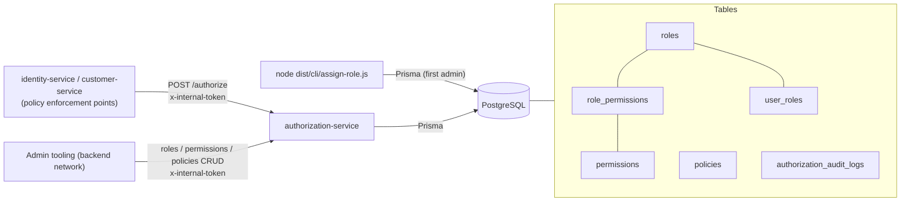
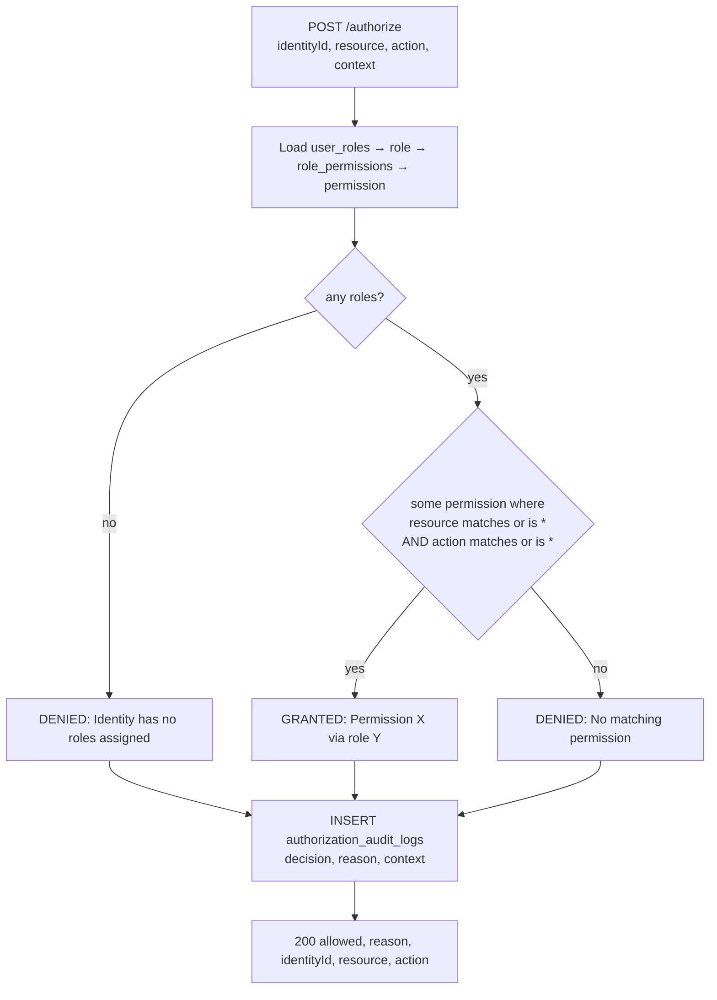
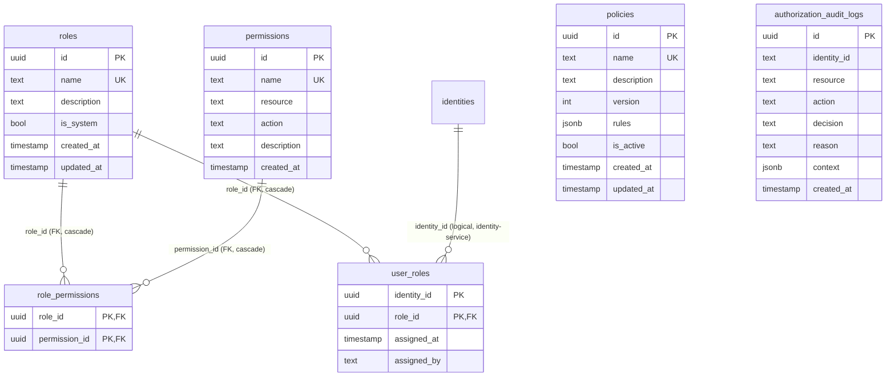
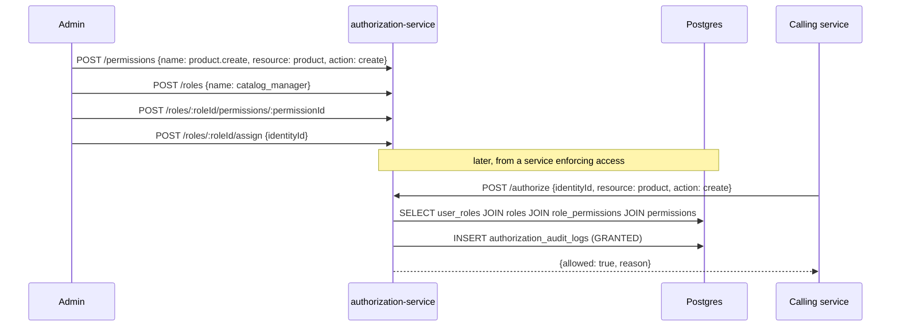

# authorization-service

> Role-based access control (RBAC): roles, permissions, role assignments, access decisions with an audit log, and a policy store for future attribute-based access control (ABAC).
> [← Service index](../README.md) · Business spec: [docs/modules/authorization.md](../../docs/modules/authorization.md)

| | |
|---|---|
| **Stack** | NestJS 10, Prisma 6, PostgreSQL |
| **Port** | `3002` |
| **Route prefix** | `/api/authorization` |
| **Gateway route** | **None, by design.** It's internal-only: reach it on the `backend` network with `x-internal-token` |
| **Swagger** | `/api/authorization/docs` (not served when `NODE_ENV=production`) |
| **Owns tables** | `roles`, `permissions`, `role_permissions`, `user_roles`, `policies`, `authorization_audit_logs` |
| **Depends on** | PostgreSQL |
| **Used by** | identity-service and customer-service, which call `POST /authorize` for every non-owner request |

---

## 1. Responsibilities

- Require the shared `INTERNAL_SERVICE_TOKEN` (`x-internal-token` header) on every endpoint except `/health`.
- CRUD for **roles**. System roles (`isSystem = true`) can't be changed or deleted. The seeded `admin` role is one.
- CRUD for **permissions**, each a `resource` + `action` pair, for example `product` + `create`.
- Grant and revoke permissions on roles.
- Assign and revoke roles for identities.
- **Access decisions** (`POST /authorize`): deny by default, `*` matches any resource or action, and every decision is audited.
- List the effective permissions of an identity.
- CRUD for **policies**: JSON rule sets with a version that goes up on every update.

---

## 2. High-Level Design



The **decision model** is plain RBAC: identity → roles → permissions → match. `AuthorizationService.evaluatePolicy()` implements a first-match ABAC evaluator over `policies.rules`, but **no endpoint calls it** yet.

---

## 3. Low-Level Design

```text
src/
├── main.ts                    # prefix api/authorization, ValidationPipe, CORS, Swagger, port 3002
├── app.module.ts              # Config, Prisma, Roles, Permissions, Policies, Authorization modules
├── prisma/                    # global PrismaService
├── auth/
│   ├── internal-service.guard.ts # global guard: x-internal-token on every route except @Public()
│   └── public.decorator.ts
├── cli/assign-role.ts         # bootstrap: assign a role (default admin) to an identity
├── health/health.controller.ts # public; SELECT 1 with a 2 s timeout, 503 when down
├── roles/                     # RolesController, RolesService, DTOs
├── permissions/               # PermissionsController, PermissionsService, DTOs
├── policies/                  # PoliciesController, PoliciesService, DTOs
└── authorization/             # AuthorizationController, AuthorizationService, CheckAccessDto
```

### 3.1 Services

| Service | Key methods and rules |
|---|---|
| `RolesService` | `createRole` (name must be unique, else 409); `findAll` and `findById` (include `rolePermissions.permission`); `updateRole` and `deleteRole` (400 for a system role, 409 for a duplicate name); `assignPermission` (404 if the role or permission is missing, 409 if already granted); `revokePermission`; `assignRoleToUser` (409 if already assigned); `revokeRoleFromUser`; `getUserRoles` (not exposed over HTTP). |
| `PermissionsService` | `create` (both `name` and `(resource, action)` must be unique, else 409); `findAll`, sorted by resource then action; `findById`; `update` (re-checks both uniqueness rules, excluding itself); `remove` (cascades to `role_permissions`). |
| `PoliciesService` | `create` (name must be unique; `rules` defaults to `[]`, `isActive` to `true`); `findAll`, sorted by `createdAt`; `findById`; `update` (**increments `version`** on every update); `remove`. |
| `AuthorizationService` | `checkAccess(dto)`, `getUserPermissions(identityId)` (deduplicated by permission ID), `evaluatePolicy(policyId, context)` (internal only). |

### 3.2 Access-decision algorithm (`checkAccess`)



- The **first match wins**, and permissions are evaluated as one flat set. There are no deny permissions in RBAC.
- `context` is stored in the audit log but **doesn't affect the decision**.

### 3.3 Policy evaluation (`evaluatePolicy`, internal)

- An inactive policy returns `{ matched: false, effect: 'deny' }`.
- `rules` is filtered to valid `{ effect: 'allow' | 'deny', resource, action, conditions? }` objects.
- Rules are evaluated in order, and the first rule whose resource and action match (`*` allowed) returns its `effect`.
- If no rule matches, the result is deny. `conditions` are **not evaluated** yet.

### 3.4 DTO validation

| DTO | Fields |
|---|---|
| `CreateRoleDto` | `name` (non-empty string), `description?` |
| `UpdateRoleDto` | Partial of the above |
| `AssignRoleDto` | `identityId` (UUID), `assignedBy?` (string) |
| `CreatePermissionDto` | `name`, `resource`, `action` (non-empty strings), `description?` |
| `UpdatePermissionDto` | Partial of the above |
| `CreatePolicyDto` | `name` (non-empty), `description?`, `rules?` (array), `isActive?` (boolean) |
| `UpdatePolicyDto` | Partial of the above |
| `CheckAccessDto` | `identityId` (UUID), `resource`, `action` (non-empty), `context?` (object) |

---

## 4. API

All paths are relative to `/api/authorization`. **Every endpoint except `/health` requires** `x-internal-token: <INTERNAL_SERVICE_TOKEN>` and returns 401 without it.

### Health

| Method | Path | Response |
|---|---|---|
| GET | `/health` | 200 `{ status: 'ok', service, checks: { database: 'up' } }`; 503 with the failed check marked `down` |

### Roles

| Method | Path | Body | Success | Errors |
|---|---|---|---|---|
| POST | `/roles` | `CreateRoleDto` | 201 role | 400, 409 |
| GET | `/roles` | – | 200 roles with permissions | – |
| GET | `/roles/:roleId` | – | 200 role | 404 |
| PUT | `/roles/:roleId` | `UpdateRoleDto` | 200 role | 400 (system role), 404, 409 |
| DELETE | `/roles/:roleId` | – | 200 `{message}` | 400 (system role), 404 |
| POST | `/roles/:roleId/permissions/:permissionId` | – | 201 role_permission | 404, 409 |
| DELETE | `/roles/:roleId/permissions/:permissionId` | – | 200 `{message}` | 404 |
| POST | `/roles/:roleId/assign` | `AssignRoleDto` | 201 user_role | 404, 409 |
| DELETE | `/roles/:roleId/users/:identityId` | – | 200 `{message}` | 404 |

### Permissions

| Method | Path | Body | Success | Errors |
|---|---|---|---|---|
| POST | `/permissions` | `CreatePermissionDto` | 201 | 400, 409 |
| GET | `/permissions` | – | 200 list | – |
| GET | `/permissions/:permissionId` | – | 200 | 404 |
| PUT | `/permissions/:permissionId` | `UpdatePermissionDto` | 200 | 404, 409 |
| DELETE | `/permissions/:permissionId` | – | 200 `{message}` | 404 |

### Policies

| Method | Path | Body | Success | Errors |
|---|---|---|---|---|
| POST | `/policies` | `CreatePolicyDto` | 201 | 400, 409 |
| GET | `/policies` | – | 200 list | – |
| GET | `/policies/:policyId` | – | 200 | 404 |
| PUT | `/policies/:policyId` | `UpdatePolicyDto` | 200 (version + 1) | 404, 409 |
| DELETE | `/policies/:policyId` | – | 200 `{message}` | 404 |

### Decisions

| Method | Path | Body | Response |
|---|---|---|---|
| POST | `/authorize` | `CheckAccessDto` | 200 `{ allowed, reason, identityId, resource, action }` |
| POST | `/check-access` | `CheckAccessDto` | Alias of `/authorize` |
| GET | `/users/:identityId/permissions` | – | 200 `{ identityId, roles[], permissions[] }` |

```http
POST /api/authorization/authorize
Content-Type: application/json

{ "identityId": "550e8400-e29b-41d4-a716-446655440000", "resource": "product", "action": "create", "context": { "region": "us-east" } }
```

```json
{ "allowed": true, "reason": "GRANTED: Permission \"product.create\" via role \"catalog_manager\"",
  "identityId": "550e8400-e29b-41d4-a716-446655440000", "resource": "product", "action": "create" }
```

---

## 5. Data model



| Table | Keys and constraints | Notes |
|---|---|---|
| `roles` | PK `id`, UNIQUE `name` | `is_system` defaults to `false`. The seeded `admin` role is a system role. |
| `permissions` | PK `id`, UNIQUE `name`, UNIQUE `(resource, action)` | `*` acts as a wildcard during checks |
| `role_permissions` | PK `(role_id, permission_id)`, FKs with `ON DELETE CASCADE` | Join table |
| `user_roles` | PK `(identity_id, role_id)`, FK `role_id` with cascade | `identity_id` has no FK, because identities live in identity-service |
| `policies` | PK `id`, UNIQUE `name` | `version` defaults to 1, `rules` to `[]`, `is_active` to `true` |
| `authorization_audit_logs` | PK `id` | `decision` ∈ `GRANTED \| DENIED`; append-only, with no index on `identity_id` or `created_at` |

Created by migration `20261001130000_init`, which also **seeds**:

| Seeded | Values |
|---|---|
| Role `admin` (system, ID `00000000-0000-4000-9000-000000000001`) | holds the wildcard permission `*` (`*`/`*`) |
| Identity permissions | `identity.read`, `identity.update`, `identity.delete`, `identity.suspend`, `identity.audit` |
| Customer permissions | `customer.create`, `customer.read`, `customer.update`, `customer.delete`, `customer.manage` |

Only `admin` is seeded as a role. Finer roles, for example a support role with `customer.read` and `identity.read`, can be created through the API. The Dockerfile doesn't copy `.npmrc`, unlike the other NestJS services.

---

## 6. Flows

### Bootstrapping the first admin

Nobody holds a role at first, and every role-granting API call needs the internal token, so the first admin is assigned directly in the database:

```bash
docker compose exec authorization-service node dist/cli/assign-role.js <identityId> [roleName=admin]
```

The command is idempotent; running it again for the same identity and role changes nothing.

### Bootstrapping RBAC and checking access



---

## 7. Configuration

| Variable | Required | Default | Purpose |
|---|---|---|---|
| `PORT` | no | `3002` | HTTP port |
| `DATABASE_URL` | yes | – | Postgres connection string |
| `CORS_ORIGINS` | no | `http://localhost:3000` | Comma-separated list of allowed origins |
| `NODE_ENV` | no | – | `production` hides Swagger |
| `INTERNAL_SERVICE_TOKEN` | **yes** | – | Required on every request except `/health`. If unset, every such request gets 401 and a warning is logged at startup. |
| `JWT_SECRET`, `REDIS_URL` | – | – | Passed in by compose but **not used** |

---

## 8. Run, build and test

```bash
cd services/authorization-service
npm install
npx prisma generate
npx prisma migrate deploy     # creates the tables and seeds admin + permissions
INTERNAL_SERVICE_TOKEN=dev-internal npm run start:dev   # http://localhost:3002/api/authorization/docs
node dist/cli/assign-role.js <identityId>               # after npm run build
```

**Tests:** `npm test` runs 8 Jest unit tests in `test/`. They cover:

- the global internal-token guard, with health public and fail-closed behavior when the token isn't configured
- `checkAccess`: deny by default, exact matches, the `*/*` admin wildcard and per-resource wildcards, with audit rows written
- protection of the seeded `admin` system role

`test.text` in this folder is a directory-tree dump, not a test.

---

## 9. Known limitations and follow-ups

- The admin API trusts any holder of `INTERNAL_SERVICE_TOKEN`. It doesn't know which person is acting, so `assignedBy` comes from the request body. A per-admin check (for example `authorization.manage`) would need the caller's JWT.
- The validator only accepts version-4 UUIDs as `identityId`. Callers treat its 400 as "deny".
- `evaluatePolicy` isn't exposed, and `conditions` and `context` are ignored, so ABAC isn't functional.
- Nothing caches decisions. Every check is a 4-table join plus an audit insert, so it will need caching (for example in Redis) at scale.
- `authorization_audit_logs` has no indexes and no retention policy.
- `assignRoleToUser` doesn't check that the identity exists in identity-service.
- Only the decision logic and the guard have unit tests. CRUD services and policy evaluation don't.
