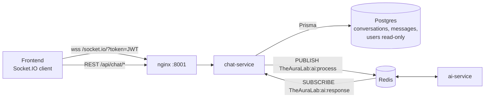
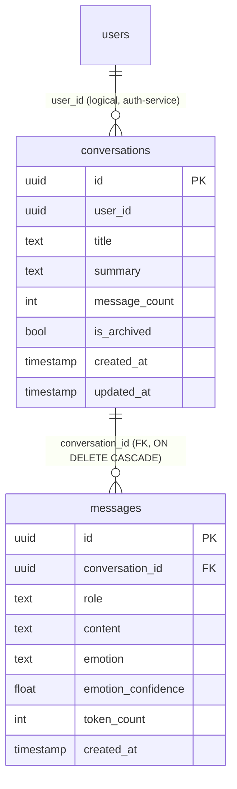
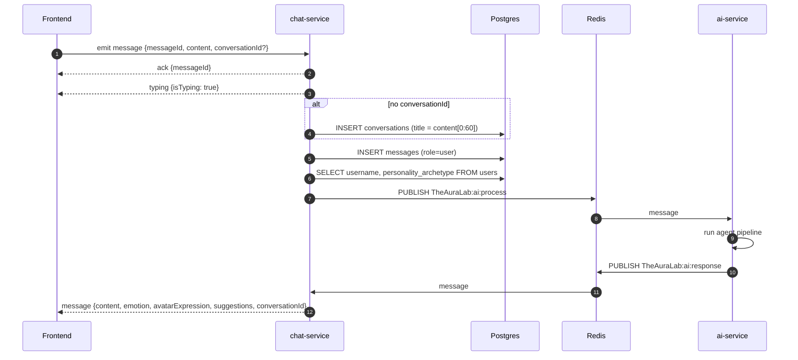
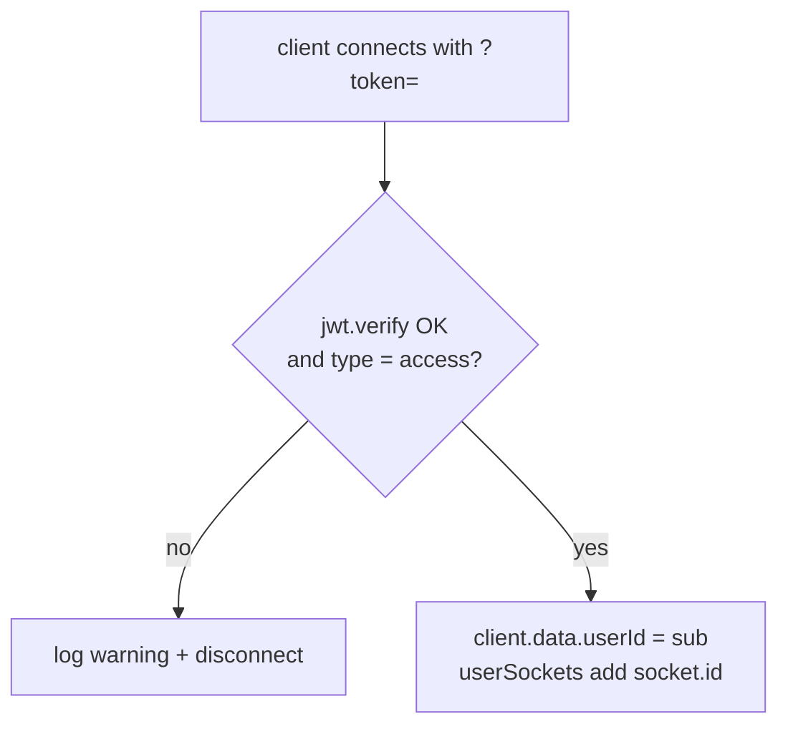

# chat-service

> Real-time chat: a Socket.IO gateway, conversation and message persistence, and the bridge to the AI pipeline over Redis pub/sub.
> [← Service index](../README.md)

| | |
|---|---|
| **Stack** | NestJS 10, Socket.IO 4, Prisma 6, PostgreSQL, ioredis |
| **Port** | `3000` (HTTP and WebSocket) |
| **Route prefix** | `/api/chat` (REST); `/socket.io/` (WebSocket) |
| **Gateway routes** | `/api/chat/*` and `/socket.io/` (with WebSocket upgrade) |
| **Swagger** | `/api/chat/docs` (not served when `NODE_ENV=production`) |
| **Owns tables** | `conversations`, `messages` |
| **Reads tables** | `users` (raw SQL, owned by auth-service) |
| **Redis** | publishes `TheAuraLab:ai:process`; subscribes to `TheAuraLab:ai:response` |
| **Depends on** | PostgreSQL, Redis, ai-service (asynchronously, through Redis) |

---

## 1. Responsibilities

- Authenticate WebSocket connections with the access JWT.
- Receive user chat messages, acknowledge them, show a typing indicator and persist them.
- Create a conversation on the fly when the client doesn't send one.
- Look up the user's `username` and `personality_archetype`, then hand the message to **ai-service** via Redis.
- Relay AI responses from Redis back to every socket the user has open.
- Provide REST endpoints to list, create, read and delete conversations and to page through messages.

---

## 2. High-Level Design



- **Two Redis connections.** `REDIS_PUB` publishes. `REDIS_SUB` is a dedicated subscriber, because ioredis can't publish on a connection that is in subscriber mode.
- **Socket registry.** An in-memory `Map<userId, Set<socketId>>` routes AI responses to every tab the user has open. This keeps the service **single-instance**: with two replicas, a response could reach a replica that doesn't hold the user's socket. See [limitations](#9-known-limitations-and-follow-ups).
- **Transport.** WebSocket only (`transports: ['websocket']`, no long-polling fallback).

---

## 3. Low-Level Design

```text
src/
├── main.ts                       # prefix api/chat, ValidationPipe, CORS (credentials), Swagger
├── app.module.ts                 # Config, Prisma, Redis, JwtModule, ConversationModule, ChatGateway
├── prisma/                       # global PrismaService
├── redis/redis.module.ts         # REDIS_PUB and REDIS_SUB providers (ioredis)
├── gateway/chat.gateway.ts       # Socket.IO gateway
├── health/health.controller.ts   # public; Postgres SELECT 1 + Redis PING, 503 when down
└── conversation/
    ├── conversation.module.ts    # Passport + JwtModule
    ├── conversation.controller.ts# REST, class-level AuthGuard('jwt')
    ├── conversation.service.ts
    └── jwt.strategy.ts
```

### 3.1 `ChatGateway`

| Hook or event | Behavior |
|---|---|
| `onModuleInit` | Subscribes to `TheAuraLab:ai:response`. Each message is parsed as JSON and forwarded as a `message` event to every socket of `payload.userId`. Parse errors are logged. |
| `handleConnection` | Reads `handshake.query.token` and verifies it with `JWT_SECRET`, requiring `type === 'access'`. It stores `userId` and `email` in `client.data` and registers the socket. On failure it logs and disconnects. |
| `handleDisconnect` | Removes the socket, and the user entry once the user has no sockets left. |
| `message` event | See the [send-message flow](#61-send-a-chat-message-end-to-end). |
| `ping` event | Emits `pong { ts }`. |

### 3.2 `ConversationService`

| Method | Behavior |
|---|---|
| `findAll(userId, skip=0, limit=20)` | Non-archived conversations, sorted by `updatedAt desc`. Returns `id, title, messageCount, createdAt, updatedAt`. |
| `create(userId, title?)` | Inserts a conversation. |
| `findOne(id, userId)` | Conversation with all its messages in ascending order. 404 if it doesn't exist or isn't the caller's. |
| `remove(id, userId)` | Checks ownership, then deletes. Messages cascade. |
| `getMessages(id, userId, skip=0, limit=100)` | Checks ownership, then returns a page of messages in ascending order. |

### 3.3 WebSocket protocol

Connect with `io('<gateway>', { path: '/socket.io/', transports: ['websocket'], query: { token: '<access JWT>' } })`.

| Direction | Event | Payload |
|---|---|---|
| client → server | `message` | `{ messageId: string, content: string, conversationId?: string }` |
| client → server | `ping` | – |
| server → client | `ack` | `{ messageId }` |
| server → client | `typing` | `{ isTyping: true }` |
| server → client | `message` | AI response: `{ userId, messageId, content, emotion, avatarExpression, memoryUpdates[], suggestions[], conversationId }` |
| server → client | `pong` | `{ ts }` |

### 3.4 Redis contract

`TheAuraLab:ai:process` is published by chat-service:

```json
{ "userId": "uuid", "messageId": "client-id", "content": "text", "conversationId": "uuid",
  "username": "jane_d", "personality": "friend" }
```

`TheAuraLab:ai:response` is consumed by chat-service. The payload shape is in [ai-service](../ai-service/README.md#4-interfaces).

---

## 4. REST API

All paths are relative to `/api/chat`. All except `/health` require `Authorization: Bearer <access token>`.

| Method | Path | Query or body | Success | Errors |
|---|---|---|---|---|
| GET | `/conversations` | `skip` (default 0), `limit` (default 20) | 200 conversation summaries | 401 |
| POST | `/conversations` | `{ title? }` | 201 conversation | 401 |
| GET | `/conversations/:id` | – | 200 conversation with messages | 401, 404 |
| DELETE | `/conversations/:id` | – | 204 | 401, 404 |
| GET | `/conversations/:id/messages` | `skip` (default 0), `limit` (default 100) | 200 messages | 401, 404 |
| GET | `/health` (public) | – | 200 `{ status: 'ok', service, checks: { database: 'up', redis: 'up' } }`; 503 with the failed check marked `down` | – |

`/health` lives in its own unguarded `HealthController`. It runs `SELECT 1` against Postgres and `PING` against Redis, each with a 2-second timeout.

---

## 5. Data model



Created by migration `20260722125020_init`.

| Table | Column notes |
|---|---|
| `conversations` | `title` is set to the first 60 characters of the first message when the conversation is created from the socket. `summary`, `message_count` and `is_archived` are **never updated** by the code. |
| `messages` | `role` is `user` or `assistant`; only `user` rows are written today. `emotion`, `emotion_confidence` and `token_count` are never filled in. |

There are no secondary indexes. Listing by `(user_id, updated_at)` and paging by `(conversation_id, created_at)` will need indexes as data grows.

---

## 6. Flows

### 6.1 Send a chat message end to end



The assistant reply in steps 9–11 is **not persisted** to `messages`, so conversation history from the REST API shows only user messages.

### 6.2 Socket connection



---

## 7. Configuration

| Variable | Required | Default | Purpose |
|---|---|---|---|
| `PORT` | no | `3000` | HTTP and WebSocket port |
| `DATABASE_URL` | yes | – | Postgres connection string |
| `JWT_SECRET` | yes | `changeme` | Verifies access tokens; must match auth-service |
| `REDIS_URL` | yes | `redis://localhost:6379` | Pub/sub |
| `CORS_ORIGINS` | no | `http://localhost:3000` | REST CORS. The WebSocket gateway uses `origin: '*'`. |
| `NODE_ENV` | no | – | `production` hides Swagger |

---

## 8. Run, build and test

```bash
cd services/chat-service
npm install
npx prisma generate && npx prisma migrate deploy
npm run start:dev
```

Quick socket test, using `socket.io-client` in Node:

```js
const s = require('socket.io-client')('http://localhost:8001', { transports: ['websocket'], query: { token: ACCESS } });
s.on('message', console.log);
s.emit('message', { messageId: 'm1', content: 'Hello!' });
```

**Tests:** none exist yet.

---

## 9. Known limitations and follow-ups

- **Security:**
  - The `conversationId` sent over the socket **isn't checked for ownership**, so a user who knows another user's conversation UUID can append messages to it.
  - WebSocket CORS is `*`.
  - The JWT travels in the query string, where access logs can capture it.
  - Incoming `content` has no length limit and no validation.
- Assistant messages aren't persisted, and `message_count`, `emotion` and `summary` are never updated.
- The service reads auth-service's `users` table with raw SQL, which couples the two schemas.
- The in-memory socket map plus a Redis subscription on every instance means **no horizontal scaling**. Use `@socket.io/redis-adapter` and rooms per user to remove that limit.
- Redis pub/sub is fire-and-forget. If ai-service is down, messages are lost. Redis Streams or a queue with retries and a dead-letter queue would fix this.
- Errors inside `handleMessage`, such as a database failure, aren't caught and nothing is sent back to the client.
- There are no tests.
