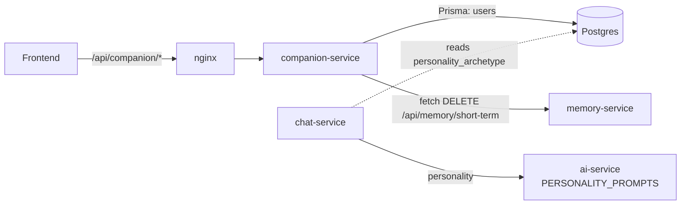
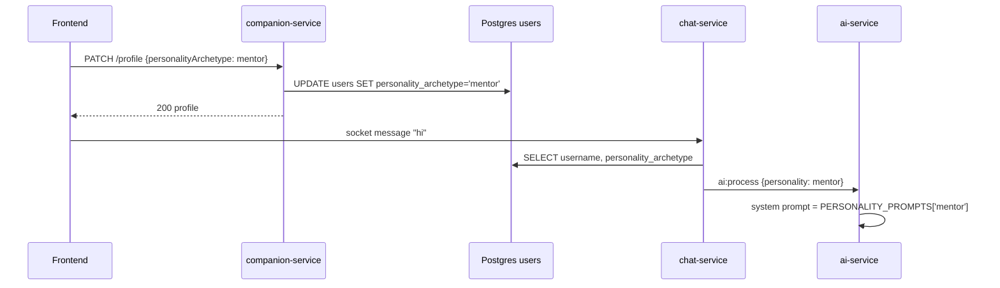

# companion-service

> Settings for the user's AI companion: personality archetype, avatar configuration, communication style and username. It can also reset the companion's short-term memory.
> [← Service index](../README.md)

| | |
|---|---|
| **Stack** | NestJS 10, Prisma 6, PostgreSQL |
| **Port** | `3000` |
| **Route prefix** | `/api/companion` |
| **Gateway route** | `/api/companion/*` |
| **Swagger** | `/api/companion/docs` |
| **Owns tables** | none. It reads and writes columns of `users`, which auth-service owns |
| **Calls** | memory-service `DELETE /api/memory/short-term` |
| **Depends on** | PostgreSQL, memory-service |

---

## 1. Responsibilities

- Return the user's profile without the password hash.
- Update `username`, `personalityArchetype`, `avatarConfig` and `communicationStyle`.
- List the five supported **personality archetypes**.
- Reset the companion's short-term conversational memory by delegating to memory-service.

The archetype chosen here becomes the `personality` sent to ai-service by chat-service. It selects the system prompt in `ai-service/services/llm_service.py`.

---

## 2. High-Level Design



The service's Prisma schema (`prisma/schema.prisma`) is a **copy** of auth-service's `User` model, mapped to the same `users` table. It has no migrations folder, so it relies on auth-service's migration having run. Keep the two schemas in sync.

---

## 3. Low-Level Design

```text
src/
├── main.ts                 # prefix api/companion, ValidationPipe, CORS, Swagger
├── app.module.ts           # Config, Passport, JwtModule; providers PrismaService, CompanionService, JwtStrategy
├── prisma.service.ts
├── jwt.strategy.ts         # access tokens only
├── companion.controller.ts # class-level AuthGuard('jwt'); inline UpdateProfileDto
└── companion.service.ts    # ARCHETYPES constant + profile logic
```

### 3.1 `UpdateProfileDto`, declared inline in the controller

| Field | Rules |
|---|---|
| `username` | optional string. Unlike registration, there's no length or pattern check. |
| `personalityArchetype` | optional, one of `friend \| mentor \| coach \| creator \| assistant` |
| `avatarConfig` | optional object, free-form JSON |
| `communicationStyle` | optional, one of `casual \| formal \| playful \| empathetic` |

### 3.2 `CompanionService`

| Method | Behavior |
|---|---|
| `getProfile(userId)` | Finds the user (404 if missing) and strips `hashedPassword` |
| `updateProfile(userId, data)` | If `username` changes, checks that it's unique among other users (409 if not). It updates only the fields that are truthy (`avatarConfig` whenever it's defined) and returns the sanitized user. |
| `listArchetypes()` | `{ archetypes: [{ id, name, description, emoji }] }` |

**Archetypes:**

| id | Name | Description |
|---|---|---|
| `friend` | Friend 🤝 | Warm, casual, fun |
| `mentor` | Mentor 🦉 | Wise and thoughtful |
| `coach` | Coach 🏆 | Energetic and goal-oriented |
| `creator` | Creator 🎨 | Imaginative creative muse |
| `assistant` | Assistant ⚡ | Efficient and organized |

---

## 4. API

All paths are relative to `/api/companion`, and **every route requires** `Authorization: Bearer <access token>`.

| Method | Path | Body | Success | Errors |
|---|---|---|---|---|
| GET | `/profile` | – | 200 user (no hash) | 401, 404 |
| PATCH | `/profile` | `UpdateProfileDto` | 200 user | 400, 401, 409 |
| GET | `/archetypes` | – | 200 `{ archetypes[] }` | 401 |
| POST | `/reset-memory` | – | 200 `{ message: 'Short-term memory cleared' }` | 401 |
| GET | `/health` | – | 200 `{status, service}`. **Also JWT-guarded.** | 401 |

> ⚠️ Because the guard is set on the controller class, `/health` returns 401 to the Docker healthcheck. Move it to an unguarded controller.

```http
PATCH /api/companion/profile
Authorization: Bearer <token>
Content-Type: application/json

{ "personalityArchetype": "coach", "communicationStyle": "playful", "avatarConfig": { "hair": "short", "color": "#7c3aed" } }
```

---

## 5. Data model

The service accesses the `users` table, which auth-service owns. The full column list is in the [auth-service data model](../auth-service/README.md#5-data-model).

| Column | Access |
|---|---|
| `username` | read and write |
| `personality_archetype` | read and write |
| `avatar_config` (JSONB) | read and write |
| `communication_style` | read and write |
| all other columns | read (returned by `/profile`, minus `hashed_password`) |

---

## 6. Flows

### Change personality, then chat



The reset-memory flow is shown in [memory-service](../memory-service/README.md#reset-conversational-context-through-companion-service).

---

## 7. Configuration

| Variable | Required | Default | Purpose |
|---|---|---|---|
| `PORT` | no | `3000` | HTTP port |
| `DATABASE_URL` | yes | – | Postgres (same database as auth-service) |
| `JWT_SECRET` | yes | `changeme` | Verifies access tokens |
| `MEMORY_SERVICE_URL` | no | `http://memory-service:3000` | Base URL for reset-memory. Not set in compose, so the default is used. |
| `CORS_ORIGINS` | no | `http://localhost:3000` | Allowed origins |
| `REDIS_URL` | – | – | Passed in by compose but **not used**, even though `ioredis` is listed as a dependency |

---

## 8. Run, build and test

```bash
cd services/companion-service
npm install
npx prisma generate              # the users table must already exist (auth-service migration)
npm run start:dev
```

**Tests:** none exist yet.

---

## 9. Known limitations and follow-ups

- `/health` is behind the JWT guard.
- `reset-memory` ignores the HTTP status that memory-service returns and has no timeout, so it always reports success.
- A schema copy of `users` means two services write the same table. Any change to the table must be applied in both places.
- `username` updates skip the format rules that registration enforces (3–30 characters, `[A-Za-z0-9_-]`).
- `communicationStyle` is stored but **ai-service doesn't use it**.
- Updates only apply truthy values, so a field can't be cleared or set to an empty value.
- There are no tests.
