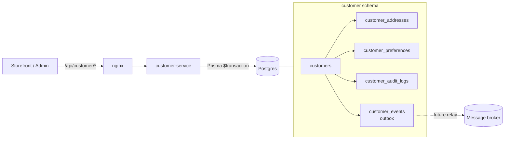
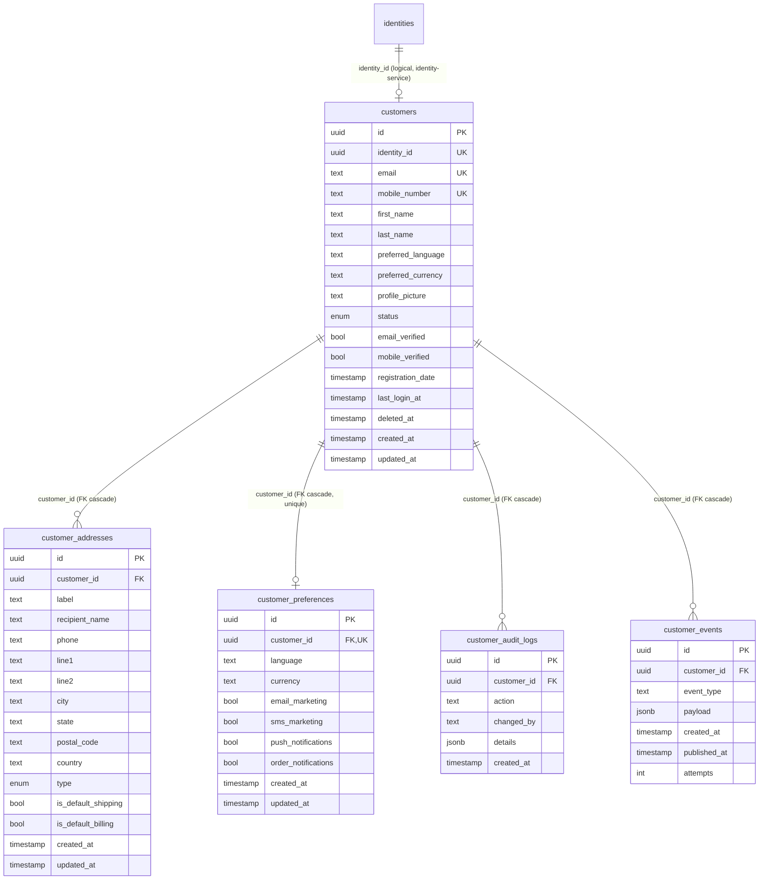
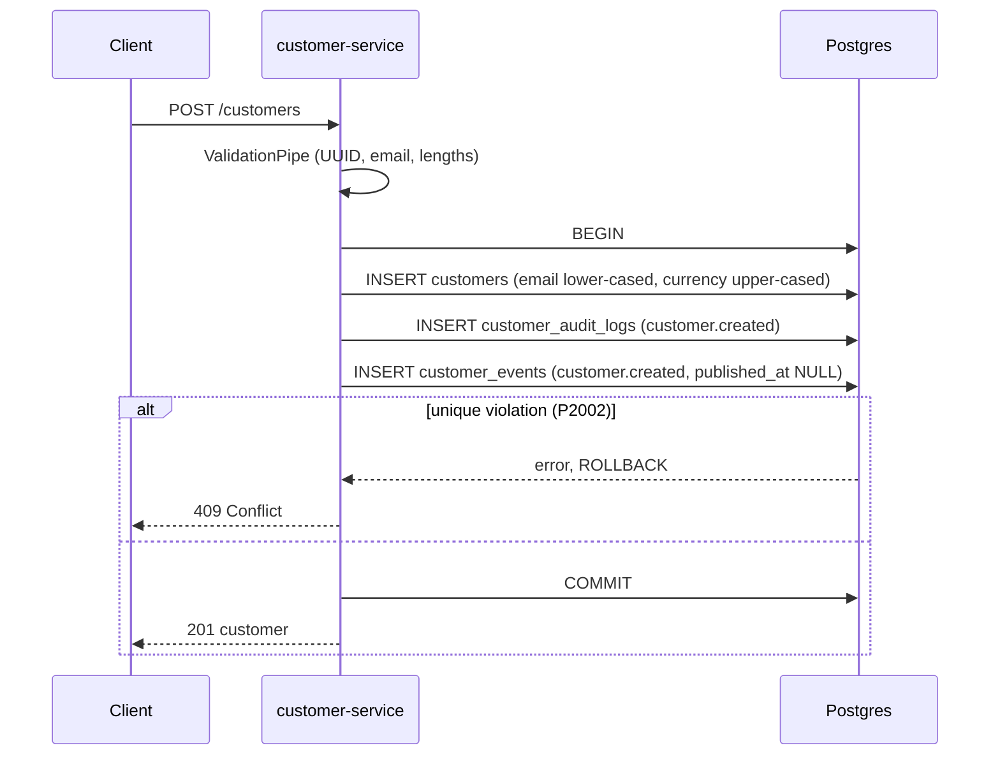
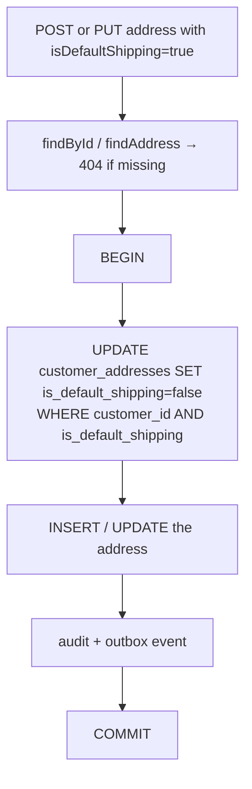
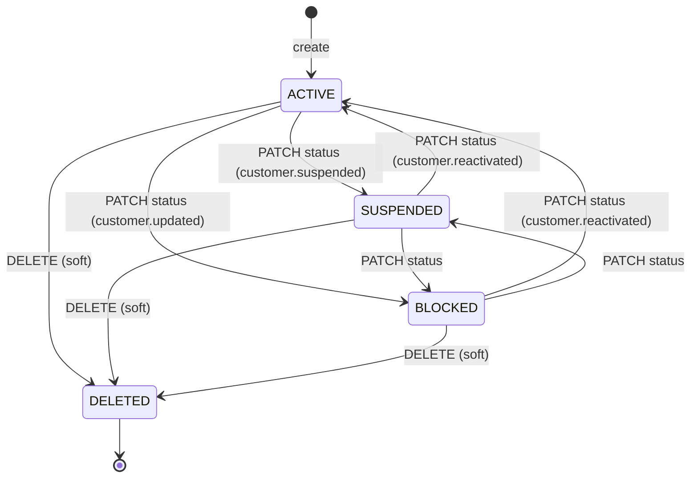

# customer-service

> Customer profiles for the e-commerce domain: profile data, addresses, preferences and lifecycle status, with an audit log and a transactional outbox for events.
> [← Service index](../README.md) · Business spec: [docs/modules/customer.md](../../docs/modules/customer.md) · API spec: [docs/api/customer-api.md](../../docs/api/customer-api.md)

| | |
|---|---|
| **Stack** | NestJS 10, Prisma 6, PostgreSQL |
| **Port** | `3000` |
| **Route prefix** | `/api/customer` |
| **Gateway route** | `/api/customer/*` |
| **Swagger** | `/api/customer/docs` |
| **Owns tables** | `customers`, `customer_addresses`, `customer_preferences`, `customer_audit_logs`, `customer_events` |
| **Depends on** | PostgreSQL |
| **Related** | `customers.identity_id` holds an ID from [identity-service](../identity-service/README.md) (no foreign key) |

---

## 1. Responsibilities

- Create a customer profile linked to an identity, one customer per identity.
- Search customers by name, email or mobile number, optionally filtered by status, with pagination.
- Read and update a profile by customer ID or by the caller's identity (`x-identity-id` header).
- Soft-delete customers and change their status (`ACTIVE`, `BLOCKED`, `SUSPENDED`).
- Manage addresses, with **at most one default shipping and one default billing address** per customer.
- Manage marketing and notification preferences.
- Record every change in `customer_audit_logs`, and write a domain event to `customer_events` (the outbox) **in the same transaction**.

---

## 2. High-Level Design



- **Transactional outbox.** Every write, along with its audit row and event row, is committed atomically through `recordCustomerChange()`. Events start with `published_at = NULL` and `attempts = 0`. **No relay or publisher exists yet** to deliver them.
- **Soft delete.** `deleted_at` is set and `status` becomes `DELETED`. Every read filters on `deleted_at IS NULL`.

---

## 3. Low-Level Design

```text
src/
├── main.ts                       # prefix api/customer, ValidationPipe, CORS, Swagger
├── app.module.ts                 # Config, Prisma, CustomerModule, HealthController
├── health.controller.ts          # GET /health (unguarded)
├── prisma/                       # global PrismaService
└── customer/
    ├── customer.module.ts
    ├── customer.controller.ts    # REST + inline CustomerSearchQuery
    ├── customer.service.ts       # business logic, transactions
    ├── customer-records.ts       # recordCustomerChange(): audit + outbox in one transaction
    └── dto/
        ├── create-customer.dto.ts
        ├── update-customer.dto.ts
        ├── update-customer-status.dto.ts
        ├── create-address.dto.ts
        ├── update-address.dto.ts       # PartialType(CreateAddressDto)
        └── update-preferences.dto.ts
```

### 3.1 DTO validation

| DTO | Field rules |
|---|---|
| `CreateCustomerDto` | `identityId` UUID; `email` email; `mobileNumber?` string; `firstName`, `lastName` 1–100 characters; `preferredLanguage?` 2–10 characters; `preferredCurrency?` exactly 3 characters; `profilePicture?` string |
| `UpdateCustomerDto` | All the profile fields above are optional; `identityId` isn't accepted |
| `UpdateCustomerStatusDto` | `status` ∈ `ACTIVE \| BLOCKED \| SUSPENDED \| DELETED` (DELETED is rejected by the service) |
| `CreateAddressDto` | `recipientName` 1–150 characters; `line1` 1–200; `city` 1–100; `postalCode` 1–20; `country` ISO 3166-1 alpha-2; `label?`, `phone?`, `line2?`, `state?` strings; `type?` ∈ `SHIPPING \| BILLING \| BOTH` (default SHIPPING); `isDefaultShipping?`, `isDefaultBilling?` booleans |
| `UpdateAddressDto` | Partial of `CreateAddressDto` |
| `UpdatePreferencesDto` | `language?` 2–10; `currency?` 3; `emailMarketing?`, `smsMarketing?`, `pushNotifications?`, `orderNotifications?` booleans |
| `CustomerSearchQuery` | `q?` string; `status?` enum; `page` integer ≥ 1 (default 1); `pageSize` integer 1–100 (default 25) |

Path parameters `customerId` and `addressId` are validated with `ParseUUIDPipe`, which returns 400 on an invalid UUID.

### 3.2 Business rules

| # | Rule | Where |
|---|---|---|
| 1 | One customer per identity; email unique; mobile unique. A violation returns 409 *"Identity, email, or mobile number is already registered"*. | DB unique indexes + `rethrowKnownWriteError` (P2002) |
| 2 | Email is trimmed and lower-cased; mobile is trimmed, with blank stored as `NULL`; currency is upper-cased; country is upper-cased. | `create`, `update`, `createAddress`, `updatePreferences` |
| 3 | Soft-deleted customers behave as if they don't exist (404). | `findById`, `findProfile`, `findAddress`, `search` |
| 4 | Status can't be set to `DELETED` through PATCH (400). Use `DELETE`. | `updateStatus` |
| 5 | The status event type is `customer.suspended` when moving to SUSPENDED, `customer.reactivated` when moving from a non-ACTIVE status to ACTIVE, and `customer.updated` otherwise. | `updateStatus` |
| 6 | Setting a new default shipping or billing address first clears the previous default, in the same transaction. A partial unique index enforces this in the database as well. | `clearAddressDefaults` + migration |
| 7 | A default address can't be deleted (409). Choose another default first. | `removeAddress` |
| 8 | Preferences are created on first update (upsert), with language and currency seeded from the customer. A read before any write returns defaults (`en`, `USD`). | `getPreferences`, `updatePreferences` |
| 9 | Every write produces exactly one audit row and one outbox event. | `recordCustomerChange` |

### 3.3 Events written to `customer_events`

| `event_type` | Trigger | `payload` (always includes `customerId`) |
|---|---|---|
| `customer.created` | POST /customers | `identityId` |
| `customer.updated` | PUT /customers/:id, PUT /profile, PATCH status (other transitions) | `fields[]` or `status` |
| `customer.suspended` | PATCH status → SUSPENDED | `status` |
| `customer.reactivated` | PATCH status non-ACTIVE → ACTIVE | `status` |
| `customer.deleted` | DELETE /customers/:id | – |
| `customer.address.created`, `.updated`, `.deleted` | Address endpoints | `addressId` |
| `customer.preferences.updated` | PUT preferences | `preferenceId` |

The audit `action` matches the event type, except status changes, which are always audited as `customer.status.updated`.

### 3.4 Error handling

| Case | HTTP |
|---|---|
| DTO, query or UUID validation failure; DELETED via PATCH; missing or invalid `x-identity-id` | 400 |
| Customer, profile or address not found (or soft-deleted) | 404 |
| Unique violation on create or update; deleting a default address | 409 |
| Any other Prisma error | 500 (rethrown unchanged) |

---

## 4. API

All paths are relative to `/api/customer`. **No authentication is enforced.** The `/profile` endpoints trust the `x-identity-id` header.

| Method | Path | Body or query | Success | Errors |
|---|---|---|---|---|
| GET | `/health` | – | 200 `{status, service}` | – |
| POST | `/customers` | `CreateCustomerDto` | 201 customer | 400, 409 |
| GET | `/customers` | `q, status, page, pageSize` | 200 `{ data[], page, pageSize, total }` | 400 |
| GET | `/customers/profile` | header `x-identity-id` | 200 customer with `addresses` and `preferences` | 400, 404 |
| PUT | `/customers/profile` | header + `UpdateCustomerDto` | 200 customer | 400, 404, 409 |
| GET | `/customers/:customerId` | – | 200 customer with `addresses` and `preferences` | 400, 404 |
| PUT | `/customers/:customerId` | `UpdateCustomerDto` | 200 customer | 400, 404, 409 |
| DELETE | `/customers/:customerId` | – | 204 | 400, 404 |
| PATCH | `/customers/:customerId/status` | `{ status }` | 200 customer | 400, 404 |
| POST | `/customers/:customerId/addresses` | `CreateAddressDto` | 201 address | 400, 404 |
| GET | `/customers/:customerId/addresses` | – | 200 addresses (defaults first, then oldest first) | 400, 404 |
| PUT | `/customers/:customerId/addresses/:addressId` | `UpdateAddressDto` | 200 address | 400, 404 |
| DELETE | `/customers/:customerId/addresses/:addressId` | – | 204 | 400, 404, 409 |
| GET | `/customers/:customerId/preferences` | – | 200 preferences, or defaults | 400, 404 |
| PUT | `/customers/:customerId/preferences` | `UpdatePreferencesDto` | 200 preferences | 400, 404 |

```http
POST /api/customer/customers
Content-Type: application/json

{ "identityId": "3b0f3f9a-1f7e-4e0f-9a3b-2a1b4c5d6e7f", "email": "Alex@Example.com",
  "firstName": "Alex", "lastName": "Morgan", "preferredCurrency": "usd" }
```

```http
POST /api/customer/customers/{customerId}/addresses
Content-Type: application/json

{ "recipientName": "Alex Morgan", "line1": "100 Market Street", "city": "San Francisco",
  "postalCode": "94105", "country": "us", "isDefaultShipping": true }
```

---

## 5. Data model

Created by migration `20261001000000_init`.



### Enums

- `CustomerStatus`: `ACTIVE` (default), `BLOCKED`, `SUSPENDED`, `DELETED`
- `AddressType`: `SHIPPING` (default), `BILLING`, `BOTH`

### Indexes and constraints

| Index | Columns | Purpose |
|---|---|---|
| `customers_identity_id_key` | UNIQUE `identity_id` | One customer per identity |
| `customers_email_key` | UNIQUE `email` | |
| `customers_mobile_number_key` | UNIQUE `mobile_number` | Multiple `NULL` values are allowed |
| `customers_status_deleted_at_idx` | `(status, deleted_at)` | Search filter |
| `customer_addresses_customer_id_idx` | `customer_id` | |
| `customer_addresses_one_default_shipping` | UNIQUE `customer_id` WHERE `is_default_shipping` | At most one default shipping address (partial index) |
| `customer_addresses_one_default_billing` | UNIQUE `customer_id` WHERE `is_default_billing` | At most one default billing address (partial index) |
| `customer_preferences_customer_id_key` | UNIQUE `customer_id` | 1:1 with customers |
| `customer_audit_logs_customer_id_created_at_idx` | `(customer_id, created_at)` | Audit timeline |
| `customer_events_published_at_created_at_idx` | `(published_at, created_at)` | Lets an outbox relay find unpublished events quickly |

The partial unique indexes exist **only in the SQL migration**. Prisma's schema can't express them, so `prisma db push` won't create them. Always use `migrate deploy` for this service.

---

## 6. Flows

### 6.1 Create a customer, with the outbox



### 6.2 Set a new default shipping address



### 6.3 Customer status lifecycle



---

## 7. Configuration

| Variable | Required | Default | Purpose |
|---|---|---|---|
| `PORT` | no | `3000` | HTTP port |
| `DATABASE_URL` | yes | – | Postgres connection string |
| `CORS_ORIGINS` | no | `http://localhost:3000` | Allowed origins |
| `JWT_SECRET`, `REDIS_URL` | – | – | Passed in by compose but **not used** |

---

## 8. Run, build and test

```bash
cd services/customer-service
npm install
npx prisma generate && npx prisma migrate deploy
npm run start:dev                 # http://localhost:3000/api/customer/docs
```

The Docker image is multi-stage, runs as the non-root `node` user and prunes dev dependencies.

**Tests:** none exist yet.

---

## 9. Known limitations and follow-ups

- **No authentication or authorization.** Any caller can search, read or modify any customer. The `/profile` endpoints trust a client-supplied `x-identity-id` header, which is only safe behind a gateway that sets it from a verified JWT.
- The **outbox has no relay**, so `customer_events` grows without ever being published.
- `prisma` is a devDependency and `npm prune --omit=dev` removes it, so `npx prisma migrate deploy` at container start has to download the CLI at runtime. Move `prisma` to `dependencies`, or run migrations in a separate job.
- `changedBy` is never set on audit rows.
- `identityId` isn't checked against identity-service.
- `update` reads the customer outside the transaction, so a concurrent delete can race with an update.
- Mobile numbers aren't validated against E.164.
- There are no tests.
