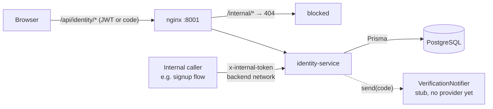
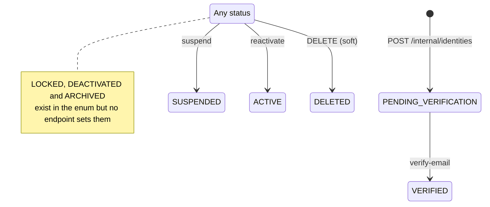
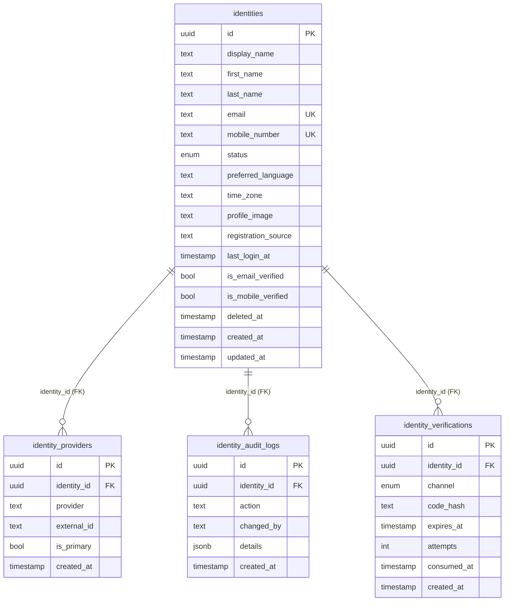
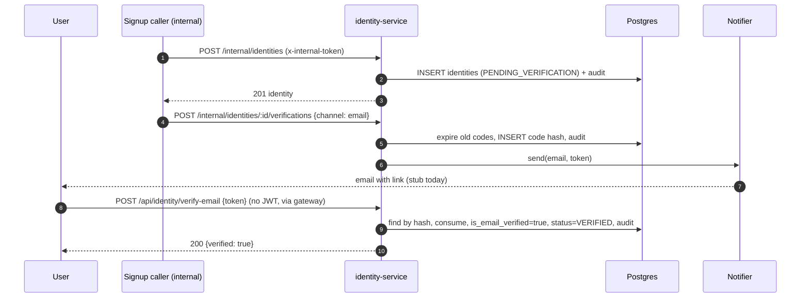
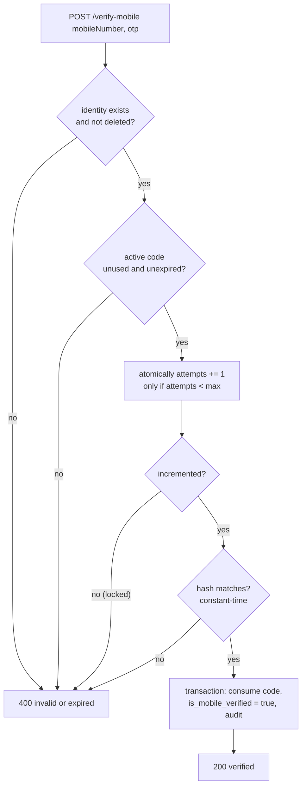
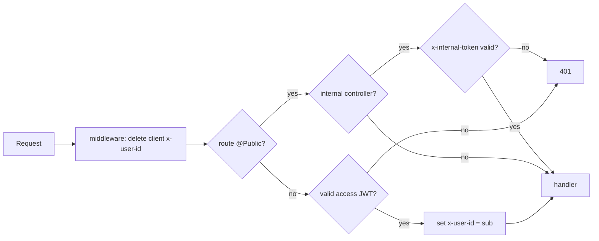

# identity-service

> The record of **who a user is** across their lifecycle: profile identity, verified email and mobile, linked login providers and an audit trail.
> [← Service index](../README.md) · Business spec: [docs/modules/identity.md](../../docs/modules/identity.md)

| | |
|---|---|
| **Stack** | NestJS 10, Prisma 6, PostgreSQL, Passport-JWT |
| **Port** | `3001` |
| **Route prefix** | `/api/identity` |
| **Gateway route** | `/api/identity/*` (public endpoints only; `/api/identity/internal/*` is blocked with 404) |
| **Swagger** | `/api/identity/docs` (not served when `NODE_ENV=production`) |
| **Owns tables** | `identities`, `identity_providers`, `identity_audit_logs`, `identity_verifications` |
| **Depends on** | PostgreSQL |
| **Used by** | Internal callers (signup and login flows) through `/internal/*`. Its IDs are referenced as `identity_id` by [authorization-service](../authorization-service/README.md) and [customer-service](../customer-service/README.md). |

---

## 1. Responsibilities

- Create identities during signup through an internal, service-to-service API.
- Look up identities for login and status checks (internal API).
- **Verify ownership** of an email address (one-time link token) and a mobile number (six-digit OTP). Users can do this before they have ever logged in.
- Update profile fields, soft-delete, suspend and reactivate identities (JWT required).
- Link and unlink external login providers (JWT required).
- Record an audit log entry for every change.

Out of scope: passwords and JWT issuing ([auth-service](../auth-service/README.md)), roles and permissions ([authorization-service](../authorization-service/README.md)), and actually sending emails or SMS (no notification service exists yet; see [Verification delivery](#36-verification-delivery)).

---

## 2. High-Level Design

The service exposes three surfaces, each with its own access rule:

| Surface | Path | Reachable from | Authentication | Why |
|---|---|---|---|---|
| **Internal** | `/api/identity/internal/*` | `backend` Docker network only; the gateway returns 404 | `x-internal-token` header (shared `INTERNAL_SERVICE_TOKEN`) | Called during signup and login, before the user has a JWT |
| **Verification** | `/api/identity/verify-email`, `/verify-mobile`, `/verifications/resend` | Public, through the gateway | None; the one-time code is the credential | Users verify from an email link or SMS, often before logging in |
| **Account** | `/api/identity/identities/*` | Public, through the gateway | Bearer **access JWT** | Everything else |
| Health | `/api/identity/health` | Public | None | Docker and gateway probes |



- **Default-deny authentication.** A global `JwtAuthGuard` (`APP_GUARD`) protects every route. Only routes marked `@Public()` skip it: health, the verification endpoints, and the internal controller, which uses `InternalServiceGuard` instead.
- **Trusted user ID header.** On a valid token the JWT strategy writes the token's `sub` into the `x-user-id` request header. A middleware in `main.ts` deletes any client-supplied `x-user-id` first, so the header can only come from a verified token.
- Identity IDs are the cross-service key for authorization (`user_roles.identity_id`) and customers (`customers.identity_id`). No foreign keys cross services.

---

## 3. Low-Level Design

```text
src/
├── main.ts                       # prefix, strips client x-user-id, ValidationPipe, CORS, Swagger (non-prod)
├── app.module.ts                 # Config, Passport, Prisma, IdentityModule; JwtStrategy + global JwtAuthGuard
├── auth/
│   ├── public.decorator.ts       # @Public() → skips JwtAuthGuard
│   ├── jwt-auth.guard.ts         # global guard (AuthGuard('jwt') + @Public check)
│   ├── jwt.strategy.ts           # verifies access token, sets x-user-id
│   └── internal-service.guard.ts # constant-time x-internal-token check, fails closed
├── health/health.controller.ts   # public; SELECT 1 with a 2 s timeout
├── prisma/                       # global PrismaService
└── identity/
    ├── identity.module.ts
    ├── identity.controller.ts           # /identities/* (JWT)
    ├── internal-identity.controller.ts  # /internal/identities/* (x-internal-token)
    ├── verification.controller.ts       # /verify-email, /verify-mobile, /verifications/resend (public)
    ├── identity.service.ts              # CRUD, providers, status, audit
    ├── verification.service.ts          # issue / verify / resend codes
    ├── verification-notifier.ts         # delivery stub
    └── dto/  create-identity, update-identity, link-provider,
              issue-verification, verify-email, verify-mobile, resend-verification
```

### 3.1 `IdentityService`

| Method | Behavior | Audit action |
|---|---|---|
| `createIdentity(dto)` | Checks email (and mobile, if given) are unique; creates the identity with status `PENDING_VERIFICATION` | `IDENTITY_CREATED` |
| `findById(id)` | Identity with `providers`, or 404 | – |
| `findByEmail(email)` | Identity or `null` | – |
| `updateIdentity(id, dto)` | Updates only the fields provided: displayName, firstName, lastName, mobileNumber, preferredLanguage, timeZone | `IDENTITY_UPDATED` |
| `deleteIdentity(id)` | Soft delete: `deletedAt = now()`, `status = DELETED` | `IDENTITY_DELETED` |
| `linkProvider` / `unlinkProvider` | Insert or delete an `identity_providers` row | `PROVIDER_LINKED` / `PROVIDER_UNLINKED` |
| `suspendIdentity` / `reactivateIdentity` | `status = SUSPENDED` / `ACTIVE` | `IDENTITY_SUSPENDED` / `IDENTITY_REACTIVATED` |
| `getAuditLogs(id)` | Audit rows, newest first | – |

### 3.2 `VerificationService`

| Method | Behavior |
|---|---|
| `issue(identityId, channel)` | Rejects a deleted or missing identity (404), an already-verified channel (409), and mobile without a number (400). In production, returns 503 while no delivery provider is configured. Otherwise it generates the code, expires any earlier unused code for the same channel, stores only the hash, writes the `VERIFICATION_ISSUED` audit row in the same transaction, and calls the notifier. Outside production the response includes `devCode`. |
| `verifyEmail(token)` | Finds the code by token hash; it must be unused, unexpired and belong to a non-deleted identity. In one transaction it consumes the code, sets `isEmailVerified`, moves the status `PENDING_VERIFICATION → VERIFIED` (other statuses are kept), and writes the `EMAIL_VERIFIED` audit row. |
| `verifyMobile(mobileNumber, otp)` | Finds the newest active mobile code for the identity. It **increments `attempts` before comparing**, so parallel guesses can't exceed the limit, then compares in constant time. On success, in one transaction it consumes the code, sets `isMobileVerified` and writes `MOBILE_VERIFIED`. |
| `resend(dto)` | Looks the identity up by email or mobile number. It does nothing if the identity is missing, deleted or already verified, or if the last code was issued less than the cooldown ago. Otherwise it calls `issue`. The caller always gets the same 202 response. |

### 3.3 Verification rules

| Rule | Email | Mobile |
|---|---|---|
| Code format | 32 random bytes, base64url (43 characters) | 6 random digits |
| Stored as | SHA-256 of the token | SHA-256 of `identityId:otp` |
| Lifetime | `VERIFICATION_EMAIL_TTL_MINUTES` (30) | `VERIFICATION_OTP_TTL_MINUTES` (10) |
| Attempt limit | not needed (256-bit token) | `VERIFICATION_MAX_ATTEMPTS` (5), after which the code is locked and a new one is needed |
| Single use | yes (`consumed_at`) | yes |
| New code issued | earlier unused codes for the channel expire immediately | same |
| Resend cooldown | `VERIFICATION_RESEND_COOLDOWN_SECONDS` (60) | same |
| Failure response | 400 `Invalid or expired verification code`, the same for unknown, wrong, expired, used or locked codes, so responses don't reveal which accounts exist | same |

### 3.4 Status lifecycle as implemented



### 3.5 Error handling

| Situation | HTTP |
|---|---|
| Validation failure, invalid or expired verification code, mobile channel without a number | 400 |
| Missing or invalid JWT on account endpoints; missing or wrong `x-internal-token` on internal endpoints | 401 |
| Identity or provider not found | 404 |
| Duplicate email or mobile on create; channel already verified | 409 |
| Code issuing in production with no delivery provider; health check with the database unreachable | 503 |
| Duplicate `(provider, externalId)` on link, or duplicate mobile on update | 500 (Prisma `P2002` isn't mapped yet) |

### 3.6 Verification delivery

`VerificationNotifier` is a stub. `isConfigured()` returns `false`, and `send()` only logs a masked destination (`j***@example.com`, `***2671`), **never the code**. Because of this:

- **Development and test:** the internal issue endpoint returns the code as `devCode`, so the flow can be exercised end to end.
- **Production:** issuing a code returns **503** instead of pretending to send it. Public resend still answers 202 and logs a warning.

To go live, implement `send()` with an email or SMS provider (or a notification service) and return `true` from `isConfigured()`.

---

## 4. API

All paths are relative to `/api/identity`.

### Health (public)

| Method | Path | Success | Failure |
|---|---|---|---|
| GET | `/health` | 200 `{ status: 'ok', service, checks: { database: 'up' } }` | 503 `{ status: 'error', …, checks: { database: 'down' } }` |

### Internal: `x-internal-token` required, not reachable through the gateway

| Method | Path | Body or query | Success | Errors |
|---|---|---|---|---|
| POST | `/internal/identities` | `CreateIdentityDto` | 201 identity (`PENDING_VERIFICATION`) | 400, 401, 409 |
| GET | `/internal/identities/by-email?email=` | – | 200 identity with providers | 400, 401, 404 |
| GET | `/internal/identities/:id` | – | 200 identity with providers | 400 (not a UUID), 401, 404 |
| POST | `/internal/identities/:id/verifications` | `{ channel: 'email' \| 'mobile' }` | 201 `{ verificationId, channel, expiresAt, devCode? }` | 400, 401, 404, 409, 503 |

### Verification: public, no JWT

| Method | Path | Body | Success | Errors |
|---|---|---|---|---|
| POST | `/verify-email` | `{ token }` | 200 `{ verified: true, channel: 'email' }` | 400 |
| POST | `/verify-mobile` | `{ mobileNumber, otp }` | 200 `{ verified: true, channel: 'mobile' }` | 400 |
| POST | `/verifications/resend` | `{ channel, email }` or `{ channel, mobileNumber }` | 202 `{ message }` (always) | 400 (validation only) |

### Account: Bearer access JWT required

| Method | Path | Body | Success | Errors |
|---|---|---|---|---|
| GET | `/identities/:id` | – | 200 identity with providers | 401, 404 |
| PUT | `/identities/:id` | `UpdateIdentityDto` | 200 identity | 400, 401, 404 |
| DELETE | `/identities/:id` | – | 200 identity (soft-deleted) | 401, 404 |
| POST | `/identities/:id/providers` | `LinkProviderDto` | 201 provider | 401, 404, 500 (duplicate) |
| DELETE | `/identities/:id/providers/:providerId` | – | 200 `{ message }` | 401, 404 |
| POST | `/identities/:id/suspend` | – | 200 identity | 401, 404 |
| POST | `/identities/:id/reactivate` | – | 200 identity | 401, 404 |
| GET | `/identities/:id/audit-logs` | – | 200 audit log array | 401, 404 |

The previous `POST /identities`, `POST /identities/:id/verify-email` and `POST /identities/:id/verify-mobile` were removed. Creation moved to the internal API, and verification moved to the public endpoints above, which check real codes.

### Examples

```http
POST /api/identity/internal/identities            (backend network only)
x-internal-token: <INTERNAL_SERVICE_TOKEN>
Content-Type: application/json

{ "email": "jane.doe@example.com", "displayName": "Jane Doe", "mobileNumber": "+14155552671", "registrationSource": "web" }
```

```http
POST /api/identity/internal/identities/{id}/verifications
x-internal-token: <INTERNAL_SERVICE_TOKEN>
Content-Type: application/json

{ "channel": "mobile" }
```

```json
{ "verificationId": "9d0b…", "channel": "mobile", "expiresAt": "2026-10-01T12:10:00.000Z", "devCode": "482913" }
```

```http
POST /api/identity/verify-mobile
Content-Type: application/json

{ "mobileNumber": "+14155552671", "otp": "482913" }
```

---

## 5. Data model

Created by migration `20261001120000_init`.



| Table | Keys, constraints and indexes | Notes |
|---|---|---|
| `identities` | PK `id`; UNIQUE `email`; UNIQUE `mobile_number` | `status` is the `IdentityStatus` enum (`PENDING_VERIFICATION`, `VERIFIED`, `ACTIVE`, `SUSPENDED`, `LOCKED`, `DEACTIVATED`, `ARCHIVED`, `DELETED`) |
| `identity_providers` | PK `id`; FK `identity_id`; UNIQUE `(provider, external_id)` | Providers: local, google, apple, facebook, microsoft (not validated) |
| `identity_audit_logs` | PK `id`; FK `identity_id` | Actions include `IDENTITY_*`, `PROVIDER_*`, `VERIFICATION_ISSUED`, `EMAIL_VERIFIED`, `MOBILE_VERIFIED`. `changed_by` isn't filled in yet. |
| `identity_verifications` | PK `id`; FK `identity_id`; INDEX `(identity_id, channel, created_at)`; INDEX `code_hash` | `channel` is `VerificationChannel` (`EMAIL`, `MOBILE`). Only hashes are stored. Rows are kept after use. |

---

## 6. Flows

### 6.1 Signup with verification before first login



### 6.2 Mobile OTP with attempt limit



### 6.3 Request authentication



---

## 7. Configuration

| Variable | Required | Default | Purpose |
|---|---|---|---|
| `PORT` | no | `3001` | HTTP port |
| `DATABASE_URL` | yes | – | Postgres connection string |
| `JWT_SECRET` | yes | `changeme` (fallback in code; never use it outside local development) | Verifies access tokens; must match auth-service. Compose maps it from `SECRET_KEY`. |
| `INTERNAL_SERVICE_TOKEN` | yes, for internal calls | unset | Shared secret for `x-internal-token`. If unset, every internal call gets 401 and a warning is logged at startup. |
| `NODE_ENV` | no | – | `production` hides Swagger, omits `devCode`, and makes issuing return 503 until delivery is configured |
| `VERIFICATION_EMAIL_TTL_MINUTES` | no | `30` | Email token lifetime |
| `VERIFICATION_OTP_TTL_MINUTES` | no | `10` | OTP lifetime |
| `VERIFICATION_MAX_ATTEMPTS` | no | `5` | Wrong OTP guesses before the code locks |
| `VERIFICATION_RESEND_COOLDOWN_SECONDS` | no | `60` | Minimum gap between resends |
| `CORS_ORIGINS` | no | `http://localhost:3000` | Comma-separated list of allowed origins |
| `REDIS_URL` | – | – | Passed in by compose but not used |

---

## 8. Run, build and test

```bash
cd services/identity-service
npm install
npx prisma generate
npx prisma migrate deploy          # requires DATABASE_URL
JWT_SECRET=dev INTERNAL_SERVICE_TOKEN=dev-internal npm run start:dev   # http://localhost:3001/api/identity/docs
```

**Tests:** there's no automated test suite yet. The change that added JWT protection and verification was checked with smoke scripts against a real Postgres. They covered:

- 401 without a JWT, and for refresh-type tokens or a wrong signature
- internal endpoints rejecting a missing or wrong token
- create, lookup and duplicate (409) cases
- superseded, random and reused email tokens rejected
- an OTP locked after 5 wrong attempts
- the same resend response for unknown numbers
- 503 and hidden Swagger in production
- health returning 503 with Postgres stopped

---

## 9. Known limitations and follow-ups

- **Authentication only, no authorization.** Any logged-in user can read, update, suspend, reactivate, delete or view audit logs for **any** identity. Next step: an ownership rule for self-service endpoints, and an authorization-service check (for example `identity:suspend`) for admin actions.
- **No email or SMS delivery yet**, so production verification returns 503 until a provider is wired in (see [§3.6](#36-verification-delivery)).
- auth-service isn't wired to the internal API yet. Its register and login don't create or check identities, and the JWT `sub` (`users.id`) isn't linked to `identities.id`.
- There's no rate limiting on the public verification endpoints apart from the OTP attempt limit and the resend cooldown. Add gateway or IP throttling.
- `changedBy` isn't set on audit rows (the `x-user-id` header is available for this).
- Unique-constraint errors on link and update surface as 500 instead of 409.
- No status-transition guards, for example reactivating a `DELETED` identity.
- No automated tests yet (adding Jest needs a dev-dependency decision).
