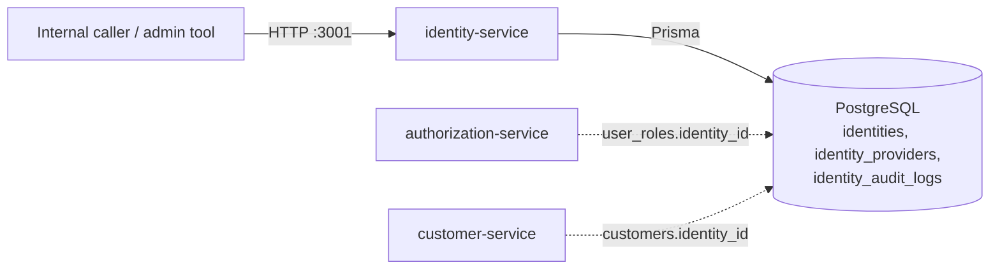
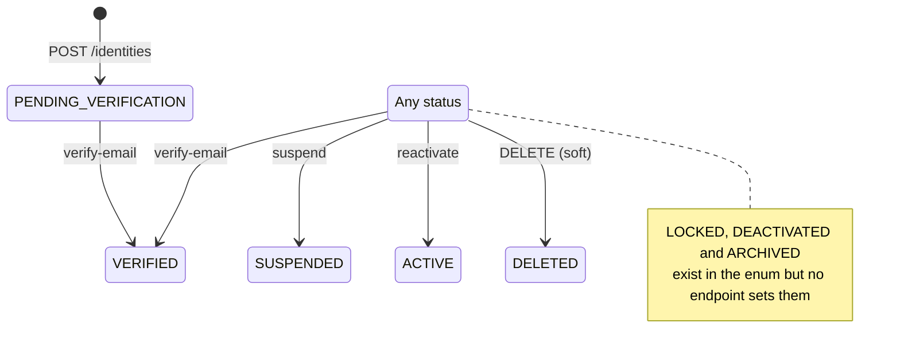
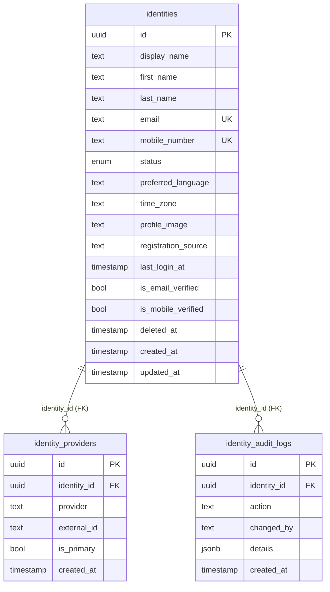
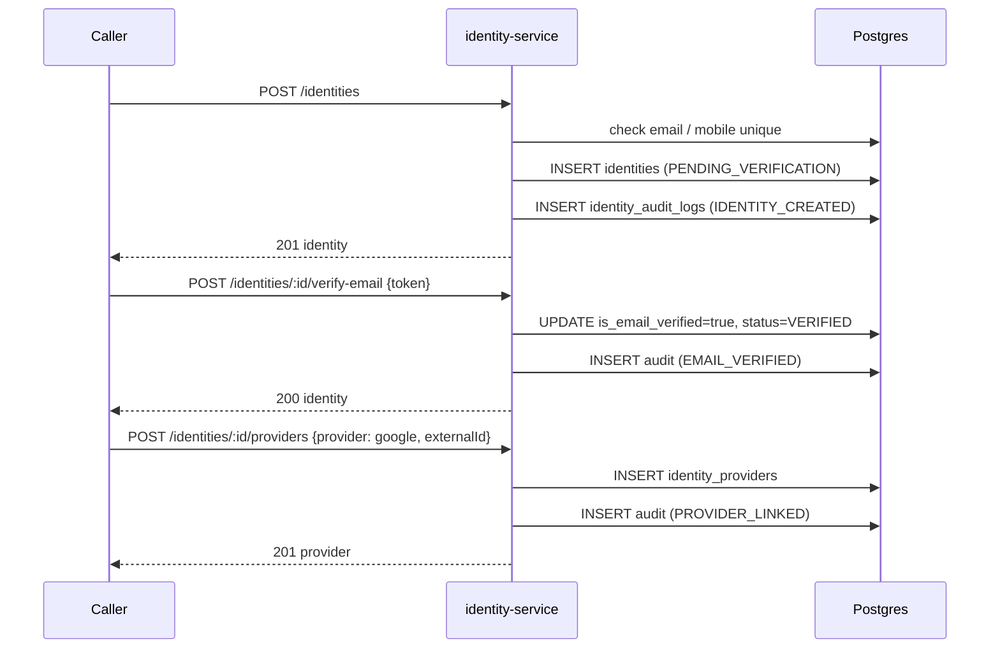

# identity-service

> The record of **who a user is** across their lifecycle: profile identity, verification status, linked login providers and an audit trail.
> [← Service index](../README.md) · Business spec: [docs/modules/identity.md](../../docs/modules/identity.md)

| | |
|---|---|
| **Stack** | NestJS 10, Prisma 6, PostgreSQL |
| **Port** | `3001` |
| **Route prefix** | `/api/identity` |
| **Gateway route** | **None.** nginx doesn't route to this service; reach it only on the `backend` network or at `localhost:3001` |
| **Swagger** | `/api/identity/docs` |
| **Owns tables** | `identities`, `identity_providers`, `identity_audit_logs` |
| **Depends on** | PostgreSQL |
| **Used by** | Nothing yet. Its IDs are referenced as `identity_id` by [authorization-service](../authorization-service/README.md) and [customer-service](../customer-service/README.md). |

---

## 1. Responsibilities

- Create, read, update and soft-delete identities.
- Mark email and mobile numbers as verified. The verification itself is simplified; see [Business rules](#33-business-rules).
- Link and unlink external identity providers (local, google, apple, facebook, microsoft).
- Change status: suspend and reactivate.
- Write an audit log entry for every change.

Out of scope: passwords and JWT issuing, which belong to [auth-service](../auth-service/README.md), and roles and permissions, which belong to [authorization-service](../authorization-service/README.md).

---

## 2. High-Level Design



- A single REST module (`IdentityModule`) on top of Prisma.
- There's no event publishing. Every change instead writes a row to `identity_audit_logs`.
- Identity IDs are the cross-service key for authorization (`user_roles.identity_id`) and customers (`customers.identity_id`). Neither link is enforced with a foreign key.

---

## 3. Low-Level Design

```text
src/
├── main.ts                   # prefix api/identity, ValidationPipe, CORS, Swagger, default port 3001
├── app.module.ts             # ConfigModule, PrismaModule, IdentityModule
├── prisma/                   # global PrismaService
└── identity/
    ├── identity.module.ts
    ├── identity.controller.ts
    ├── identity.service.ts
    └── dto/
        ├── create-identity.dto.ts
        ├── update-identity.dto.ts   # PartialType(CreateIdentityDto)
        ├── verify-email.dto.ts
        ├── verify-mobile.dto.ts
        └── link-provider.dto.ts
```

### 3.1 `IdentityService` methods

| Method | Behavior | Audit action |
|---|---|---|
| `createIdentity(dto)` | Checks email, and mobile if given, for uniqueness, then creates the identity with status `PENDING_VERIFICATION` | `IDENTITY_CREATED` |
| `findById(id)` | Returns the identity with its `providers`, or throws 404 | – |
| `findByEmail(email)` | Returns the identity or `null`. Not exposed over HTTP. | – |
| `updateIdentity(id, dto)` | Updates only the fields provided: displayName, firstName, lastName, mobileNumber, preferredLanguage, timeZone | `IDENTITY_UPDATED` (details = the DTO) |
| `deleteIdentity(id)` | Soft delete: sets `deletedAt = now()` and `status = DELETED` | `IDENTITY_DELETED` |
| `verifyEmail(id, dto)` | Sets `isEmailVerified = true` and `status = VERIFIED`. **The token isn't checked.** | `EMAIL_VERIFIED` |
| `verifyMobile(id, dto)` | Sets `isMobileVerified = true`. **The OTP isn't checked.** | `MOBILE_VERIFIED` |
| `linkProvider(id, dto)` | Inserts an `identity_providers` row | `PROVIDER_LINKED` |
| `unlinkProvider(id, providerId)` | Deletes the provider if it belongs to the identity, otherwise 404 | `PROVIDER_UNLINKED` |
| `suspendIdentity(id)` | Sets `status = SUSPENDED` | `IDENTITY_SUSPENDED` |
| `reactivateIdentity(id)` | Sets `status = ACTIVE` | `IDENTITY_REACTIVATED` |
| `getAuditLogs(id)` | Returns the audit rows, newest first | – |

### 3.2 DTO validation

| DTO | Field | Rules |
|---|---|---|
| `CreateIdentityDto` | `email` | `@IsEmail` (required) |
| | `displayName` | string, at least 1 character (required) |
| | `firstName`, `lastName`, `mobileNumber`, `registrationSource`, `preferredLanguage`, `timeZone` | optional strings |
| `UpdateIdentityDto` | – | All `CreateIdentityDto` fields optional. `email` and `registrationSource` are accepted by validation but the service ignores them. |
| `VerifyEmailDto` | `token` | string |
| `VerifyMobileDto` | `otp` | string |
| `LinkProviderDto` | `provider` | string |
| | `externalId` | string |
| | `isPrimary` | optional boolean |

### 3.3 Business rules

1. Email must be unique, and so must the mobile number when given. A duplicate returns 409.
2. A new identity always starts in `PENDING_VERIFICATION`, with `preferredLanguage` defaulting to `en` and `timeZone` to `UTC`.
3. Delete is a **soft delete**. The row stays, and `findById` still returns it.
4. Verifying an email moves the status to `VERIFIED`. Verifying a mobile number doesn't change the status.
5. The code doesn't enforce state-machine guards. You can, for example, reactivate a `DELETED` identity.
6. `(provider, externalId)` is unique at the database level.

### 3.4 Status lifecycle as implemented



### 3.5 Error handling

| Situation | HTTP |
|---|---|
| Validation failure | 400 |
| Identity or provider not found | 404 |
| Duplicate email or mobile on create | 409 |
| Duplicate `(provider, externalId)` on link | Prisma `P2002`, which is **not mapped** and surfaces as 500 |
| Duplicate mobile number on update | Prisma `P2002`, which surfaces as 500 |

---

## 4. API

All paths are relative to `/api/identity`. **No endpoint is authenticated.** `@ApiBearerAuth` is only a Swagger annotation; no guard enforces it.

| Method | Path | Body | Success | Errors |
|---|---|---|---|---|
| GET | `/health` | – | 200 `{status, service}` | – |
| POST | `/identities` | `CreateIdentityDto` | 201 identity with `providers` | 400, 409 |
| GET | `/identities/:id` | – | 200 identity with `providers` | 404 |
| PUT | `/identities/:id` | `UpdateIdentityDto` | 200 identity | 400, 404 |
| DELETE | `/identities/:id` | – | 200 identity (soft-deleted) | 404 |
| POST | `/identities/:id/verify-email` | `{ token }` | 200 identity | 404 |
| POST | `/identities/:id/verify-mobile` | `{ otp }` | 200 identity | 404 |
| POST | `/identities/:id/providers` | `LinkProviderDto` | 201 provider | 404, 409 (documented, but actually 500) |
| DELETE | `/identities/:id/providers/:providerId` | – | 200 `{ message }` | 404 |
| POST | `/identities/:id/suspend` | – | 200 identity | 404 |
| POST | `/identities/:id/reactivate` | – | 200 identity | 404 |
| GET | `/identities/:id/audit-logs` | – | 200 audit log array | 404 |

```http
POST /api/identity/identities
Content-Type: application/json

{ "email": "jane.doe@example.com", "displayName": "Jane Doe", "mobileNumber": "+14155552671", "registrationSource": "web" }
```

---

## 5. Data model



| Table | Key constraints | Notes |
|---|---|---|
| `identities` | PK `id`; UNIQUE `email`; UNIQUE `mobile_number` | `status` is the `IdentityStatus` enum: `PENDING_VERIFICATION`, `VERIFIED`, `ACTIVE`, `SUSPENDED`, `LOCKED`, `DEACTIVATED`, `ARCHIVED`, `DELETED`. Defaults: `status = PENDING_VERIFICATION`, `preferred_language = 'en'`, `time_zone = 'UTC'`, both verified flags `false`. |
| `identity_providers` | PK `id`; FK `identity_id → identities.id`; UNIQUE `(provider, external_id)` | `provider` values: local, google, apple, facebook, microsoft. Not validated. |
| `identity_audit_logs` | PK `id`; FK `identity_id → identities.id` | `changed_by` is never filled in, because there's no authenticated actor. |

> ⚠️ **No migrations directory.** `prisma/migrations/` doesn't exist, so `npx prisma migrate deploy` on container start applies nothing and these tables are **never created**. Create them with `npx prisma migrate dev --name init` and commit the result. Until then you can use `npx prisma db push` in local development.

---

## 6. Flows

### Onboarding an identity



The change and its audit row are written **without a transaction**, so a failure between the two writes leaves an unaudited change.

---

## 7. Configuration

| Variable | Required | Default | Purpose |
|---|---|---|---|
| `PORT` | no | `3001` | HTTP port |
| `DATABASE_URL` | yes | – | Postgres connection string |
| `CORS_ORIGINS` | no | `http://localhost:3000` | Comma-separated list of allowed origins |
| `JWT_SECRET`, `REDIS_URL` | – | – | Passed in by compose but **not used** |

---

## 8. Run, build and test

```bash
cd services/identity-service
npm install
npx prisma generate
npx prisma db push            # until a migration is committed
npm run start:dev             # http://localhost:3001/api/identity/docs
```

**Tests:** none exist yet.

---

## 9. Known limitations and follow-ups

- **No authentication or authorization** on any endpoint, including suspend, delete and the audit logs.
- The service isn't exposed through the API gateway.
- There are no Prisma migrations, so the tables are missing in Docker deployments.
- Email-token and OTP verification are stubs that accept any value.
- The change and its audit row aren't written in a single transaction.
- Unique-constraint errors on link and update surface as 500 instead of 409.
- Nothing enforces status-transition rules.
- `changedBy` is never set.
- Nothing connects this service to auth-service's `users` table.
