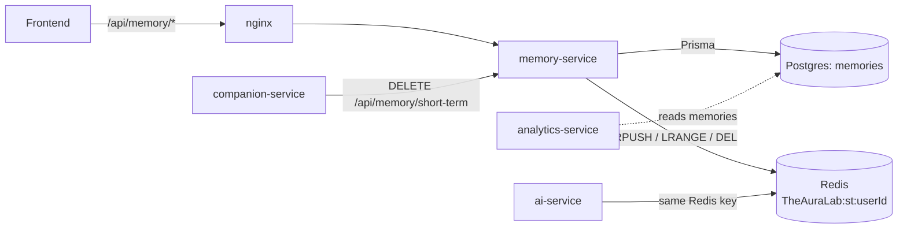
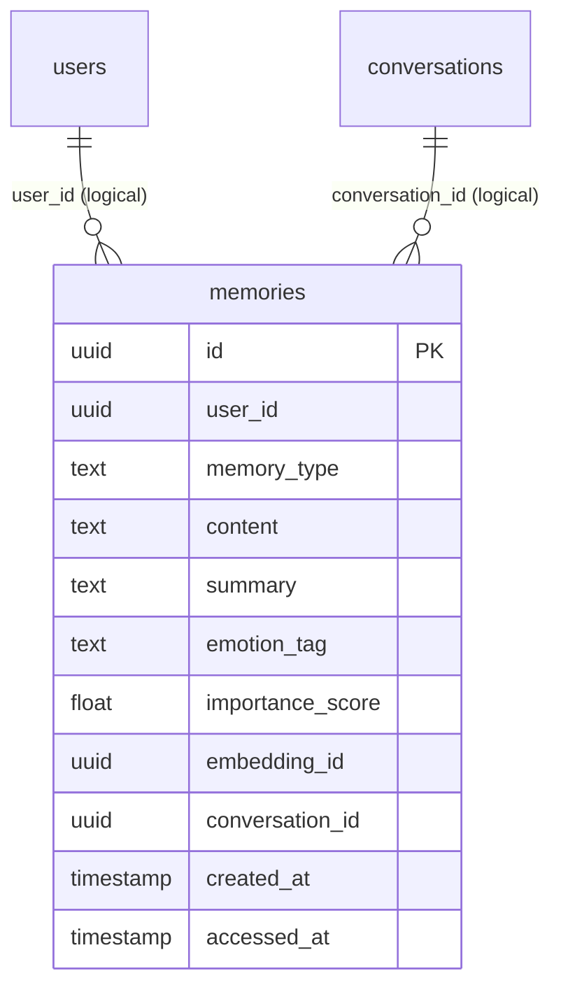
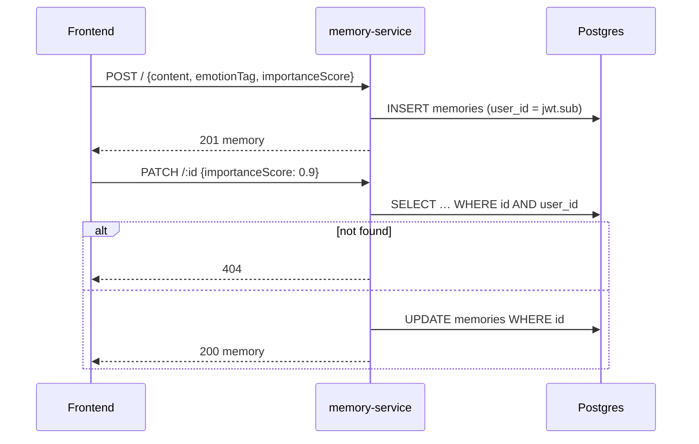
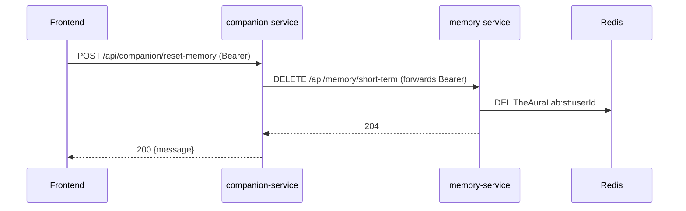

# memory-service

> User memories: long-term memories in Postgres, short-term conversation context in Redis, and JSON export.
> [← Service index](../README.md)

| | |
|---|---|
| **Stack** | NestJS 10, Prisma 6, PostgreSQL, ioredis |
| **Port** | `3000` |
| **Route prefix** | `/api/memory` |
| **Gateway route** | `/api/memory/*` |
| **Swagger** | `/api/memory/docs` (not served when `NODE_ENV=production`) |
| **Owns tables** | `memories` |
| **Redis keys** | `TheAuraLab:st:{userId}` (a list, shared with ai-service) |
| **Depends on** | PostgreSQL, Redis |
| **Used by** | Frontend; companion-service (`DELETE /short-term`); analytics-service (reads `memories` directly) |

---

## 1. Responsibilities

- CRUD for a user's **long-term memories**: facts with an emotion tag and an importance score.
- Manage **short-term memory**, a capped and expiring Redis list of recent `{role, content}` messages.
- **Export** all of a user's memories as a downloadable JSON file.

Semantic or vector memory lives in **ChromaDB** and is handled entirely by [ai-service](../ai-service/README.md). This service doesn't talk to ChromaDB, even though the Swagger description mentions it.

---

## 2. High-Level Design



The short-term key is a **shared contract** with ai-service, which reads and writes `TheAuraLab:st:{userId}` directly with the same limits (50 entries, 3600-second TTL). Clearing it here resets the AI's conversational context.

---

## 3. Low-Level Design

```text
src/
├── main.ts                 # prefix api/memory, ValidationPipe, CORS, Swagger
├── app.module.ts           # Config, Prisma, Redis, MemoryModule
├── prisma/                 # global PrismaService
├── redis/redis.module.ts   # REDIS_CLIENT provider
├── health/health.controller.ts # public; Postgres SELECT 1 + Redis PING, 503 when down
└── memory/
    ├── memory.module.ts    # Passport + JwtModule
    ├── memory.controller.ts# class-level AuthGuard('jwt')
    ├── memory.service.ts
    ├── jwt.strategy.ts
    └── dto/create-memory.dto.ts
```

### 3.1 `MemoryService`

| Method | Store | Behavior |
|---|---|---|
| `saveShortTerm(userId, {role, content})` | Redis | `RPUSH`, then `LTRIM -50 -1` (keep the last 50), then `EXPIRE 3600` |
| `getShortTerm(userId)` | Redis | `LRANGE 0 -1`, with each entry JSON-parsed |
| `clearShortTerm(userId)` | Redis | `DEL` |
| `create(userId, dto)` | Postgres | Inserts with defaults `memoryType = long`, `emotionTag = neutral`, `importanceScore = 0.5` |
| `findAll(userId, skip=0, limit=50, memoryType?)` | Postgres | Sorted by `importanceScore desc`, then `createdAt desc` |
| `findOne(id, userId)` | Postgres | Ownership-scoped lookup |
| `update(id, userId, data)` | Postgres | Updates by `id`; the controller checks ownership first |
| `remove(id, userId)` | Postgres | Ownership-scoped delete; returns `false` if the memory isn't found |
| `exportAll(userId)` | Postgres | All of the user's memories |

The constants `MAX_SHORT_TERM = 50` and `SHORT_TERM_TTL = 3600` are hard-coded and don't read the environment.

### 3.2 `CreateMemoryDto`

| Field | Rules | Default |
|---|---|---|
| `content` | string (required) | – |
| `summary` | optional string | – |
| `memoryType` | `short \| long \| semantic` | `long` |
| `emotionTag` | `joy \| sadness \| anger \| fear \| surprise \| neutral \| love \| anxiety` | `neutral` |
| `importanceScore` | number between 0 and 1 | `0.5` |
| `conversationId` | optional string (should be a UUID, but this isn't validated) | – |

`PATCH /:id` takes `Partial<CreateMemoryDto>`, which is a TypeScript type and doesn't exist at runtime, so **the request body isn't validated or whitelisted**. `POST /short-term` takes an inline type and isn't validated either.

---

## 4. API

All paths are relative to `/api/memory`, and **every route requires** `Authorization: Bearer <access token>`.

| Method | Path | Query or body | Success | Errors |
|---|---|---|---|---|
| GET | `/` | `skip` (0), `limit` (50), `memory_type?` | 200 memories | 401 |
| POST | `/` | `CreateMemoryDto` | 201 memory | 400, 401 |
| GET | `/export/json` | – | 200 file `TheAuraLab-memories.json`: `{ memories[], count }` | 401 |
| POST | `/short-term` | `{ role, content }` | 201 (empty body) | 401 |
| GET | `/short-term` | – | 200 `[{role, content}]` | 401 |
| DELETE | `/short-term` | – | 204 | 401 |
| GET | `/:id` | – | 200 memory | 401, 404 |
| PATCH | `/:id` | partial memory | 200 memory | 401, 404 |
| DELETE | `/:id` | – | 204 | 401, 404 |

`GET /health` is public and served by a separate `HealthController`, registered in `AppModule` so it's matched before the guarded `GET /:id`. It runs `SELECT 1` against Postgres and `PING` against Redis, each with a 2-second timeout, and returns 200 `{ status: 'ok', service, checks: { database: 'up', redis: 'up' } }`; 503 with the failed check marked `down`.

```http
POST /api/memory
Authorization: Bearer <token>
Content-Type: application/json

{ "content": "Jane's sister is called Mia", "emotionTag": "love", "importanceScore": 0.8 }
```

---

## 5. Data model

**Table `memories`**: migration `20260722123353_init` creates it, and `20260722125119_init` converts `user_id`, `embedding_id` and `conversation_id` to UUID.

| Column | Type | Constraints / default | Notes |
|---|---|---|---|
| `id` | UUID | PK | |
| `user_id` | UUID | NOT NULL | Logical link to `users.id` |
| `memory_type` | TEXT | default `'long'` | `short \| long \| semantic` |
| `content` | TEXT | NOT NULL | |
| `summary` | TEXT | nullable | |
| `emotion_tag` | TEXT | default `'neutral'` | |
| `importance_score` | DOUBLE | default `0.5` | 0–1 |
| `embedding_id` | UUID | nullable | Meant to link to the ChromaDB document; never set |
| `conversation_id` | UUID | nullable | Logical link to `conversations.id` |
| `created_at` | TIMESTAMP(3) | default now | |
| `accessed_at` | TIMESTAMP(3) | nullable | Never updated |



There's no index on `user_id`, and every query filters on it.

**Redis:** key `TheAuraLab:st:{userId}`, type LIST, values `{"role":"user|assistant","content":"…"}` as JSON. At most 50 entries, and a TTL of 3600 seconds that resets on every write.

---

## 6. Flows

### Long-term memory CRUD



### Reset conversational context (through companion-service)



---

## 7. Configuration

| Variable | Required | Default | Purpose |
|---|---|---|---|
| `PORT` | no | `3000` | HTTP port |
| `DATABASE_URL` | yes | – | Postgres connection string |
| `REDIS_URL` | yes | `redis://localhost:6379` | Short-term store |
| `JWT_SECRET` | yes | `changeme` | Verifies access tokens |
| `CORS_ORIGINS` | no | `http://localhost:3000` | Allowed origins |
| `NODE_ENV` | no | – | `production` hides Swagger |

---

## 8. Run, build and test

```bash
cd services/memory-service
npm install
npx prisma generate && npx prisma migrate deploy
npm run start:dev               # http://localhost:3000/api/memory/docs
```

**Tests:** none exist yet.

---

## 9. Known limitations and follow-ups

- **Memories extracted by the AI never reach this table.** ai-service writes them only to ChromaDB, so `memories`, and therefore the analytics dashboards, only contain memories that users create by hand.
- The `TheAuraLab:memory:save` channel is declared in `services/shared` but nothing publishes or subscribes to it.
- `PATCH /:id` and `POST /short-term` bodies aren't validated.
- The short-term limits are hard-coded, so changing the environment variables on ai-service alone causes drift between the two services.
- There's no index on `memories.user_id`, and `accessed_at` and `embedding_id` are never set.
- There are no tests.
