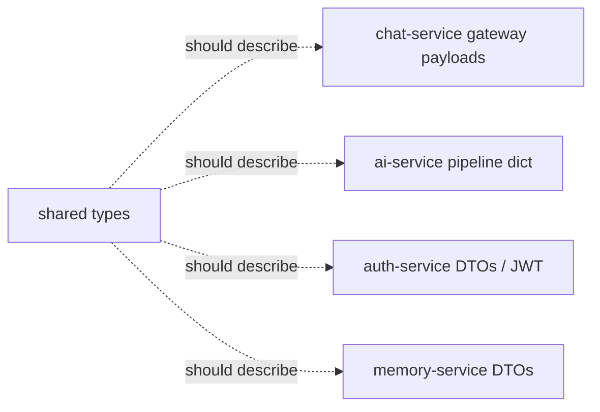

# shared (`@TheAuraLab/shared`)

> TypeScript types and Redis constants shared across services: the intended single source of truth for cross-service contracts.
> [← Service index](../README.md)

| | |
|---|---|
| **Type** | Library (not a running service) |
| **Build** | `npm run build` (`tsc` → `dist/`, with `.d.ts` files and source maps) |
| **Consumers** | **None today.** No service imports this package (see [limitations](#4-known-limitations-and-follow-ups)). |

---

## 1. Contents

```text
src/
├── index.ts                 # re-exports everything
├── types/
│   ├── user.ts              # User, RegisterDto, LoginDto, AuthTokens, JwtPayload, PersonalityArchetype, CommunicationStyle
│   ├── chat.ts              # Message, Conversation, MessageRole, EmotionType, AvatarExpression, WSIncoming, WSOutgoing
│   ├── memory.ts            # Memory, MemoryType, MemorySearchResult
│   └── ai.ts                # AIProcessRequest, AIProcessResponse, EmotionResult
└── events/
    └── redis-events.ts      # REDIS_CHANNELS, REDIS_KEYS
```

### Redis contracts

```ts
REDIS_CHANNELS = {
  AI_PROCESS:    'TheAuraLab:ai:process',   // chat-service → ai-service   (in use)
  AI_RESPONSE:   'TheAuraLab:ai:response',  // ai-service   → chat-service (in use)
  MEMORY_SAVE:   'TheAuraLab:memory:save',  // declared, unused
  MEMORY_SEARCH: 'TheAuraLab:memory:search' // declared, unused
}
REDIS_KEYS.shortTerm(userId) = `TheAuraLab:st:${userId}` // memory-service + ai-service
```

### Domain enums

| Type | Values |
|---|---|
| `PersonalityArchetype` | `friend`, `mentor`, `coach`, `creator`, `assistant` |
| `CommunicationStyle` | `casual`, `formal`, `playful`, `empathetic` |
| `EmotionType` | `joy`, `sadness`, `anger`, `fear`, `surprise`, `neutral`, `love`, `anxiety` |
| `AvatarExpression` | `happy`, `sad`, `surprised`, `upset`, `worried`, `idle` |
| `MemoryType` | `short`, `long`, `semantic` |

---

## 2. How the types map to the code



---

## 3. Build

```bash
cd services/shared
npm install
npm run build
```

---

## 4. Known limitations and follow-ups

- **The package isn't used anywhere**, so its types have already drifted from the code:
  - `AIProcessResponse` is missing the `userId` and `conversationId` fields that ai-service actually sends.
  - `AuthTokens` uses camelCase, but auth-service returns `access_token`, `refresh_token` and `token_type`.
  - `WSIncoming` and `WSOutgoing` describe a `{type: …}` envelope, but chat-service uses Socket.IO event names (`message`, `ack`, `typing`, `pong`).
- Each service is built from its own Docker context (`./services/<name>`), so a dependency on `../shared` wouldn't resolve inside the image. Using the package needs either an npm workspace with a root-level build context, or a published package.
- Either wire the package in and add contract tests, or remove it.
